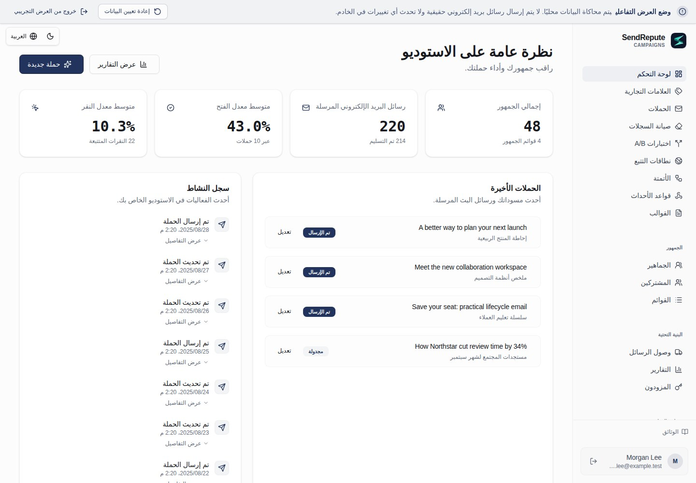

[English](README.md) · [العربية](README.ar.md) · [Français](README.fr.md) · [Русский](README.ru.md) · [Українська](README.uk.md) · [हिन्दी](README.hi.md) · [Deutsch](README.de.md) · [Español](README.es.md) · [Italiano](README.it.md) · [Português](README.pt.md) · [Bahasa Indonesia](README.id.md) · [Türkçe](README.tr.md) · [简体中文](README.zh.md) · [Tiếng Việt](README.vi.md)

# SendRepute Campaigns

استضافة ذاتية للجماهير والحملات والقوالب والأتمتة والتسليم من
خادمك الخاص. يوفر هذا المستودع **بيئة التشغيل المُجمَّعة**، وليس
المستودع الموحد (monorepo) للشيفرة المصدرية الكاملة.



جرّب [العرض التوضيحي التفاعلي](https://www.sendrepute.com/campaigns/?demo=true)
(بدون رسائل حقيقية أو أدوات بناء مستضافة أو نتائج مدفوعة).

<a id="quickstart-fresh-ubuntu-24042604"></a>

## البدء السريع: تثبيت جديد لنظام Ubuntu 24.04/26.04

على **خادم جديد لا يحتوي على تثبيت مسبق لـ Campaigns**، شغّل:

```sh
sudo apt-get update
sudo apt-get install -y git
git clone https://github.com/sendrepute/sendrepute-campaigns.git
cd sendrepute-campaigns
./setup.sh
```

يسأل الإعداد عن وضع الوصول المطلوب ويعيد استخدام Docker/Compose إذا كان يعمل؛ وعلى
خوادم Ubuntu الجديدة المدعومة التي لا تحتوي على Docker، سيطلب الموافقة لتثبيت
حزم Ubuntu. لا يقوم الإعداد بإزالة Snap Docker أو تجاوز AppArmor. لا تقم
بالاستنساخ (clone) فوق تثبيت حالي؛ راجع [التحديث](#update).

ظهور **CAMPAIGNS READY FOR OWNER SETUP** يعني أن التطبيق سليم داخل
الحاوية الخاصة به، وليس أن إعداد المالك قد اكتمل أو أنه تم التحقق من اتصال HTTPS العام.
بالنسبة لـ HTTPS، تحقق أولاً من صفحة التثبيت المعروضة من شبكة أخرى:
يجب أن تحتوي على شهادة صالحة وموثوقة بدون تحذيرات من المتصفح. إذا كانت
الشهادة قيد الانتظار أو غير صالحة، **لا** تُدخل أي بيانات سرية.

بالنسبة لمالك جديد، يُعد الرمز المميز (token) لمرة واحدة **مطلوباً** وليس اختيارياً. بمجرد أن يصبح
وضع الوصول الذي اخترته جاهزاً، شغّل هذا الأمر على الخادم الافتراضي (VPS) **من دليل المشروع**:

```sh
sudo docker compose exec campaigns cat /var/lib/sendrepute-campaigns/installer-token
```

استبعد `sudo` إذا كان حساب Docker الخاص بك لا يتطلب ذلك. انسخ مخرجات الأمر
والصقها في حقل **Setup token** في صفحة التثبيت المعروضة.
أضف بيانات المالك وعنوان URL العام (Public URL) المطابق والذي ينتهي بـ `/campaigns/`،
ثم أكمل تنشيط SendRepute وإعداد المالك في المعالج. **لا** يطبع الإعداد
الرمز المميز تلقائياً. لا تضعه أبداً في عنوان URL أو تشاركه؛ احتفظ
بالرمز المميز و `.env` والسجلات في سرية تامة. مساحة العمل المثبتة مسبقاً لا
تحتاج إلى رمز إعداد آخر.

<a id="choose-access"></a>

## اختيار طريقة الوصول

- **نطاق HTTPS (موصى به):** يشغل الإعداد وكيل Caddy المرفق.
  أدخل نطاقاً فرعياً تتحكم فيه، على سبيل المثال `campaigns.example.com` (استبدله
  بنطاقك)، **بدون البروتوكول أو المنفذ أو المسار**. وجّه سجل DNS الخاص
  باسم المضيف `A` إلى هذا الخادم، واسمح بمرور TCP 80/443 وتحقق من
  الشهادة الموثوقة خارجياً. استخدم `AAAA` فقط إذا كان اتصال IPv6 يعمل.
- **محلي / نفق SSH:** يربط التطبيق بواجهة الاسترجاع (loopback) الخاصة بالخادم الافتراضي (VPS). افتحه من خلال
  نفق SSH موثوق من حاسوبك؛ عنوان `localhost` الخاص بحاسوبك ليس
  هو الخادم الافتراضي.
- **IP عام + HTTP:** الموافقة الصريحة على الوصول غير المشفر عبر المنفذ 8080.
  يمكن اعتراض كلمات المرور والرموز المميزة والجلسات؛ **غير مخصص للنشر
  الآمن في بيئة الإنتاج**.

راجع [دليل أوامر الإعداد](docs/install.md#guided-setup-command-cookbook)
للحصول على الأوامر الدقيقة، والخيارات، وإنشاء أنفاق SSH المحلية، والتشخيصات، والتحذيرات.

<a id="moving-from-http-to-https"></a>

## الانتقال من HTTP إلى HTTPS

قم بإجراء نسخ احتياطي أولاً. وجّه **اسم المضيف الفعلي** إلى الخادم الافتراضي (VPS)، وحرر/افتح TCP 80/443
وتأكد من عمل الـ DNS الخاص به. على الخادم الافتراضي، داخل دليل المشروع **الحالي**:

```sh
./setup.sh --mode https --host campaigns.sendrepute.com
```

استبدل `campaigns.sendrepute.com` باسم المضيف الخاص بك (يعتبر `campaign` و
`campaigns` اسمي DNS مختلفين). أكّد تغيير التعريض (exposure) عند مطالبتك بذلك؛
يبدأ الإعداد تشغيل Caddy ولكنه لا يعيد كتابة عنوان URL العام (Public URL) المحفوظ لمساحة العمل المثبتة.
بعد التحقق من HTTPS خارجياً، قم بتغيير ذلك الرابط في **Workspace Settings**
إلى `https://YOUR_HOSTNAME/campaigns/`. إذا كنت تستخدم Cloudflare، فاستخدم وضع
**Full (strict)**، وتجنب استخدام Flexible أبداً. راجع
[خطوات النقل](docs/install.md#migrate-an-installed-public-ip-http-workspace-to-https)
قبل إجراء تغييرات على تثبيت قيد التشغيل.

<a id="download-v0141"></a>

## تنزيل الإصدار v0.1.44

يمكن للمسؤولين التحقق من إصدارات GitHub المستقرة في إعدادات مساحة العمل (Workspace Settings). يُفضل استخدام أرشيفات الإصدارات الرسمية المرقّمة ومرفقات المجاميع الاختبارية (checksums) من نوع SHA-256. في حال غياب هذه المرفقات المتوقعة، يمكن لأداة الفحص بدلاً من ذلك ربط علامة الإصدار المستقر ذاتها في المستودع الرسمي بالـ commit الثابت الخاص بها والتحقق من بيان المجموع الاختباري المرفق `downloads/` المرتبط بذلك الـ commit. يتم تثبيت روابط تنزيل المستودع على ذلك الـ commit، وليس على علامة (tag) أو فرع (branch) قابل للتغيير. لا يُسمح أبداً بهذا الإجراء البديل إذا كانت المرفقات المتوقعة غير صالحة أو مكررة. تعرض الإعدادات إشعاراً بالتحديث وروابط التنزيل/المجاميع الاختبارية وأمر التحديث اليدوي الموثّق للخادم الخاص بنسخة Git الحالية؛ ولا تقوم أبداً بتثبيت أو استخراج أو تنفيذ أي تنزيل. قم بإجراء نسخ احتياطي للتثبيت أولاً، ثم اتبع إجراءات الترقية وإعادة التشغيل الخاصة بالمشغل. يجب أن تتبع تثبيتات الأرشيف تعليمات ترقية الأرشيف المنفصلة والتحقق من البايتات المنزّلة ومطابقتها مع المجاميع الاختبارية. يتم الإبلاغ عن حالات فشل GitHub أو غياب البيانات الوصفية للنشر أو تشوهها أو عدم معرفة الإصدارات المثبتة على أنها غير متوفرة، ولا تُعتبر أبداً محدّثة. تتضمن أرشيفات الإصدارات الجديدة البيانات الوصفية لإصدارها المثبت؛ ولا يمكن للتثبيتات الأقدم التي تفتقر إلى هذه البيانات الوصفية ادعاء أنها الأحدث. يُعد نشر الإصدارات وإجراء المجاميع الاختبارية خطوات تشغيلية منفصلة لا يُنفذها التطبيق.

هل تفضل أرشيفاً مرقماً بإصدار؟ نزّل [ZIP](https://github.com/sendrepute/sendrepute-campaigns/raw/refs/tags/v0.1.44/downloads/sendrepute-campaigns-0.1.44.zip)
أو [tar.gz](https://github.com/sendrepute/sendrepute-campaigns/raw/refs/tags/v0.1.44/downloads/sendrepute-campaigns-0.1.44.tar.gz)،
وتحقق من [مجاميع SHA-256 الاختبارية](https://github.com/sendrepute/sendrepute-campaigns/blob/v0.1.44/downloads/sendrepute-campaigns-0.1.44-SHA256SUMS)،
ثم استخرج الملفات وشغّل `./setup.sh` هناك. هذه تنزيلات من المستودع، **وليست**
مرفقات ثنائية لإصدارات GitHub؛ خيار **Code → Download ZIP** يُعد لقطة
مختلفة. راجع [ملاحظات الإصدار v0.1.44](https://github.com/sendrepute/sendrepute-campaigns/releases/tag/v0.1.44).

<a id="additional-tracking-hostnames"></a>

## أسماء مضيفين إضافية للتتبع

مع تشغيل تثبيت HTTPS/Caddy المرفق مسبقاً، افتح **Domains**،
وأنشئ تحدي اسم المضيف (hostname challenge)، وأضف سجل A/AAAA الخاص به ليوجه إلى هذا الخادم مع
سجل ملكية TXT المعروض بدقة، ثم انقر على **Check DNS and verify**.
يضيف Campaigns تلقائياً اسم المضيف الذي تم التحقق منه إلى الوكيل المُدار نفسه
ويعيد استخدام الشهادة الأساسية عندما يغطي الـ SAN الخاص بها اسم المضيف ذلك، أو
يطلب شهادة تلقائية بخلاف ذلك. كرر العملية لعدة أسماء مضيفين؛ فلا يلزم إدخال
أوامر shell أو تعديلات على الوكيل لكل نطاق على حدة، وتبقى إعدادات
اسم مضيف التثبيت الأساسي والشهادة دون تغيير. اختر اسم المضيف
المطلوب الذي تم التحقق منه بشكل مستقل في القائمة المنسدلة **Tracking domain** لكل حملة.

يتم عرض كل من موافقة DNS، وتكوين الوكيل المُحمّل، وعمل HTTPS العام بشكل
منفصل. تحميل التكوين لا يثبت إصدار ACME أو إمكانية الوصول
العامة. تتطلب أسماء Origin CA المشمولة وكيل Cloudflare ولا يثق بها
المتصفح بشكل مباشر. يجب أن يصل DNS والمنافذ 80/443 إلى الوكيل الحالي؛ ويجب أن
يسمح Cloudflare بـ ACME ويبقى على إعداد **Full (strict)**. تتطلب الوكلاء/الأنفاق (Tunnels) الخارجية
تكويناً من قِبل المشغل. إذا كان الوكيل المُدار لا يعمل أو كان
اسم المضيف الأساسي مفقوداً، تبقى الإضافات في قائمة الانتظار حتى يتم حل هذه المشكلة
على مستوى التثبيت. لا يتم تنفيذ أي تراجع (fallback) غير آمن لـ SSL.

يُحتفظ بالمسارات المعتمدة مسبقاً عند حذف نطاق قابل للتحديد
أو تدوير التحدي الخاص به، وبذلك لا تُبطل الروابط المُسلّمة بصمت.
حافظ على توفر الـ DNS الخاص بها وتجديد شهادتها. حافظ على سجل موافقات
PostgreSQL ووحدات تخزين HTTPS/Caddy (volumes) أثناء عمليات الترقية/النسخ الاحتياطي. قد تؤدي تثبيتات الشهادات
الأساسية اليدوية إلى مقاطعة الاتصالات لفترة وجيزة أثناء
تحديث/إعادة تشغيل متحكم به يقتصر على Caddy. راجع حزمة `SMTP-TRACKING.md`
لمعرفة تعريفات الحالة، والاحتفاظ بالروابط التاريخية، وحدود الفشل/إعادة المحاولة.

<a id="update"></a>

## التحديث

قم بإجراء نسخ احتياطي أولاً؛ راجع [النسخ الاحتياطي](#back-up).
على الخادم الافتراضي (VPS)، **داخل نسخة Git الحالية** (وليست نسخة جديدة)، افحص
التغييرات المحلية، ثم شغّل:

```sh
git status --short
git pull --ff-only && ./setup.sh --mode resume
```

يحافظ `resume` على وضع الوصول الحالي، بما في ذلك HTTPS. إذا تم رفض السحب (pull)،
قم بتسوية التعديلات بدلاً من فرض إعادة التعيين (force-resetting). حافظ على `.env`، ومشروع
Compose نفسه، ووحدات تخزين (volumes) التطبيق و PostgreSQL، ومفتاح التشفير. لا تشغّل أبداً
`docker compose down -v` على بيانات حقيقية. بالنسبة لترقيات الأرشيف، استخدم
[تعليمات الترقية](docs/operations.md#upgrade)، وليس استنساخاً جديداً (new clone) فوق
التثبيت.

<a id="back-up"></a>

## النسخ الاحتياطي

حافظ على قاعدة بيانات PostgreSQL بالكامل، وبيانات التطبيق/مفتاح التشفير،
وملف `.env` الخاص، وحالة HTTPS/Caddy. اتبع
[أوامر النسخ الاحتياطي الكاملة لـ Docker](docs/operations.md#docker-infrastructure-backup)،
ثم احتفظ بنسخ مشفرة ومقيدة الوصول خارج الخادم (off-host). إن تصدير JSON من داخل التطبيق
ليس نسخة احتياطية للبنية التحتية، ويتجاهل سجل موافقات HTTPS المحتفظ به،
بما في ذلك أسماء المضيفين المعتمدة التي حُذفت صفوف نطاقاتها القابلة للتحديد.

بالنسبة للنسخ الاحتياطية المجدولة المشفرة خارج الخادم **التي تتطلب الموافقة (opt-in)**، استخدم
أمثلة `backup.sh` و `backup.conf.example` و systemd المرفقة. لا تتم جدولة أو تمكين أي شيء
من خلال الإعداد. ثبّت `age` وقم بتكوين دليل موجود ومركب خارج الخادم (off-host)
أو وجهة SFTP مقيدة. اترك كلا إعدادي age فارغين:
يُنشئ النسخ الاحتياطي التفاعلي الأول ملف الاسترداد الخاص به تلقائياً ويطلب
منك حفظ نسخة آمنة منفصلة قبل المتابعة. ستعيد النسخ الاحتياطية اللاحقة استخدامه؛
لا توجد أوامر لإنشاء المفاتيح أو قيم للمفاتيح العامة لنسخها في التكوين.
يحتفظ المضيف بنسخة محمية للتحقق من كل نسخة احتياطية؛ ولا تقم أبداً بتخزين
نسخة الاسترداد المستقلة الخاصة بك بجانب أرشيفات النسخ الاحتياطي المشفرة.
راجع [النسخ الاحتياطية الآلية](docs/operations.md#opt-in-encrypted-scheduled-backups)
لمعرفة المتطلبات الأساسية والتنشيط الآمن والتحقق والاسترداد. من الدليل
المثبت، يعرض `./backup.sh status` المحاولة الأخيرة، والنجاح الأخير والأرشيف؛
ويظل قابلاً للقراءة حتى في حال عدم توفر هوية age أو أدوات النسخ الاحتياطي، شريطة
أن يكون التكوين الخاص المملوك للمشغل وملف الحالة/التخزين المؤقت المحلي سليمين.
يتحقق `./backup.sh verify /private/path/archive.tar.age` من فك التشفير، والبيان (manifest)،
وتنسيق PostgreSQL دون استعادة البيانات.

<a id="restore"></a>

## الاستعادة

لا تستعد البيانات إلا من نسخة احتياطية تم التحقق منها ومطابقة لكل من PostgreSQL **و** وحدة تخزين البيانات (data-volume)؛
يتجاهل تصدير JSON داخل التطبيق مهام التسليم، وأحداث التدقيق، وغيرها من حالات
بيئة التشغيل. يمكن أن تؤدي الاستعادة إلى الكتابة فوق البيانات الأحدث (overwrite) أو استئناف إرسال البريد الموجود في قائمة الانتظار. اتبع
[خطوات الاستعادة المعزولة](docs/operations.md#restore-to-an-empty-isolated-installation)
قبل أي انتقال للإنتاج الفعلي (production cutover).

<a id="more-information"></a>

## مزيد من المعلومات

- [أوامر التثبيت والإعداد](docs/install.md) — جميع العلامات (flags)، HTTPS/HTTP،
  مسارات Docker أو Node.js اليدوية، الرمز المميز واستكشاف الأخطاء وإصلاحها.
- [العمليات والنسخ الاحتياطي والاستعادة](docs/operations.md) — الترقيات والاسترداد.
- [الأمان وقابلية التسليم](docs/security-and-deliverability.md) — SMTP،
  SPF/DKIM/DMARC، الموافقة وفحوصات الإنتاج.
- [عقد الخادم المستقل](docs/server-contract.md) — تفاصيل الدمج.

يتحقق التنشيط من مفتاح واجهة برمجة التطبيقات (API) الخاص بـ SendRepute الصادر بشكل منفصل؛ **لا يلزم
إيداع أي مبلغ للتنشيط**، كما أن الإدارة المحلية مجانية. يتطلب الذكاء الاصطناعي والتصنيف المستضافان الاختياريان
استحقاقاً أو رصيداً خاصاً بهما وموافقة صريحة على السعر؛ ولا يقدم الذكاء الاصطناعي التجريبي (demo AI) نتائج مدفوعة. يتم التسليم من **خادمك
إلى مزود/مُرحّل SMTP المكوّن لديك**، وليس إلى وكيل
SMTP مركزي خاص بـ SendRepute.

<a id="release-boundary"></a>

## حدود الإصدار

يتضمن الإصدار المتصفح المُجمَّع، والخادم، والتسليم، وجسر واجهة برمجة التطبيقات للعملاء (customer-API)،
وحزمة تطوير البرمجيات العامة للعملاء (public customer SDK)، وعمليات التهجير والوثائق. ويُستثنى من ذلك موقع
SendRepute الرئيسي والماسح الضوئي (scanner)، ومحتويات قاعدة البيانات، والأسرار، وخرائط المصدر (source maps)، والاختبارات
وسلسلة أدوات التطوير. لا تزال شروط تراخيص المكونات والجهات الخارجية
سارية؛ ولا تمنح الاستضافة الذاتية أي ترخيص لخدمة مستضافة أو ضماناً
للوصول إلى صندوق الوارد (inbox-placement).
