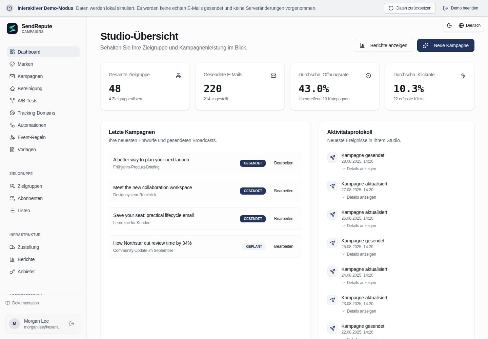

[English](README.md) · [العربية](README.ar.md) · [Français](README.fr.md) · [Русский](README.ru.md) · [Українська](README.uk.md) · [हिन्दी](README.hi.md) · [Deutsch](README.de.md) · [Español](README.es.md) · [Italiano](README.it.md) · [Português](README.pt.md) · [Bahasa Indonesia](README.id.md) · [Türkçe](README.tr.md) · [简体中文](README.zh.md) · [Tiếng Việt](README.vi.md)

# SendRepute Campaigns

Selbst gehostete Zielgruppen, Kampagnen, Vorlagen, Automatisierungen und Zustellung über den
eigenen Server. Dieses Repository stellt die **kompilierte Laufzeitumgebung** bereit, nicht das vollständige
Quellcode-Monorepo.



Probieren Sie die [interaktive Demo](https://www.sendrepute.com/campaigns/?demo=true) aus
(keine echten Nachrichten, keine gehosteten Builder oder kostenpflichtigen Ergebnisse).

<a id="quickstart-fresh-ubuntu-24042604"></a>

## Schnellstart: Frisches Ubuntu 24.04/26.04

Führen Sie auf einem **neuen Server ohne bestehende Campaigns-Installation** Folgendes aus:

```sh
sudo apt-get update
sudo apt-get install -y git
git clone https://github.com/sendrepute/sendrepute-campaigns.git
cd sendrepute-campaigns
./setup.sh
```

Das Setup fragt den gewünschten Zugriffsmodus ab und nutzt eine vorhandene Docker/Compose-Installation; auf einem
frischen, unterstützten Ubuntu-Server ohne Docker fordert es zur Zustimmung auf, die entsprechenden
Ubuntu-Pakete zu installieren. Es entfernt kein Snap-Docker und umgeht AppArmor nicht. Klonen Sie nicht
einfach über eine bestehende Installation; siehe [Update](#update).

**CAMPAIGNS READY FOR OWNER SETUP** bedeutet, dass die App in ihrem
Container fehlerfrei läuft, jedoch nicht, dass die Einrichtung durch den Eigentümer abgeschlossen oder öffentliches HTTPS verifiziert wurde.
Für HTTPS rufen Sie zunächst die angegebene Installationsseite aus einem anderen Netzwerk auf:
Diese muss ein gültiges, vertrauenswürdiges Zertifikat ohne Browserwarnungen aufweisen. Wenn das
Zertifikat noch aussteht oder ungültig ist, geben Sie **keine** vertraulichen Daten ein.

Für einen neuen Eigentümer ist das Einmal-Token **erforderlich**, nicht optional. Sobald der von Ihnen
gewählte Zugriff bereitsteht, führen Sie auf dem VPS **im Projektverzeichnis** Folgendes aus:

```sh
sudo docker compose exec campaigns cat /var/lib/sendrepute-campaigns/installer-token
```

Lassen Sie `sudo` weg, falls Ihr Docker-Konto dies nicht erfordert. Kopieren Sie die Ausgabe des Befehls
und fügen Sie diese auf der angezeigten Installationsseite in das Feld **Setup token** ein.
Füllen Sie die Eigentümerdaten und die zugehörige Public URL, die auf `/campaigns/` endet, aus
und schließen Sie dann die SendRepute-Aktivierung sowie die Einrichtung des Eigentümers im Assistenten ab. Das Setup gibt
das Token **nicht** automatisch aus. Hängen Sie es niemals an eine URL an und geben Sie es nicht weiter; halten Sie
das Token, `.env` und die Protokolle stets geheim. Ein bereits installierter Workspace benötigt
kein weiteres Setup-Token.

<a id="choose-access"></a>

## Zugriffsart auswählen

- **HTTPS-Domain (empfohlen):** Das Setup startet den mitgelieferten Caddy-Proxy.
  Geben Sie eine Subdomain ein, die Sie kontrollieren, zum Beispiel `campaigns.example.com` (durch
  Ihre eigene ersetzen), **ohne Schema, Port oder Pfad**. Leiten Sie den DNS-Eintrag
  `A` dieses Hostnamens auf diesen Server, lassen Sie TCP 80/443 zu und überprüfen Sie
  das vertrauenswürdige Zertifikat von extern. Verwenden Sie `AAAA` nur bei funktionierendem IPv6.
- **Lokal / SSH-Tunnel:** Bindet die App an das Loopback-Interface des VPS. Greifen Sie über einen
  vertrauenswürdigen SSH-Tunnel von Ihrem Computer darauf zu; `localhost` auf Ihrem Laptop ist nicht
  der VPS.
- **Öffentliche IP + HTTP:** Erfordert ausdrückliche Zustimmung zum unverschlüsselten Zugriff über Port 8080.
  Passwörter, Token und Sitzungen können abgefangen werden; **nicht für den sicheren
  Produktivbetrieb geeignet**.

Siehe [Kochbuch für Setup-Befehle](docs/install.md#guided-setup-command-cookbook)
für genaue Befehle, Optionen, lokales SSH-Tunneling, Diagnose und Warnhinweise.

<a id="moving-from-http-to-https"></a>

## Wechsel von HTTP zu HTTPS

Erstellen Sie zunächst ein Backup. Leiten Sie **Ihren tatsächlichen Hostnamen** auf den VPS, geben Sie TCP 80/443 frei
und vergewissern Sie sich, dass das DNS funktioniert. Führen Sie auf dem VPS im **bestehenden** Projektverzeichnis Folgendes aus:

```sh
./setup.sh --mode https --host campaigns.sendrepute.com
```

Ersetzen Sie `campaigns.sendrepute.com` durch Ihren Hostnamen (`campaign` und
`campaigns` sind unterschiedliche DNS-Namen). Bestätigen Sie bei Aufforderung die Änderung der Zugriffsart;
das Setup startet Caddy, überschreibt jedoch nicht die gespeicherte Public URL des installierten Workspaces.
Nachdem Sie HTTPS extern verifiziert haben, ändern Sie diese URL in den **Workspace
Settings** auf `https://YOUR_HOSTNAME/campaigns/`. Falls Sie Cloudflare nutzen, verwenden Sie
**Full (strict)**, niemals Flexible. Beachten Sie die
[Migrationsschritte](docs/install.md#migrate-an-installed-public-ip-http-workspace-to-https),
bevor Sie Änderungen an einer Live-Installation vornehmen.

<a id="download-v0141"></a>

## Download v0.1.41

Administratoren können in den Workspace Settings nach stabilen GitHub-Releases suchen. Offizielle, versionierte Release-Archive und SHA-256-Prüfsummen als Anhänge werden bevorzugt. Sollten diese erwarteten Anhänge fehlen, kann die Update-Prüfung stattdessen denselben stabilen Release-Tag im offiziellen Repository auf dessen unveränderlichen Commit auflösen und das daran gebundene `downloads/`-Prüfsummen-Manifest validieren. Download-Links aus dem Repository sind stets an diesen Commit gebunden, nicht an einen verschiebbaren Tag oder Branch. Ungültige oder doppelt vorhandene erwartete Anhänge lassen diesen Fallback niemals zu. Die Settings zeigen einen Update-Hinweis, Download- und Prüfsummen-Links sowie den dokumentierten Befehl für ein manuelles Server-Update eines bestehenden Git-Klons an. Die Anwendung wird niemals selbstständig einen Download installieren, entpacken oder ausführen. Erstellen Sie zunächst ein Backup der Installation und folgen Sie anschließend dem Upgrade- und Neustart-Prozess für Betreiber. Bei Archiv-Installationen müssen die separaten Anweisungen für Archiv-Upgrades befolgt und die heruntergeladenen Bytes anhand der Prüfsummen verifiziert werden. GitHub-Fehler, fehlende oder fehlerhafte Veröffentlichungs-Metadaten sowie unbekannte installierte Versionen werden als nicht verfügbar gemeldet, niemals als aktuell. Neue Release-Archive enthalten die Metadaten ihrer installierten Version; ältere Installationen ohne diese Metadaten können nicht als aktuell gelten. Die Veröffentlichung von Releases und die Erstellung von Prüfsummen sind separate Betreiberschritte und werden nicht von der Anwendung durchgeführt.

Bevorzugen Sie ein versioniertes Archiv? Laden Sie die [ZIP](https://github.com/sendrepute/sendrepute-campaigns/raw/refs/tags/v0.1.41/downloads/sendrepute-campaigns-0.1.41.zip)
oder [tar.gz](https://github.com/sendrepute/sendrepute-campaigns/raw/refs/tags/v0.1.41/downloads/sendrepute-campaigns-0.1.41.tar.gz) herunter,
verifizieren Sie die [SHA-256-Prüfsummen](https://github.com/sendrepute/sendrepute-campaigns/blob/v0.1.41/downloads/sendrepute-campaigns-0.1.41-SHA256SUMS),
entpacken Sie das Archiv und führen Sie dort `./setup.sh` aus. Es handelt sich hierbei um Repository-Downloads, **nicht**
um binäre GitHub-Release-Anhänge; **Code → Download ZIP** ist ein anderer
Snapshot. Beachten Sie die [v0.1.41 Release Notes](https://github.com/sendrepute/sendrepute-campaigns/releases/tag/v0.1.41).

<a id="additional-tracking-hostnames"></a>

## Zusätzliche Tracking-Hostnamen

Sobald die mitgelieferte HTTPS/Caddy-Installation läuft, öffnen Sie **Domains**,
erstellen Sie eine Hostname-Challenge, fügen Sie deren A/AAAA-Eintrag (der auf diesen Server verweist) sowie
den exakt angezeigten TXT-Eigentumsnachweis hinzu und klicken Sie dann auf **Check DNS and verify**.
Campaigns fügt den verifizierten Hostnamen automatisch demselben verwalteten Proxy hinzu
und verwendet das primäre Zertifikat wieder, sofern dessen SAN diesen Hostnamen abdeckt; andernfalls
wird ein automatisches Zertifikat angefordert. Wiederholen Sie den Vorgang für weitere Hostnamen; es sind weder Shell-Befehle
noch Proxy-Anpassungen pro Domain erforderlich, und die Einstellungen des primären Installations-Hostnamens
sowie des Zertifikats bleiben unverändert. Wählen Sie den gewünschten verifizierten
Hostnamen unabhängig davon im Dropdown-Menü **Tracking domain** jeder Kampagne aus.

DNS-Genehmigung, geladene Proxy-Konfiguration und funktionierendes öffentliches HTTPS werden
separat angezeigt. Das Laden einer Konfiguration ist kein Beweis für eine ACME-Ausstellung oder öffentliche
Erreichbarkeit. Abgedeckte Origin CA-Namen setzen Cloudflare-Proxying voraus und werden
von Browsern nicht direkt als vertrauenswürdig eingestuft. DNS und die Ports 80/443 müssen den bestehenden Proxy erreichen; Cloudflare
muss ACME zulassen und auf **Full (strict)** eingestellt bleiben. Externe Proxys/Tunnel erfordern
eine Konfiguration durch den Betreiber. Wenn der verwaltete Proxy nicht läuft oder der primäre
Hostname fehlt, bleiben neue Hostnamen in der Warteschlange, bis dieses Problem auf Installationsebene
behoben ist. Es findet kein unsicherer SSL-Fallback statt.

Zuvor genehmigte Routen bleiben erhalten, selbst wenn eine auswählbare Domain gelöscht
oder deren Challenge rotiert wird. Dadurch werden bereits zugestellte Links nicht heimlich ungültig.
Stellen Sie sicher, dass deren DNS und Zertifikatserneuerung weiterhin verfügbar bleiben. Bewahren Sie das PostgreSQL-
Genehmigungs-Ledger und die HTTPS/Caddy-Volumes bei Upgrades oder Backups auf. Bei Installationen mit manuellem Primärzertifikat
kann es während eines kontrollierten reinen Caddy-Updates/-Neustarts zu einer kurzen Unterbrechung der Verbindungen kommen. In der enthaltenen `SMTP-TRACKING.md`
finden Sie Statusdefinitionen, Informationen zur Beibehaltung historischer Links sowie Grenzwerte für Fehler und erneute Versuche.

<a id="update"></a>

## Update

Erstellen Sie zuerst ein Backup; siehe [Backup](#back-up).
Überprüfen Sie auf dem VPS **innerhalb Ihres bestehenden Git-Klons** (kein frischer Klon) die
lokalen Änderungen und führen Sie dann Folgendes aus:

```sh
git status --short
git pull --ff-only && ./setup.sh --mode resume
```

`resume` bewahrt den bestehenden Zugriffsmodus einschließlich HTTPS. Falls Pull verweigert wird,
lösen Sie Konflikte auf, anstatt einen erzwungenen Reset durchzuführen. Behalten Sie `.env`, dasselbe Compose-
Projekt, die PostgreSQL- und Anwendungs-Volumes sowie den Verschlüsselungsschlüssel bei. Führen Sie niemals
`docker compose down -v` bei echten Daten aus. Verwenden Sie für Archiv-Upgrades die
[Upgrade-Anweisungen](docs/operations.md#upgrade) und klonen Sie nicht einfach über die
bestehende Installation.

<a id="back-up"></a>

## Backup

Sichern Sie die vollständige PostgreSQL-Datenbank, die Anwendungsdaten samt Verschlüsselungsschlüssel,
die private `.env` und den HTTPS/Caddy-Status. Befolgen Sie die
[vollständigen Docker-Backup-Befehle](docs/operations.md#docker-infrastructure-backup)
und bewahren Sie anschließend verschlüsselte, zugriffskontrollierte Off-Host-Kopien auf. Ein In-App-JSON-Export
ist kein Infrastruktur-Backup und enthält nicht das beibehaltene HTTPS-Genehmigungs-Ledger,
einschließlich der genehmigten Hostnamen, deren auswählbare Domain-Einträge gelöscht wurden.

Für **optional geplante**, verschlüsselte Off-Host-Backups verwenden Sie die beiliegenden
`backup.sh`, `backup.conf.example` und systemd-Beispiele. Das Setup plant oder aktiviert
hiervon nichts automatisch. Installieren Sie `age` und konfigurieren Sie ein bestehendes, als Off-Host eingebundenes
Verzeichnis oder ein restriktives SFTP-Ziel. Lassen Sie beide Age-Einstellungen leer:
Das erste interaktive Backup erstellt die Wiederherstellungsdatei automatisch und fordert Sie auf,
eine separate, sichere Kopie davon zu speichern, bevor Sie fortfahren. Spätere Backups verwenden diese Datei wieder;
es gibt keine Befehle zur Schlüsselgenerierung oder Public-Key-Werte, die in die Konfiguration kopiert werden müssten.
Der Host behält eine geschützte Kopie zur Verifizierung jedes Backups. Speichern Sie Ihre
unabhängige Wiederherstellungskopie niemals direkt neben den verschlüsselten Backup-Archiven.
Siehe [automatisierte Backups](docs/operations.md#opt-in-encrypted-scheduled-backups)
für Voraussetzungen, sichere Aktivierung, Verifizierung und Wiederherstellung. Im Installationsverzeichnis
zeigt `./backup.sh status` den letzten Versuch, den letzten Erfolg und das Archiv an;
dies bleibt auch dann lesbar, wenn die Age-Identität oder die Backup-Tools nicht verfügbar sind, vorausgesetzt,
die private Betreiberkonfiguration und die lokale Spool-/Statusdatei sind intakt.
`./backup.sh verify /private/path/archive.tar.age` prüft die Entschlüsselung, das Manifest und
das PostgreSQL-Format, ohne dabei Daten wiederherzustellen.

<a id="restore"></a>

## Wiederherstellung

Führen Sie eine Wiederherstellung nur aus einem verifizierten, zusammenpassenden Backup der PostgreSQL-Datenbank **und** des Daten-Volumes durch;
der In-App-JSON-Export klammert Zustellungsjobs, Audit-Ereignisse und weiteren Laufzeitstatus aus.
Das Wiederherstellen kann neuere Daten überschreiben oder den Versand von E-Mails in der Warteschlange fortsetzen. Befolgen Sie die
[isolierten Schritte zur Wiederherstellung](docs/operations.md#restore-to-an-empty-isolated-installation)
vor jeder Umstellung im Produktivbetrieb.

<a id="more-information"></a>

## Weitere Informationen

- [Installations- und Setup-Befehle](docs/install.md) — Alle Flags, HTTPS/HTTP,
  manuelle Docker- oder Node.js-Pfade, Token und Fehlerbehebung.
- [Betrieb, Backup und Wiederherstellung](docs/operations.md) — Upgrades und Recovery.
- [Sicherheit und Zustellbarkeit](docs/security-and-deliverability.md) — SMTP,
  SPF/DKIM/DMARC, Zustimmung und Produktionsprüfungen.
- [Standalone-Server-Vertrag](docs/server-contract.md) — Integrationsdetails.

Die Aktivierung validiert einen separat ausgestellten SendRepute-API-Schlüssel; **für die Aktivierung ist keine Einzahlung
erforderlich** und die lokale Verwaltung ist kostenlos. Die optionale, gehostete KI
und Klassifizierung erfordern eine eigene Berechtigung oder eigenes Guthaben sowie eine ausdrückliche Preisbestätigung;
die Demo-KI generiert keine kostenpflichtigen Ergebnisse. Der Versand erfolgt von **Ihrem
Server zu dem von Ihnen konfigurierten SMTP-Relay/-Anbieter**, nicht über einen zentralen SendRepute-
SMTP-Proxy.

<a id="release-boundary"></a>

## Release-Umfang

Das Release beinhaltet den kompilierten Browser, den Server, die Zustellungs- und Kunden-API-Bridge,
das öffentliche Kunden-SDK, Migrationen und die Dokumentation. Es schließt die Hauptwebsite von
SendRepute und den Scanner, Datenbankinhalte, Secrets, Source Maps, Tests
und die Entwicklungs-Toolchain aus. Lizenzbedingungen von Komponenten und Drittanbietern behalten ihre
Gültigkeit; das Selbst-Hosting gewährt keine Hosted-Service-Lizenz oder Garantie für die Platzierung im Posteingang.
