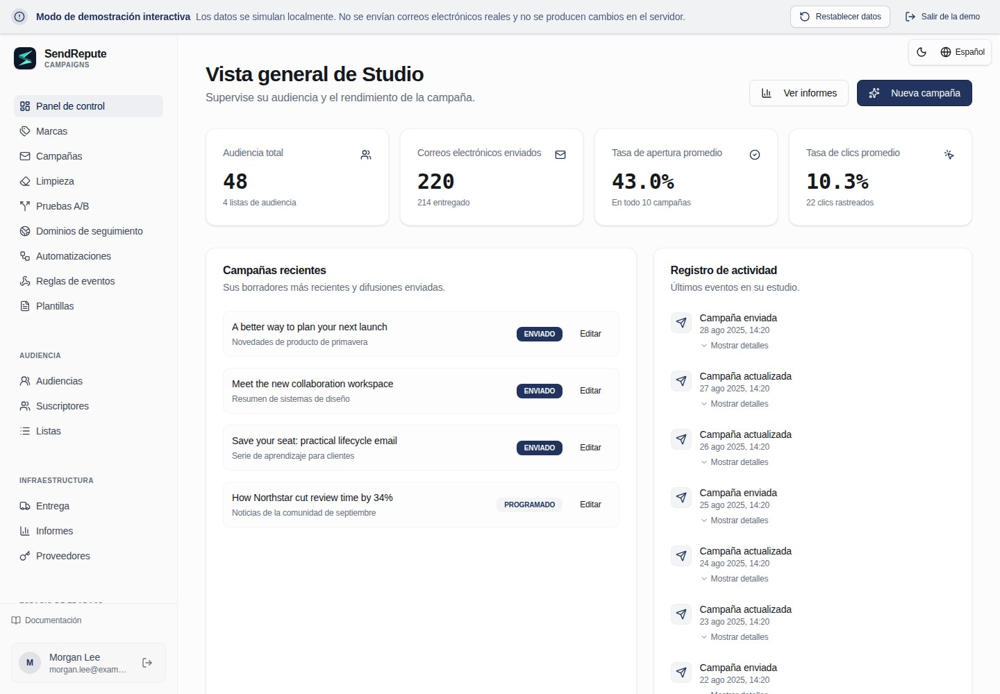

[English](README.md) · [العربية](README.ar.md) · [Français](README.fr.md) · [Русский](README.ru.md) · [Українська](README.uk.md) · [हिन्दी](README.hi.md) · [Deutsch](README.de.md) · [Español](README.es.md) · [Italiano](README.it.md) · [Português](README.pt.md) · [Bahasa Indonesia](README.id.md) · [Türkçe](README.tr.md) · [简体中文](README.zh.md) · [Tiếng Việt](README.vi.md)

# SendRepute Campaigns

Audiencias, campañas, plantillas, automatizaciones y envíos autoalojados desde su propio servidor. Este repositorio distribuye el **entorno de ejecución compilado**, no el monorepositorio completo del código fuente.



Pruebe la [demostración interactiva](https://www.sendrepute.com/campaigns/?demo=true)
(sin mensajes reales, constructores alojados ni resultados de pago).

<a id="quickstart-fresh-ubuntu-24042604"></a>

## Inicio rápido: instalación limpia de Ubuntu 24.04/26.04

En un **servidor nuevo sin una instalación previa de Campaigns**, ejecute:

```sh
sudo apt-get update
sudo apt-get install -y git
git clone https://github.com/sendrepute/sendrepute-campaigns.git
cd sendrepute-campaigns
./setup.sh
```

El programa de instalación pregunta qué modo de acceso utilizar y reutiliza una configuración existente y funcional de Docker/Compose; en un servidor Ubuntu limpio y compatible que no tenga Docker, solicitará su consentimiento para instalar los paquetes de Ubuntu. No elimina Snap Docker ni elude AppArmor. No lo clone sobre una instalación existente; consulte [Actualización](#update).

El estado **CAMPAIGNS READY FOR OWNER SETUP** significa que la aplicación funciona correctamente dentro de su contenedor, no que la configuración del propietario haya concluido o que se haya verificado el HTTPS público.
Si utiliza HTTPS, compruebe primero desde otra red la página de instalación que se muestra:
debe contar con un certificado válido y de confianza, sin advertencias del navegador. Si el
certificado está pendiente o no es válido, **no** introduzca ningún secreto.

Para un nuevo propietario, el token de un solo uso es **obligatorio**, no opcional. Una vez que su
acceso elegido esté listo, ejecute lo siguiente en el VPS **desde el directorio del proyecto**:

```sh
sudo docker compose exec campaigns cat /var/lib/sendrepute-campaigns/installer-token
```

Omita `sudo` si su cuenta de Docker no lo requiere. Copie el resultado del comando
y péguelo en el campo **Setup token** de la página de instalación indicada.
Rellene los datos del propietario y la URL pública correspondiente terminada en `/campaigns/`,
y a continuación complete la activación de SendRepute y la configuración del propietario en el asistente. La instalación
**no** imprime el token de forma automática. Nunca lo incluya en una URL ni lo comparta; mantenga
en privado el token, `.env` y los registros. Un espacio de trabajo ya instalado no
necesita otro token de configuración.

<a id="choose-access"></a>

## Elegir el modo de acceso

- **Dominio HTTPS (recomendado):** el programa de instalación inicia el proxy Caddy incluido.
  Introduzca un subdominio que controle, por ejemplo `campaigns.example.com` (sustitúyalo
  por el suyo), **sin esquema, puerto ni ruta**. Apunte el registro DNS
  `A` de ese nombre de host hacia este servidor, permita el tráfico en los puertos TCP 80/443 y compruebe
  el certificado de confianza de forma externa. Use `AAAA` solo si cuenta con conectividad IPv6 funcional.
- **Local / Túnel SSH:** vincula la aplicación a la interfaz de bucle local (loopback) del VPS. Acceda a ella a través de un
  túnel SSH de confianza desde su ordenador; la dirección `localhost` de su ordenador portátil no corresponde
  al VPS.
- **IP pública + HTTP:** consienta de forma explícita el acceso sin cifrar en el puerto 8080.
  Las contraseñas, los tokens y las sesiones pueden ser interceptados; **no es apto para un
  despliegue seguro en producción**.

Consulte el [recetario de comandos de instalación](docs/install.md#guided-setup-command-cookbook)
para conocer los comandos exactos, las opciones, la creación de túneles SSH locales, los diagnósticos y las advertencias.

<a id="moving-from-http-to-https"></a>

## Migrar de HTTP a HTTPS

Haga una copia de seguridad primero. Apunte **su nombre de host real** al VPS, libere/abra los puertos TCP 80/443
y confirme que el DNS funciona. En el VPS, dentro del directorio **existente** del proyecto:

```sh
./setup.sh --mode https --host campaigns.sendrepute.com
```

Sustituya `campaigns.sendrepute.com` por su nombre de host (`campaign` y
`campaigns` son nombres DNS distintos). Confirme el cambio de exposición cuando se le pregunte;
el programa de instalación inicia Caddy pero no reescribe la URL pública guardada
del espacio de trabajo instalado. Tras verificar el HTTPS externamente, cambie esa URL en **Workspace
Settings** a `https://YOUR_HOSTNAME/campaigns/`. Si utiliza Cloudflare, utilice
**Full (strict)**, nunca Flexible. Consulte los
[pasos de migración](docs/install.md#migrate-an-installed-public-ip-http-workspace-to-https)
antes de cambiar una instalación en producción.

<a id="download-v0141"></a>

## Descargar v0.1.41

Los administradores pueden comprobar las versiones estables de GitHub en Workspace Settings. Se prefieren los archivos adjuntos oficiales de la versión (Release) y la suma de comprobación (checksum) SHA-256. Si no están presentes esos archivos adjuntos esperados, el comprobador puede resolver la misma etiqueta de la versión estable en el repositorio oficial hacia su commit inmutable y validar el manifiesto delimitado de sumas de comprobación `downloads/` de ese commit. Los enlaces de descarga del repositorio están fijados a ese commit, no a una etiqueta o rama móvil. Los archivos adjuntos inválidos o duplicados nunca permiten utilizar esta alternativa. Workspace Settings muestra un aviso de actualización, los enlaces de descarga/suma de comprobación y el comando de actualización manual documentado del servidor para un clon de Git existente; nunca instala, extrae ni ejecuta una descarga. Primero, haga una copia de seguridad de la instalación y luego siga el procedimiento de actualización y reinicio para operadores. Las instalaciones mediante archivos comprimidos deben seguir las instrucciones de actualización por separado y verificar los bytes descargados con las sumas de comprobación. Los fallos de GitHub, los metadatos de publicación ausentes o malformados y las versiones instaladas desconocidas se notifican como no disponibles, nunca como actualizadas. Los archivos de las nuevas versiones incluyen los metadatos de su versión instalada; las instalaciones más antiguas sin estos metadatos no pueden afirmar que están al día. La publicación de la versión y las sumas de comprobación son pasos separados del operador, que no los realiza la aplicación.

¿Prefiere un archivo versionado? Descargue el [ZIP](https://github.com/sendrepute/sendrepute-campaigns/raw/refs/tags/v0.1.41/downloads/sendrepute-campaigns-0.1.41.zip)
o el [tar.gz](https://github.com/sendrepute/sendrepute-campaigns/raw/refs/tags/v0.1.41/downloads/sendrepute-campaigns-0.1.41.tar.gz),
verifique las [sumas de comprobación SHA-256](https://github.com/sendrepute/sendrepute-campaigns/blob/v0.1.41/downloads/sendrepute-campaigns-0.1.41-SHA256SUMS),
extraiga el contenido y ejecute `./setup.sh` allí. Estas son descargas del repositorio, **no**
archivos adjuntos binarios de una Release de GitHub; **Code → Download ZIP** es un snapshot
distinto. Consulte las [notas de la versión v0.1.41](https://github.com/sendrepute/sendrepute-campaigns/releases/tag/v0.1.41).

<a id="additional-tracking-hostnames"></a>

## Nombres de host de seguimiento adicionales

Con la instalación HTTPS/Caddy incluida ya en ejecución, abra **Domains**,
cree un desafío de nombre de host, añada su registro A/AAAA apuntando a este servidor y
el registro TXT exacto de propiedad que se muestra, y luego haga clic en **Check DNS and verify**.
Campaigns añade automáticamente el nombre de host verificado al mismo proxy gestionado
y reutiliza el certificado principal cuando su SAN cubre ese nombre de host; de lo contrario,
solicita un certificado automático. Repita el proceso para varios nombres de host; no se requieren comandos
de shell por dominio ni ediciones del proxy, y los ajustes del certificado y el nombre de host de la
instalación principal no cambian. Elija el nombre de host verificado deseado de forma independiente
en el menú desplegable **Tracking domain** de cada campaña.

La aprobación de DNS, la configuración cargada del proxy y el HTTPS público funcional se muestran
por separado. Cargar una configuración no demuestra la emisión ACME ni la accesibilidad pública.
Los nombres cubiertos por la Origin CA requieren el proxy de Cloudflare y no son directamente
de confianza para el navegador. El DNS y los puertos 80/443 deben llegar al proxy existente; Cloudflare
debe permitir ACME y permanecer en **Full (strict)**. Los proxies/Túneles externos requieren
configuración del operador. Si el proxy gestionado no se está ejecutando o falta el nombre de host
principal, las adiciones permanecen en cola hasta que se resuelva ese problema a nivel de instalación.
No se realiza ninguna alternativa insegura a SSL.

Las rutas previamente aprobadas se conservan cuando se elimina un dominio seleccionable
o se rota su desafío, de modo que los enlaces entregados no se revocan silenciosamente.
Mantenga disponibles sus DNS y la renovación de certificados. Preserve el libro de aprobaciones
de PostgreSQL y los volúmenes de HTTPS/Caddy durante las actualizaciones/copias de seguridad. Las instalaciones con certificado
principal manual pueden interrumpir brevemente las conexiones durante una
actualización/reinicio controlado únicamente de Caddy. Consulte el documento `SMTP-TRACKING.md` empaquetado
para las definiciones de estado, la retención de enlaces históricos y los límites de fallo/reintento.

<a id="update"></a>

## Actualización

Haga una copia de seguridad primero; consulte [Copia de seguridad](#back-up).
En el VPS, **dentro de su clon Git existente** (no un clon nuevo), inspeccione
los cambios locales, luego ejecute:

```sh
git status --short
git pull --ff-only && ./setup.sh --mode resume
```

`resume` preserva el modo de acceso existente, incluyendo HTTPS. Si la operación pull lo rechaza,
concilie las ediciones en lugar de forzar un restablecimiento (force-resetting). Preserve `.env`, el mismo proyecto de Compose,
los volúmenes de PostgreSQL y de la aplicación, y la clave de cifrado. Nunca ejecute
`docker compose down -v` contra datos reales. Para actualizaciones mediante archivos (archives), use las
[instrucciones de actualización](docs/operations.md#upgrade), no un clon nuevo sobre la
instalación.

<a id="back-up"></a>

## Copia de seguridad

Preserve la base de datos PostgreSQL completa, los datos de la aplicación/clave de cifrado,
`.env` privado y el estado de HTTPS/Caddy. Siga los
[comandos completos de copia de seguridad de Docker](docs/operations.md#docker-infrastructure-backup),
luego conserve copias cifradas fuera del servidor (off-host) con control de acceso. Una exportación JSON en la aplicación
no es una copia de seguridad de la infraestructura y omite el libro de aprobaciones de HTTPS retenido,
incluyendo los nombres de host aprobados cuyas filas de dominio seleccionables fueron eliminadas.

Para copias de seguridad cifradas fuera del servidor **programadas y opcionales (opt-in)**, utilice los ejemplos incluidos de
`backup.sh`, `backup.conf.example` y systemd. El programa de instalación no programa
ni habilita nada. Instale `age` y configure un directorio externo montado
existente o un destino SFTP restringido. Deje ambos ajustes de age en blanco:
la primera copia de seguridad interactiva crea su archivo de recuperación automáticamente y le pide
que guarde una copia segura por separado antes de continuar. Las copias de seguridad posteriores lo reutilizan;
no hay comandos de generación de claves ni valores de clave pública para copiar en la configuración.
El host guarda una copia protegida para verificar cada copia de seguridad; nunca almacene su
copia de recuperación independiente junto a los archivos cifrados de la copia de seguridad.
Consulte las [copias de seguridad automatizadas](docs/operations.md#opt-in-encrypted-scheduled-backups)
para los requisitos previos, la activación segura, la verificación y la recuperación. Desde el directorio instalado,
`./backup.sh status` muestra el último intento, el último éxito y el archivo;
sigue siendo legible si la identidad de age o las herramientas de copia de seguridad no están disponibles, siempre y cuando
la configuración privada del operador y el archivo local de spool/estado estén intactos.
`./backup.sh verify /private/path/archive.tar.age` verifica el descifrado, el manifiesto y
el formato de PostgreSQL sin restaurar datos.

<a id="restore"></a>

## Restauración

Restaure únicamente desde una copia de seguridad verificada y coincidente de PostgreSQL **y** del volumen de datos;
la exportación JSON de la aplicación omite los trabajos de envío, los eventos de auditoría y otros estados de ejecución.
Restaurar puede sobrescribir datos más recientes o reanudar el envío de correos en cola. Siga los
[pasos de restauración aislada](docs/operations.md#restore-to-an-empty-isolated-installation)
antes de cualquier transición a producción (cutover).

<a id="more-information"></a>

## Más información

- [Comandos de instalación y configuración](docs/install.md) — todas las banderas (flags), HTTPS/HTTP,
  rutas manuales de Docker o Node.js, token y solución de problemas.
- [Operaciones, copia de seguridad y restauración](docs/operations.md) — actualizaciones y recuperación.
- [Seguridad y entregabilidad](docs/security-and-deliverability.md) — SMTP,
  SPF/DKIM/DMARC, consentimiento y comprobaciones de producción.
- [Contrato de servidor independiente](docs/server-contract.md) — detalles de integración.

La activación valida una clave API de SendRepute emitida por separado; **no se requiere ningún depósito para
la activación**, y la gestión local es gratuita. La IA alojada y la clasificación opcionales requieren su propio
derecho o saldo, y el consentimiento explícito del precio; la IA de demostración no realiza resultados de pago.
La entrega va desde **su
servidor a su proveedor/relay SMTP configurado**, no a un proxy SMTP central de SendRepute.

<a id="release-boundary"></a>

## Alcance de la versión

La versión (release) incluye el navegador compilado, servidor, puente de entrega y API de clientes, SDK público de clientes, migraciones y documentación. Excluye el sitio principal de SendRepute y el escáner, contenidos de bases de datos, secretos, source maps, pruebas
y la cadena de herramientas de desarrollo. Los términos de licencia de los componentes y de terceros siguen
aplicando; el autoalojamiento no otorga ninguna licencia de servicio alojado ni garantía
de colocación en la bandeja de entrada (inbox placement).
