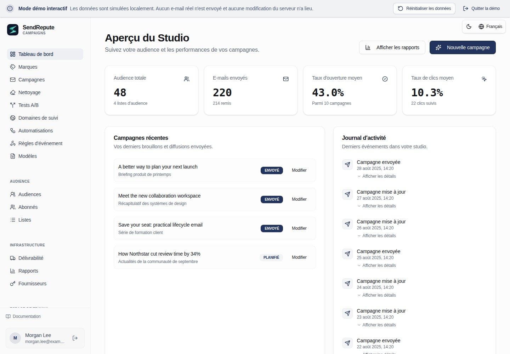

[English](README.md) · [العربية](README.ar.md) · [Français](README.fr.md) · [Русский](README.ru.md) · [Українська](README.uk.md) · [हिन्दी](README.hi.md) · [Deutsch](README.de.md) · [Español](README.es.md) · [Italiano](README.it.md) · [Português](README.pt.md) · [Bahasa Indonesia](README.id.md) · [Türkçe](README.tr.md) · [简体中文](README.zh.md) · [Tiếng Việt](README.vi.md)

# SendRepute Campaigns

Audiences, campagnes, modèles, automatisations et envois auto-hébergés depuis votre
propre serveur. Ce dépôt distribue l'**environnement d'exécution compilé**, et non le
monorepo complet du code source.



Essayez la [démo interactive](https://www.sendrepute.com/campaigns/?demo=true)
(sans messages réels, constructeurs hébergés ni résultats payants).

<a id="quickstart-fresh-ubuntu-24042604"></a>

## Démarrage rapide : Ubuntu 24.04/26.04 vierge

Sur un **nouveau serveur sans installation existante de Campaigns**, exécutez :

```sh
sudo apt-get update
sudo apt-get install -y git
git clone https://github.com/sendrepute/sendrepute-campaigns.git
cd sendrepute-campaigns
./setup.sh
```

L'installation demande quel mode d'accès utiliser et réutilise une configuration fonctionnelle de Docker/Compose ; sur un
nouveau serveur Ubuntu pris en charge et dépourvu de Docker, elle demande le consentement pour installer
les paquets Ubuntu. Elle ne supprime pas Snap Docker et ne contourne pas AppArmor. Ne clonez pas
par-dessus une installation existante ; consultez la section [Mise à jour](#update).

**CAMPAIGNS READY FOR OWNER SETUP** signifie que l'application est saine dans son
conteneur, et non que la configuration par le propriétaire est terminée ou que le HTTPS public a été vérifié.
Pour le HTTPS, vérifiez d'abord la page d'installation affichée depuis un autre réseau :
elle doit présenter un certificat valide et de confiance, sans avertissement du navigateur. Si le
certificat est en attente ou invalide, ne saisissez **aucun** secret.

Pour un nouveau propriétaire, le jeton à usage unique est **requis**, et non facultatif. Une fois que l'accès de votre
choix est prêt, exécutez ceci sur le VPS **depuis le répertoire du projet** :

```sh
sudo docker compose exec campaigns cat /var/lib/sendrepute-campaigns/installer-token
```

Omettez `sudo` si votre compte Docker ne l'exige pas. Copiez la sortie de la commande
et collez-la dans le champ **Setup token** de la page d'installation affichée.
Renseignez les détails du propriétaire et l'URL publique correspondante se terminant par `/campaigns/`,
puis terminez l'activation de SendRepute et la configuration du propriétaire dans l'assistant. L'installation n'affiche
**pas** le jeton automatiquement. Ne l'insérez jamais dans une URL et ne le partagez pas ; gardez
le jeton, `.env` et les journaux privés. Un espace de travail déjà installé ne nécessite
pas d'autre jeton de configuration.

<a id="choose-access"></a>

## Choix de l'accès

- **Domaine HTTPS (recommandé) :** l'installation démarre le proxy Caddy inclus.
  Saisissez un sous-domaine que vous contrôlez, par exemple `campaigns.example.com` (remplacez
  par le vôtre), **sans schéma, port ou chemin**. Faites pointer l'enregistrement DNS
  `A` de ce nom d'hôte vers ce serveur, autorisez le trafic TCP 80/443 et vérifiez
  le certificat de confiance en externe. N'utilisez `AAAA` qu'avec une connectivité IPv6 fonctionnelle.
- **Local / Tunnel SSH :** lie l'application à la boucle locale du VPS. Accédez-y via un
  tunnel SSH de confiance depuis votre ordinateur ; le `localhost` de votre ordinateur portable n'est pas
  celui du VPS.
- **IP publique + HTTP :** consentez explicitement à un accès non chiffré sur le port 8080.
  Les mots de passe, jetons et sessions peuvent être interceptés ; **ne convient pas à un déploiement
  sécurisé en production**.

Consultez le [recueil des commandes d'installation](docs/install.md#guided-setup-command-cookbook)
pour connaître les commandes exactes, les options, la configuration d'un tunnel SSH local, les diagnostics et les avertissements.

<a id="moving-from-http-to-https"></a>

## Passage de HTTP à HTTPS

Effectuez d'abord une sauvegarde. Faites pointer **votre véritable nom d'hôte** vers le VPS, libérez/ouvrez les ports TCP 80/443
et confirmez que son DNS fonctionne. Sur le VPS, dans le répertoire **existant** du projet :

```sh
./setup.sh --mode https --host campaigns.sendrepute.com
```

Remplacez `campaigns.sendrepute.com` par votre nom d'hôte (`campaign` et
`campaigns` sont des noms DNS différents). Confirmez le changement d'exposition à l'invite ;
l'installation démarre Caddy mais ne réécrit pas l'URL publique enregistrée de l'espace de travail installé.
Après avoir vérifié le HTTPS en externe, remplacez cette URL dans **Workspace
Settings** par `https://YOUR_HOSTNAME/campaigns/`. Si vous utilisez Cloudflare, utilisez
**Full (strict)**, jamais Flexible. Consultez les
[étapes de migration](docs/install.md#migrate-an-installed-public-ip-http-workspace-to-https)
avant de modifier une installation en production.

<a id="download-v0141"></a>

## Téléchargement de la v0.1.41

Les administrateurs peuvent vérifier la disponibilité des versions stables GitHub dans Workspace Settings. Les archives officielles de Release versionnées et les pièces jointes de sommes de contrôle SHA-256 sont privilégiées. Si ces pièces jointes attendues sont absentes, le vérificateur peut à la place résoudre le même tag de version stable dans le dépôt officiel vers son commit immuable et valider le manifeste de sommes de contrôle `downloads/` lié à ce commit. Les liens de téléchargement du dépôt sont épinglés à ce commit, et non à un tag ou une branche mobile. Des pièces jointes attendues invalides ou en double ne permettent jamais cette solution de repli. Les paramètres affichent une notification de mise à jour, les liens de téléchargement/sommes de contrôle et la commande manuelle documentée de mise à jour du serveur pour un clone Git existant ; ils n'installent, n'extraient ni n'exécutent jamais un téléchargement. Sauvegardez d'abord l'installation, puis suivez la procédure de mise à niveau et de redémarrage de l'opérateur. Les installations à partir d'archives doivent suivre les instructions distinctes de mise à niveau par archive et vérifier les octets téléchargés avec les sommes de contrôle. Les défaillances de GitHub, les métadonnées de publication absentes ou mal formées, et les versions installées inconnues sont signalées comme indisponibles, jamais comme à jour. Les nouvelles archives de Release incluent les métadonnées de leur version installée ; les installations plus anciennes dépourvues de ces métadonnées ne peuvent pas prétendre être à jour. La publication des versions et les sommes de contrôle sont des étapes distinctes de l'opérateur, non effectuées par l'application.

Vous préférez une archive versionnée ? Téléchargez le [ZIP](https://github.com/sendrepute/sendrepute-campaigns/raw/refs/tags/v0.1.41/downloads/sendrepute-campaigns-0.1.41.zip)
ou le [tar.gz](https://github.com/sendrepute/sendrepute-campaigns/raw/refs/tags/v0.1.41/downloads/sendrepute-campaigns-0.1.41.tar.gz),
vérifiez les [sommes de contrôle SHA-256](https://github.com/sendrepute/sendrepute-campaigns/blob/v0.1.41/downloads/sendrepute-campaigns-0.1.41-SHA256SUMS),
extrayez le contenu, et exécutez-y `./setup.sh`. Il s'agit de téléchargements du dépôt, et **non**
de pièces jointes binaires GitHub Release ; **Code → Download ZIP** est un instantané
différent. Consultez les [notes de version de la v0.1.41](https://github.com/sendrepute/sendrepute-campaigns/releases/tag/v0.1.41).

<a id="additional-tracking-hostnames"></a>

## Noms d'hôte de suivi supplémentaires

Avec l'installation HTTPS/Caddy incluse déjà en cours d'exécution, ouvrez **Domains**,
créez un défi de nom d'hôte, ajoutez son enregistrement A/AAAA pointant vers ce serveur et
l'enregistrement de propriété TXT affiché exact, puis cliquez sur **Check DNS and verify**.
Campaigns ajoute automatiquement le nom d'hôte vérifié au même proxy géré
et réutilise le certificat principal si son SAN couvre ce nom d'hôte, sinon
il demande un certificat automatique. Répétez l'opération pour plusieurs noms d'hôte ; aucune commande shell
par domaine ni modification du proxy n'est requise, et les paramètres du nom d'hôte et du certificat de
l'installation principale restent inchangés. Choisissez le nom d'hôte vérifié souhaité de manière
indépendante dans le menu déroulant **Tracking domain** de chaque campagne.

L'approbation DNS, la configuration du proxy chargée et le bon fonctionnement du HTTPS public sont affichés
séparément. Le chargement d'une configuration ne prouve pas l'émission ACME ni l'accessibilité
publique. Les noms couverts par un Origin CA nécessitent un proxy Cloudflare et ne sont pas
directement reconnus comme fiables par les navigateurs. Le DNS et les ports 80/443 doivent atteindre le proxy existant ; Cloudflare
doit autoriser ACME et rester en **Full (strict)**. Les proxys/tunnels externes nécessitent
une configuration par l'opérateur. Si le proxy géré n'est pas en cours d'exécution ou s'il manque le nom d'hôte
principal, les ajouts restent en file d'attente jusqu'à ce que ce problème au niveau de l'installation soit résolu. Aucun repli SSL non sécurisé n'est effectué.

Les routes précédemment approuvées sont conservées lorsqu'un domaine sélectionnable est supprimé
ou que son défi est renouvelé, de sorte que les liens distribués ne sont pas révoqués silencieusement.
Maintenez leur DNS et le renouvellement des certificats disponibles. Préservez le registre d'approbation PostgreSQL
et les volumes HTTPS/Caddy lors des mises à niveau/sauvegardes. Les installations avec un certificat
principal manuel peuvent brièvement interrompre les connexions lors d'une
mise à jour/redémarrage contrôlé exclusif à Caddy. Consultez le `SMTP-TRACKING.md` inclus
pour les définitions d'état, la conservation des liens historiques et les limites d'échec/réessai.

<a id="update"></a>

## Mise à jour

Effectuez d'abord une sauvegarde ; consultez la section [Sauvegarde](#back-up).
Sur le VPS, **à l'intérieur de votre clone Git existant** (et non un nouveau clone), inspectez
les modifications locales, puis exécutez :

```sh
git status --short
git pull --ff-only && ./setup.sh --mode resume
```

`resume` préserve le mode d'accès existant, y compris le HTTPS. Si le pull refuse,
réconciliez les modifications plutôt que de forcer la réinitialisation. Conservez `.env`, le même projet Compose,
les volumes PostgreSQL et applicatifs, et la clé de chiffrement. N'exécutez jamais
`docker compose down -v` sur des données réelles. Pour les mises à niveau d'archives, utilisez les
[instructions de mise à niveau](docs/operations.md#upgrade), et non un nouveau clone par-dessus
l'installation.

<a id="back-up"></a>

## Sauvegarde

Préservez l'intégralité de la base de données PostgreSQL, les données de l'application/la clé de chiffrement,
le `.env` privé et l'état HTTPS/Caddy. Suivez les
[commandes complètes de sauvegarde Docker](docs/operations.md#docker-infrastructure-backup),
puis conservez des copies chiffrées hors hôte à accès contrôlé. Un export JSON dans l'application
n'est pas une sauvegarde d'infrastructure et omet le registre d'approbation HTTPS conservé,
y compris les noms d'hôte approuvés dont les lignes de domaine sélectionnables ont été supprimées.

Pour des sauvegardes chiffrées hors hôte **planifiées explicitement**, utilisez les exemples inclus
`backup.sh`, `backup.conf.example` et systemd. L'installation ne planifie
ni n'active rien. Installez `age` et configurez un répertoire monté existant hors hôte
ou une destination SFTP restreinte. Laissez les deux paramètres age vides :
la première sauvegarde interactive crée automatiquement son fichier de récupération et vous demande
d'en enregistrer une copie sûre distincte avant de poursuivre. Les sauvegardes ultérieures le réutilisent ;
il n'y a pas de commandes de génération de clé ni de valeurs de clé publique à copier dans la configuration.
L'hôte conserve une copie protégée pour vérifier chaque sauvegarde ; ne stockez jamais votre
copie de récupération indépendante à côté des archives de sauvegarde chiffrées.
Consultez les [sauvegardes automatisées](docs/operations.md#opt-in-encrypted-scheduled-backups)
pour les prérequis, l'activation sécurisée, la vérification et la récupération. Depuis le répertoire
installé, `./backup.sh status` affiche la dernière tentative, le dernier succès et l'archive ;
il reste lisible si l'identité age ou les outils de sauvegarde sont indisponibles, à condition
que la configuration privée appartenant à l'opérateur et le fichier de statut/spool local soient intacts.
`./backup.sh verify /private/path/archive.tar.age` vérifie le déchiffrement, le manifeste et le
format PostgreSQL sans restaurer les données.

<a id="restore"></a>

## Restauration

Ne restaurez qu'à partir d'une sauvegarde vérifiée et correspondante de PostgreSQL **et** du volume de données ;
l'export JSON dans l'application omet les tâches d'envoi, les événements d'audit et d'autres états
d'exécution. La restauration peut écraser des données plus récentes ou reprendre des courriels en file d'attente. Suivez les
[étapes de restauration isolée](docs/operations.md#restore-to-an-empty-isolated-installation)
avant tout basculement en production.

<a id="more-information"></a>

## Plus d'informations

- [Commandes d'installation et de configuration](docs/install.md) — toutes les options, HTTPS/HTTP,
  chemins Docker ou Node.js manuels, jeton et dépannage.
- [Opérations, sauvegarde et restauration](docs/operations.md) — mises à niveau et récupération.
- [Sécurité et délivrabilité](docs/security-and-deliverability.md) — SMTP,
  SPF/DKIM/DMARC, consentement et vérifications de production.
- [Contrat du serveur autonome](docs/server-contract.md) — détails de l'intégration.

L'activation valide une clé d'API SendRepute émise séparément ; **aucun dépôt n'est
requis pour l'activation**, et la gestion locale est gratuite. L'IA hébergée et la classification en option
nécessitent leur propre droit ou crédit et un consentement de prix explicite ; l'IA de démonstration n'effectue pas de résultats payants. L'envoi s'effectue depuis **votre
serveur vers votre relais/fournisseur SMTP configuré**, et non par l'intermédiaire d'un proxy SMTP
central SendRepute.

<a id="release-boundary"></a>

## Périmètre de la version

La version inclut le navigateur compilé, le serveur, la livraison et le pont de l'API client,
le SDK client public, les migrations et la documentation. Elle exclut le site principal
et le scanner SendRepute, le contenu de la base de données, les secrets, les source maps, les tests
et la chaîne d'outils de développement. Les conditions de licence des composants et des tiers s'appliquent
toujours ; l'auto-hébergement n'accorde aucune licence de service hébergé ou de garantie de placement en boîte de réception.
