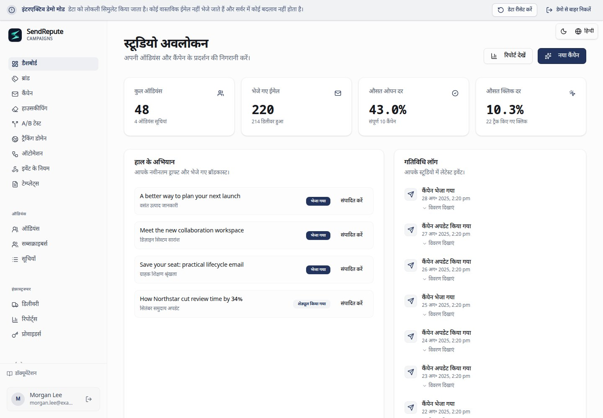

[English](README.md) · [العربية](README.ar.md) · [Français](README.fr.md) · [Русский](README.ru.md) · [Українська](README.uk.md) · [हिन्दी](README.hi.md) · [Deutsch](README.de.md) · [Español](README.es.md) · [Italiano](README.it.md) · [Português](README.pt.md) · [Bahasa Indonesia](README.id.md) · [Türkçe](README.tr.md) · [简体中文](README.zh.md) · [Tiếng Việt](README.vi.md)

# SendRepute Campaigns

अपने स्वयं के सर्वर से सेल्फ-होस्टेड ऑडियंस, कैंपेन, टेम्प्लेट, ऑटोमेशन और डिलीवरी। यह रिपॉजिटरी **compiled runtime** वितरित करती है, न कि संपूर्ण सोर्स मोनोरीपो (source monorepo)।



[इंटरैक्टिव डेमो](https://www.sendrepute.com/campaigns/?demo=true) आज़माएं
(इसमें कोई वास्तविक संदेश, होस्टेड बिल्डर या सशुल्क परिणाम शामिल नहीं हैं)।

<a id="quickstart-fresh-ubuntu-24042604"></a>

## क्विकस्टार्ट: नया Ubuntu 24.04/26.04

एक **नए सर्वर पर जिसमें पहले से Campaigns इंस्टॉल न हो**, यह रन करें:

```sh
sudo apt-get update
sudo apt-get install -y git
git clone https://github.com/sendrepute/sendrepute-campaigns.git
cd sendrepute-campaigns
./setup.sh
```

सेटअप पूछता है कि किस एक्सेस मोड का उपयोग करना है और काम कर रहे Docker/Compose का दोबारा उपयोग करता है; बिना Docker वाले एक नए समर्थित Ubuntu सर्वर पर, यह Ubuntu के पैकेज इंस्टॉल करने की सहमति मांगता है। यह Snap Docker को नहीं हटाता है या AppArmor को बायपास नहीं करता है। किसी मौजूदा इंस्टॉलेशन के ऊपर क्लोन न करें; [अपडेट](#update) देखें।

**CAMPAIGNS READY FOR OWNER SETUP** का अर्थ है कि ऐप अपने कंटेनर के अंदर सही ढंग से काम कर रहा है, इसका मतलब यह नहीं है कि ओनर सेटअप पूरा हो गया है या पब्लिक HTTPS वेरीफाई हो चुका है। HTTPS के लिए, सबसे पहले किसी दूसरे नेटवर्क से प्रिंट किए गए इंस्टॉलेशन पेज को वेरीफाई करें: इसमें बिना किसी ब्राउज़र चेतावनी के एक मान्य, विश्वसनीय सर्टिफ़िकेट होना चाहिए। यदि सर्टिफ़िकेट पेंडिंग या अमान्य है, तो **कोई भी** गुप्त जानकारी (secrets) दर्ज न करें।

एक नए ओनर के लिए, वन-टाइम टोकन **आवश्यक** है, यह वैकल्पिक नहीं है। आपका चुना गया एक्सेस तैयार हो जाने के बाद, VPS पर **प्रोजेक्ट डायरेक्टरी से** इसे रन करें:

```sh
sudo docker compose exec campaigns cat /var/lib/sendrepute-campaigns/installer-token
```

यदि आपके Docker अकाउंट को इसकी आवश्यकता नहीं है तो `sudo` को छोड़ दें। कमांड आउटपुट को कॉपी करें और इसे प्रिंट किए गए इंस्टॉलेशन पेज पर **Setup token** फ़ील्ड में पेस्ट करें। ओनर का विवरण और `/campaigns/` पर समाप्त होने वाला संबंधित Public URL भरें, फिर विज़ार्ड में SendRepute एक्टिवेशन और ओनर सेटअप पूरा करें। सेटअप स्वचालित रूप से टोकन प्रिंट **नहीं** करता है। इसे कभी भी URL में न डालें या किसी के साथ शेयर न करें; टोकन, `.env` और लॉग्स को प्राइवेट रखें। पहले से इंस्टॉल किए गए वर्कस्पेस को किसी अन्य सेटअप टोकन की आवश्यकता नहीं होती है।

<a id="choose-access"></a>

## एक्सेस चुनें

- **HTTPS domain (अनुशंसित):** सेटअप इसमें शामिल Caddy प्रॉक्सी को शुरू करता है।
  अपने नियंत्रण वाला एक सबडोमेन दर्ज करें, उदाहरण के लिए `campaigns.example.com` (इसे
  अपने डोमेन से बदलें), जिसमें **कोई स्कीम, पोर्ट या पाथ न हो**। उस होस्टनेम के DNS
  `A` रिकॉर्ड को इस सर्वर पर पॉइंट करें, TCP 80/443 की अनुमति दें और
  विश्वसनीय सर्टिफ़िकेट की बाहरी रूप से जांच करें। `AAAA` का उपयोग केवल चालू IPv6 के साथ ही करें।
- **Local / SSH tunnel:** ऐप को VPS लूपबैक से बाइंड करता है। इसे अपने कंप्यूटर से एक
  विश्वसनीय SSH टनल के माध्यम से खोलें; आपके लैपटॉप का `localhost` VPS
  नहीं है।
- **Public IP + HTTP:** पोर्ट 8080 पर अनएन्क्रिप्टेड एक्सेस के लिए स्पष्ट सहमति दें।
  पासवर्ड, टोकन और सेशन बीच में इंटरसेप्ट किए जा सकते हैं; यह **सुरक्षित
  प्रोडक्शन डिप्लॉयमेंट के लिए नहीं है**。

सटीक कमांड, विकल्प, लोकल SSH टनलिंग, डायग्नोस्टिक्स और चेतावनियों के लिए [सेटअप कमांड कुकबुक](docs/install.md#guided-setup-command-cookbook)
देखें।

<a id="moving-from-http-to-https"></a>

## HTTP से HTTPS पर माइग्रेट करना

सबसे पहले बैकअप लें। **अपने वास्तविक होस्टनेम** को VPS पर पॉइंट करें, TCP 80/443 को फ़्री/ओपन करें
और पुष्टि करें कि इसका DNS काम कर रहा है। VPS पर, **मौजूदा** प्रोजेक्ट डायरेक्टरी में:

```sh
./setup.sh --mode https --host campaigns.sendrepute.com
```

`campaigns.sendrepute.com` को अपने होस्टनेम से बदलें (`campaign` और
`campaigns` अलग-अलग DNS नाम हैं)। पूछे जाने पर एक्सपोज़र बदलाव की पुष्टि करें;
सेटअप Caddy शुरू करता है लेकिन इंस्टॉल किए गए वर्कस्पेस के सहेजे गए Public
URL को फिर से नहीं लिखता (rewrite) है। बाहरी रूप से HTTPS को वेरीफाई करने के बाद, **Workspace
Settings** में उस URL को बदलकर `https://YOUR_HOSTNAME/campaigns/` कर दें। यदि Cloudflare का उपयोग कर रहे हैं, तो
**Full (strict)** का उपयोग करें, Flexible का कभी नहीं। किसी चालू (live) इंस्टॉलेशन को बदलने से पहले
[माइग्रेशन स्टेप्स](docs/install.md#migrate-an-installed-public-ip-http-workspace-to-https)
देखें।

<a id="download-v0141"></a>

## v0.1.42 डाउनलोड करें

एडमिनिस्ट्रेटर Workspace Settings में स्थिर (stable) GitHub रिलीज़ की जांच कर सकते हैं। आधिकारिक वर्ज़न वाले Release आर्काइव और SHA-256 चेकसम अटैचमेंट को प्राथमिकता दी जाती है। यदि वे अपेक्षित अटैचमेंट मौजूद नहीं हैं, तो चेकर इसके बजाय आधिकारिक रिपॉजिटरी में उसी स्थिर रिलीज़ टैग को उसके अपरिवर्तनीय कमिट (immutable commit) पर रिज़ॉल्व कर सकता है और उस कमिट के बाउंडेड `downloads/` चेकसम मैनिफेस्ट को मान्य (validate) कर सकता है। रिपॉजिटरी डाउनलोड लिंक उसी कमिट पर पिन किए गए होते हैं, न कि किसी मूवेबल टैग या ब्रांच पर। अमान्य या डुप्लीकेट अपेक्षित अटैचमेंट कभी भी इस फ़ॉलबैक (fallback) की अनुमति नहीं देते हैं। Settings में एक अपडेट नोटिस, डाउनलोड/चेकसम लिंक और मौजूदा Git क्लोन के लिए डॉक्यूमेंट किया गया मैनुअल सर्वर अपडेट कमांड दिखाई देता है; यह कभी भी किसी डाउनलोड को इंस्टॉल, एक्सट्रैक्ट (extract) या निष्पादित (execute) नहीं करता है। सबसे पहले इंस्टॉलेशन का बैकअप लें, फिर ऑपरेटर अपग्रेड और रिस्टार्ट प्रक्रिया का पालन करें। आर्काइव इंस्टॉलेशन के लिए अलग से दिए गए आर्काइव अपग्रेड निर्देशों का पालन करना होगा और चेकसम के विरुद्ध डाउनलोड किए गए बाइट्स को वेरीफाई करना होगा। GitHub विफलताओं, अनुपस्थित या खराब पब्लिकेशन मेटाडेटा और अज्ञात इंस्टॉल किए गए वर्ज़न्स को अनुपलब्ध (unavailable) के रूप में रिपोर्ट किया जाता है, कभी भी अप-टू-डेट (up to date) के रूप में नहीं। नए रिलीज़ आर्काइव में उनका इंस्टॉल किया गया वर्ज़न मेटाडेटा शामिल होता है; इस मेटाडेटा के बिना पुराने इंस्टॉलेशन वर्तमान (current) होने का दावा नहीं कर सकते। रिलीज़ पब्लिशिंग और चेकसम अलग-अलग ऑपरेटर चरण हैं, जो एप्लिकेशन द्वारा नहीं किए जाते हैं।

क्या आप वर्ज़न वाले आर्काइव को प्राथमिकता देते हैं? [ZIP](https://github.com/sendrepute/sendrepute-campaigns/raw/refs/tags/v0.1.42/downloads/sendrepute-campaigns-0.1.42.zip)
या [tar.gz](https://github.com/sendrepute/sendrepute-campaigns/raw/refs/tags/v0.1.42/downloads/sendrepute-campaigns-0.1.42.tar.gz) डाउनलोड करें,
[SHA-256 चेकसम](https://github.com/sendrepute/sendrepute-campaigns/blob/v0.1.42/downloads/sendrepute-campaigns-0.1.42-SHA256SUMS) वेरीफाई करें,
एक्सट्रैक्ट करें, और वहां `./setup.sh` रन करें। ये रिपॉजिटरी डाउनलोड हैं, GitHub रिलीज़ बाइनरी अटैचमेंट **नहीं**;
**Code → Download ZIP** एक अलग
स्नैपशॉट है। [v0.1.42 रिलीज़ नोट्स](https://github.com/sendrepute/sendrepute-campaigns/releases/tag/v0.1.42) देखें।

<a id="additional-tracking-hostnames"></a>

## अतिरिक्त ट्रैकिंग होस्टनेम

पहले से चल रहे HTTPS/Caddy इंस्टॉलेशन के साथ, **Domains** खोलें,
एक होस्टनेम चैलेंज बनाएं, इस सर्वर पर पॉइंट करने वाला इसका A/AAAA रिकॉर्ड और
सटीक रूप से दिखाया गया TXT ओनरशिप रिकॉर्ड जोड़ें, फिर **Check DNS and verify** पर क्लिक करें।
Campaigns स्वचालित रूप से वेरीफाई किए गए होस्टनेम को उसी प्रबंधित (managed) प्रॉक्सी में जोड़ देता है
और जब इसका SAN उस होस्टनेम को कवर करता है तो प्राथमिक सर्टिफ़िकेट का दोबारा उपयोग करता है, अन्यथा
एक स्वचालित सर्टिफ़िकेट का अनुरोध करता है। एक से अधिक होस्टनेम के लिए इसे दोहराएं; प्रति-डोमेन (per-domain)
शेल कमांड या प्रॉक्सी संपादन (edits) की आवश्यकता नहीं है, और प्राथमिक इंस्टॉलेशन
होस्टनेम और सर्टिफ़िकेट सेटिंग्स अपरिवर्तित रहती हैं। प्रत्येक कैंपेन के **Tracking domain** ड्रॉपडाउन में
स्वतंत्र रूप से अपना इच्छित वेरीफाई किया गया होस्टनेम चुनें।

DNS स्वीकृति (approval), लोड की गई प्रॉक्सी कॉन्फ़िगरेशन, और काम कर रहा पब्लिक HTTPS अलग-अलग
दिखाए जाते हैं। कॉन्फ़िगरेशन लोड करने का अर्थ यह साबित करना नहीं है कि ACME जारी (issuance) हो गया है या पब्लिक
रीचेबिलिटी (reachability) उपलब्ध है। कवर्ड Origin CA नामों के लिए Cloudflare प्रॉक्सींग की आवश्यकता होती है और ये
सीधे तौर पर ब्राउज़र-विश्वसनीय (browser-trusted) नहीं होते हैं। DNS और पोर्ट्स 80/443 को मौजूदा प्रॉक्सी तक पहुंचना चाहिए; Cloudflare
को ACME की अनुमति देनी चाहिए और इसे **Full (strict)** ही रहना चाहिए। बाहरी प्रॉक्सी/टनल के लिए
ऑपरेटर कॉन्फ़िगरेशन की आवश्यकता होती है। यदि प्रबंधित प्रॉक्सी नहीं चल रही है या प्राथमिक
होस्टनेम गायब है, तो नए जोड़े गए होस्टनेम तब तक कतार (queued) में रहते हैं जब तक कि इंस्टॉलेशन-स्तर की
वह समस्या हल नहीं हो जाती। कोई भी असुरक्षित (insecure) SSL फ़ॉलबैक नहीं किया जाता है।

जब कोई चयन योग्य (selectable) डोमेन हटा दिया जाता है या उसका चैलेंज रोटेट किया जाता है
तो पहले से स्वीकृत रूट (routes) बनाए रखे जाते हैं, ताकि डिलीवर किए गए लिंक बिना बताए रद्द (silently revoked) न हों।
उनके DNS और सर्टिफ़िकेट नवीनीकरण (renewal) को उपलब्ध रखें। अपग्रेड/बैकअप के दौरान PostgreSQL
अप्रूवल लेज़र और HTTPS/Caddy वॉल्यूम (volumes) को सुरक्षित रखें। मैनुअल-प्राथमिक
सर्टिफ़िकेट इंस्टॉलेशन, नियंत्रित रूप से केवल-Caddy अपडेट/रिस्टार्ट (controlled Caddy-only update/restart) के दौरान कुछ समय के लिए कनेक्शन बाधित कर सकते हैं। स्थिति की परिभाषाओं, ऐतिहासिक-लिंक बनाए रखने (historic-link retention), और विफलता/पुनः प्रयास सीमाओं के लिए पैकेज किए गए `SMTP-TRACKING.md`
को देखें।

<a id="update"></a>

## अपडेट

सबसे पहले बैकअप लें; [बैकअप](#back-up) देखें।
VPS पर, **अपने मौजूदा Git क्लोन के अंदर** (नए क्लोन में नहीं), स्थानीय परिवर्तनों
का निरीक्षण करें, फिर यह रन करें:

```sh
git status --short
git pull --ff-only && ./setup.sh --mode resume
```

`resume` HTTPS सहित मौजूदा एक्सेस मोड को सुरक्षित रखता है। यदि पुल (pull) मना करता है,
तो फ़ोर्स-रीसेट करने के बजाय बदलावों में सामंजस्य बैठाएं (reconcile)। `.env`, उसी Compose
प्रोजेक्ट, PostgreSQL और एप्लिकेशन वॉल्यूम, और एन्क्रिप्शन की (encryption key) को सुरक्षित रखें। कभी भी
वास्तविक डेटा के विरुद्ध `docker compose down -v` रन न करें। आर्काइव अपग्रेड के लिए, इंस्टॉलेशन के ऊपर नए क्लोन का नहीं, बल्कि
[अपग्रेड निर्देशों](docs/operations.md#upgrade) का उपयोग करें।

<a id="back-up"></a>

## बैकअप

संपूर्ण PostgreSQL डेटाबेस, एप्लिकेशन डेटा/एन्क्रिप्शन की,
प्राइवेट `.env` और HTTPS/Caddy स्थिति को सुरक्षित रखें।
[संपूर्ण Docker बैकअप कमांड](docs/operations.md#docker-infrastructure-backup) का पालन करें,
फिर एन्क्रिप्टेड, एक्सेस-नियंत्रित (access-controlled) ऑफ़-होस्ट कॉपियां रखें। इन-ऐप JSON एक्सपोर्ट
कोई इंफ्रास्ट्रक्चर बैकअप नहीं है और यह बनाए गए HTTPS अप्रूवल लेज़र को छोड़ देता है,
जिसमें वे स्वीकृत होस्टनेम भी शामिल हैं जिनकी चयन योग्य डोमेन पंक्तियां हटा दी गई थीं।

**ऑप्ट-इन शेड्यूल्ड (opt-in scheduled)** एन्क्रिप्टेड ऑफ़-होस्ट बैकअप के लिए, इसमें शामिल
`backup.sh`, `backup.conf.example` और systemd उदाहरणों का उपयोग करें। सेटअप द्वारा कुछ भी शेड्यूल
या सक्षम नहीं किया जाता है। `age` इंस्टॉल करें और किसी मौजूदा ऑफ़-होस्ट माउंटेड (mounted)
डायरेक्टरी या प्रतिबंधित SFTP गंतव्य (destination) को कॉन्फ़िगर करें। दोनों age सेटिंग्स को खाली छोड़ दें:
पहला इंटरैक्टिव बैकअप स्वचालित रूप से अपनी रिकवरी फ़ाइल बनाता है और आगे बढ़ने से पहले आपको
एक अलग सुरक्षित कॉपी सहेजने के लिए कहता है। बाद के बैकअप इसका दोबारा उपयोग करते हैं;
कॉन्फ़िग (config) में कॉपी करने के लिए कोई की-जनरेशन कमांड या पब्लिक-की मान नहीं होते हैं।
प्रत्येक बैकअप को वेरीफाई करने के लिए होस्ट एक सुरक्षित कॉपी रखता है; अपनी
स्वतंत्र रिकवरी कॉपी को कभी भी एन्क्रिप्टेड बैकअप आर्काइव के पास स्टोर न करें।
पूर्वापेक्षाओं (prerequisites), सुरक्षित एक्टिवेशन, वेरिफिकेशन और रिकवरी के लिए [स्वचालित बैकअप](docs/operations.md#opt-in-encrypted-scheduled-backups)
देखें। इंस्टॉल की गई डायरेक्टरी से, `./backup.sh status` अंतिम प्रयास, अंतिम सफलता और आर्काइव दिखाता है;
यदि age आइडेंटिटी या बैकअप टूल उपलब्ध न हों, तब भी यह पढ़ने योग्य रहता है, बशर्ते कि
ऑपरेटर के स्वामित्व वाला प्राइवेट कॉन्फ़िग और लोकल स्पूल/स्टेटस फ़ाइल सुरक्षित हों।
`./backup.sh verify /private/path/archive.tar.age` डेटा को रिस्टोर किए बिना डिक्रिप्ट, मैनिफेस्ट और
PostgreSQL फ़ॉर्मेट की जांच करता है।

<a id="restore"></a>

## रिस्टोर

केवल एक वेरीफाई किए गए, मेल खाने वाले PostgreSQL **और** डेटा-वॉल्यूम बैकअप से ही रिस्टोर करें;
इन-ऐप JSON एक्सपोर्ट डिलीवरी जॉब्स, ऑडिट इवेंट्स और अन्य रनटाइम
स्टेट को छोड़ देता है। रिस्टोर करने से नया डेटा ओवरराइट हो सकता है या कतार में लगे मेल फिर से शुरू हो सकते हैं। किसी भी
प्रोडक्शन कटओवर से पहले [आइसोलेटेड रिस्टोर स्टेप्स](docs/operations.md#restore-to-an-empty-isolated-installation)
का पालन करें।

<a id="more-information"></a>

## अधिक जानकारी

- [इंस्टॉलेशन और सेटअप कमांड](docs/install.md) — सभी फ्लैग, HTTPS/HTTP,
  मैनुअल Docker या Node.js पाथ्स, टोकन और ट्रबलशूटिंग।
- [संचालन, बैकअप और रिस्टोर](docs/operations.md) — अपग्रेड और रिकवरी।
- [सुरक्षा और डिलिवरेबिलिटी](docs/security-and-deliverability.md) — SMTP,
  SPF/DKIM/DMARC, सहमति (consent) और प्रोडक्शन चेक।
- [स्टैंडअलोन सर्वर कॉन्ट्रैक्ट](docs/server-contract.md) — इंटीग्रेशन विवरण।

एक्टिवेशन अलग से जारी की गई SendRepute API की (key) को मान्य (validate) करता है; **एक्टिवेशन के लिए किसी जमा राशि (deposit) की
आवश्यकता नहीं होती है**, और लोकल मैनेजमेंट निःशुल्क है। वैकल्पिक होस्ट किए गए AI
और क्लासिफिकेशन के लिए उनके स्वयं के अधिकार (entitlement) या क्रेडिट और स्पष्ट मूल्य
सहमति की आवश्यकता होती है; डेमो AI सशुल्क (paid) परिणाम नहीं देता है। डिलीवरी **आपके
सर्वर से आपके द्वारा कॉन्फ़िगर किए गए SMTP रिले/प्रदाता (relay/provider) तक** जाती है, न कि किसी केंद्रीय SendRepute
SMTP प्रॉक्सी के माध्यम से।

<a id="release-boundary"></a>

## रिलीज़ बाउंड्री

रिलीज़ में कंपाइल किया गया ब्राउज़र, सर्वर, डिलीवरी और कस्टमर-API (customer-API)
ब्रिज, पब्लिक कस्टमर SDK, माइग्रेशन और डॉक्स (docs) शामिल हैं। इसमें मुख्य
SendRepute साइट और स्कैनर, डेटाबेस सामग्री, सीक्रेट्स, सोर्स मैप्स, टेस्ट्स
और डेवलपमेंट टूलचेन शामिल नहीं हैं। कंपोनेंट और थर्ड-पार्टी लाइसेंस शर्तें अभी भी
लागू होती हैं; सेल्फ-होस्टिंग किसी होस्टेड-सर्विस लाइसेंस या इनबॉक्स-प्लेसमेंट
गारंटी की अनुमति नहीं देती है।
