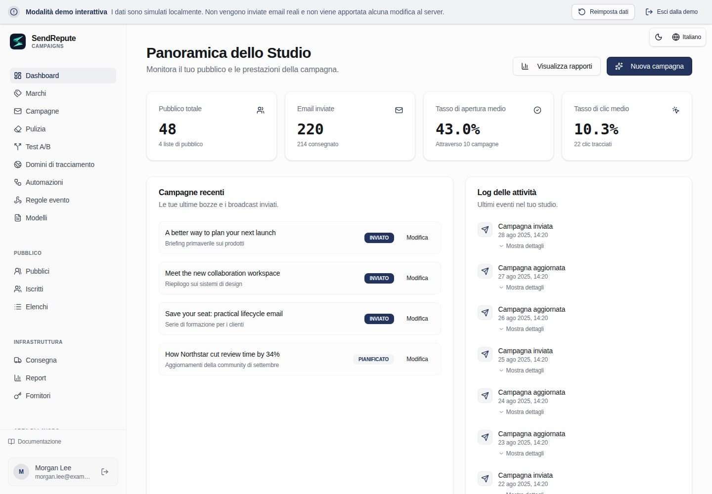

[English](README.md) · [العربية](README.ar.md) · [Français](README.fr.md) · [Русский](README.ru.md) · [Українська](README.uk.md) · [हिन्दी](README.hi.md) · [Deutsch](README.de.md) · [Español](README.es.md) · [Italiano](README.it.md) · [Português](README.pt.md) · [Bahasa Indonesia](README.id.md) · [Türkçe](README.tr.md) · [简体中文](README.zh.md) · [Tiếng Việt](README.vi.md)

# SendRepute Campaigns

Pubblico, campagne, template, automazioni e consegna in self-hosting direttamente dal tuo server. Questo repository distribuisce il **runtime compilato**, non l'intero monorepo dei sorgenti.



Prova la [demo interattiva](https://www.sendrepute.com/campaigns/?demo=true)
(nessun messaggio reale, builder in hosting o risultati a pagamento).

<a id="quickstart-fresh-ubuntu-24042604"></a>

## Quickstart: nuova installazione di Ubuntu 24.04/26.04

Su un **nuovo server senza un'installazione esistente di Campaigns**, esegui:

```sh
sudo apt-get update
sudo apt-get install -y git
git clone https://github.com/sendrepute/sendrepute-campaigns.git
cd sendrepute-campaigns
./setup.sh
```

Il setup chiede quale modalità di accesso utilizzare e riutilizza Docker/Compose se già funzionanti; su una nuova installazione server Ubuntu supportata priva di Docker, richiede il consenso per l'installazione dei pacchetti Ubuntu. Non rimuove Snap Docker né elude AppArmor. Non clonare sopra un'installazione esistente; vedi [Aggiornamento](#update).

**CAMPAIGNS READY FOR OWNER SETUP** significa che l'app è operativa all'interno del suo container, non che la configurazione del proprietario sia completa o che l'HTTPS pubblico sia stato verificato.
Per l'HTTPS, verifica prima la pagina di installazione mostrata da un'altra rete:
deve presentare un certificato valido e attendibile senza avvisi del browser. Se il
certificato è in sospeso o non valido, **non** inserire alcun segreto.

Per un nuovo proprietario, il token monouso è **obbligatorio**, non opzionale. Una volta che l'accesso scelto è pronto, esegui questo comando sulla VPS **dalla directory del progetto**:

```sh
sudo docker compose exec campaigns cat /var/lib/sendrepute-campaigns/installer-token
```

Ometti `sudo` se il tuo account Docker non lo richiede. Copia l'output del comando
e incollalo nel campo **Setup token** della pagina di installazione mostrata.
Compila i dettagli del proprietario e il Public URL corrispondente che termina in `/campaigns/`,
quindi completa l'attivazione di SendRepute e la configurazione del proprietario nella procedura guidata. Il setup
**non** stampa il token automaticamente. Non inserirlo mai in un URL e non condividerlo; mantieni
il token, `.env` e i log privati. Un workspace già installato non
necessita di un altro token di setup.

<a id="choose-access"></a>

## Scegli l'accesso

- **Dominio HTTPS (consigliato):** il setup avvia il proxy Caddy incluso.
  Inserisci un sottodominio sotto il tuo controllo, ad esempio `campaigns.example.com` (sostituiscilo
  con il tuo), **senza schema, porta o percorso**. Punta il record DNS
  `A` di quell'hostname a questo server, consenti il traffico TCP 80/443 e verifica
  il certificato attendibile esternamente. Usa `AAAA` solo con IPv6 funzionante.
- **Locale / Tunnel SSH:** associa l'app al loopback della VPS. Aprilo tramite un
  tunnel SSH attendibile dal tuo computer; il `localhost` del tuo portatile non è
  la VPS.
- **IP pubblico + HTTP:** acconsenti esplicitamente all'accesso non crittografato sulla porta 8080.
  Password, token e sessioni possono essere intercettati; **non adatto a deployment in
  produzione sicuri**.

Consulta il [cookbook dei comandi di setup](docs/install.md#guided-setup-command-cookbook)
per i comandi esatti, le opzioni, il tunneling SSH locale, la diagnostica e le avvertenze.

<a id="moving-from-http-to-https"></a>

## Passaggio da HTTP a HTTPS

Esegui prima un backup. Fai puntare il **tuo hostname effettivo** alla VPS, libera/apri le porte TCP 80/443
e conferma che il suo DNS funzioni. Sulla VPS, all'interno della directory di progetto **esistente**:

```sh
./setup.sh --mode https --host campaigns.sendrepute.com
```

Sostituisci `campaigns.sendrepute.com` con il tuo hostname (`campaign` e
`campaigns` sono nomi DNS differenti). Conferma la modifica dell'esposizione quando richiesto;
il setup avvia Caddy ma non riscrive il Public URL salvato del workspace installato.
Dopo aver verificato l'HTTPS esternamente, modifica tale URL in **Workspace
Settings** impostandolo a `https://YOUR_HOSTNAME/campaigns/`. Se utilizzi Cloudflare, usa
**Full (strict)**, mai Flexible. Consulta i
[passaggi per la migrazione](docs/install.md#migrate-an-installed-public-ip-http-workspace-to-https)
prima di modificare un'installazione live.

<a id="download-v0141"></a>

## Download v0.1.42

Gli amministratori possono verificare la presenza di release stabili di GitHub in Workspace Settings. Sono preferibili gli archivi ufficiali versionati delle Release e i relativi allegati con checksum SHA-256. Se tali allegati previsti sono assenti, il sistema di controllo può invece risolvere il medesimo tag della release stabile nel repository ufficiale verso il suo commit immutabile e convalidare il manifesto dei checksum `downloads/` vincolato a quel commit. I link di download del repository sono ancorati a quel commit, non a un tag o a un branch modificabili. La presenza di allegati previsti non validi o duplicati non consente mai questo fallback. La pagina Settings mostra una notifica di aggiornamento, i link per il download e il checksum e il comando documentato per l'aggiornamento manuale del server destinato a un clone Git esistente; non installa, estrae o esegue mai alcun download. Esegui prima il backup dell'installazione, quindi segui la procedura dell'operatore per l'aggiornamento e il riavvio. Le installazioni tramite archivio devono seguire le istruzioni separate per l'aggiornamento degli archivi e verificare i byte scaricati confrontandoli con i checksum. Eventuali disservizi di GitHub, metadati di pubblicazione assenti o malformati e versioni installate sconosciute vengono segnalati come non disponibili, mai come aggiornati. I nuovi archivi di release includono i propri metadati della versione installata; le vecchie installazioni prive di questi metadati non possono risultare aggiornate. La pubblicazione delle release e dei checksum sono operazioni distinte a carico dell'operatore, non eseguite dall'applicazione.

Preferisci un archivio versionato? Scarica lo [ZIP](https://github.com/sendrepute/sendrepute-campaigns/raw/refs/tags/v0.1.42/downloads/sendrepute-campaigns-0.1.42.zip)
o il [tar.gz](https://github.com/sendrepute/sendrepute-campaigns/raw/refs/tags/v0.1.42/downloads/sendrepute-campaigns-0.1.42.tar.gz),
verifica i [checksum SHA-256](https://github.com/sendrepute/sendrepute-campaigns/blob/v0.1.42/downloads/sendrepute-campaigns-0.1.42-SHA256SUMS),
estrai ed esegui `./setup.sh` al suo interno. Questi sono download dal repository, **non**
allegati binari di GitHub Release; **Code → Download ZIP** è uno
snapshot differente. Consulta le [note di rilascio della v0.1.42](https://github.com/sendrepute/sendrepute-campaigns/releases/tag/v0.1.42).

<a id="additional-tracking-hostnames"></a>

## Hostname di tracciamento aggiuntivi

Con l'installazione HTTPS/Caddy inclusa già in esecuzione, apri **Domains**,
crea una hostname challenge, aggiungi il suo record A/AAAA facendolo puntare a questo server unitamente
all'esatto record di proprietà TXT visualizzato, quindi fai clic su **Check DNS and verify**.
Campaigns aggiunge automaticamente l'hostname verificato al medesimo proxy gestito
e riutilizza il certificato primario qualora la sua SAN copra quell'hostname, altrimenti
richiede un certificato automatico. Ripeti l'operazione per più hostname; non sono necessari
comandi shell o modifiche al proxy per singolo dominio, mentre l'hostname primario dell'installazione
e le impostazioni del certificato rimangono invariati. Scegli l'hostname verificato desiderato in modo
indipendente nel menu a tendina **Tracking domain** di ciascuna campagna.

L'approvazione del DNS, la configurazione caricata del proxy e l'HTTPS pubblico funzionante vengono mostrati
separatamente. Il caricamento di una configurazione non dimostra l'emissione ACME o la raggiungibilità
pubblica. I nomi Origin CA coperti richiedono il proxy tramite Cloudflare e non sono considerati
direttamente attendibili dal browser. I record DNS e le porte 80/443 devono raggiungere il proxy esistente; Cloudflare
deve consentire l'ACME e rimanere su **Full (strict)**. Proxy/Tunnel esterni richiedono
una configurazione da parte dell'operatore. Se il proxy gestito non è in esecuzione o manca l'hostname
primario, le aggiunte rimangono in coda finché il problema a livello di installazione
non viene risolto. Non viene eseguito alcun fallback a SSL insicuro.

Le rotte approvate in precedenza vengono mantenute quando un dominio selezionabile viene eliminato
o la sua challenge viene ruotata, in modo che i link già consegnati non vengano revocati silenziosamente.
Mantieni disponibili i relativi record DNS e il rinnovo dei certificati. Conserva il registro
delle approvazioni (approval ledger) di PostgreSQL e i volumi HTTPS/Caddy durante gli aggiornamenti e i backup. Le installazioni
con certificato primario manuale potrebbero interrompere brevemente le connessioni durante un
aggiornamento/riavvio controllato del solo Caddy. Consulta il file `SMTP-TRACKING.md` incluso
per le definizioni di stato, la conservazione dei link storici e i limiti di fallimento/ritentativo.

<a id="update"></a>

## Aggiornamento

Esegui prima un backup; vedi [Backup](#back-up).
Sulla VPS, **all'interno del tuo clone Git esistente** (non un nuovo clone), verifica
le modifiche locali, quindi esegui:

```sh
git status --short
git pull --ff-only && ./setup.sh --mode resume
```

`resume` mantiene la modalità di accesso esistente, incluso l'HTTPS. Se il pull viene rifiutato,
riconcilia le modifiche anziché forzare un reset. Conserva `.env`, lo stesso progetto Compose,
i volumi di PostgreSQL e dell'applicazione, e la chiave di crittografia. Non eseguire mai
`docker compose down -v` su dati reali. Per gli aggiornamenti da archivio, utilizza le
[istruzioni di aggiornamento](docs/operations.md#upgrade), non un nuovo clone sopra
l'installazione.

<a id="back-up"></a>

## Backup

Conserva l'intero database PostgreSQL, i dati dell'applicazione, la chiave di crittografia,
il file privato `.env` e lo stato di HTTPS/Caddy. Segui i
[comandi completi per il backup di Docker](docs/operations.md#docker-infrastructure-backup),
quindi mantieni copie off-host crittografate e ad accesso controllato. Un'esportazione JSON dall'app
non è un backup dell'infrastruttura e omette il registro delle approvazioni HTTPS conservato,
inclusi gli hostname approvati le cui righe di dominio selezionabili sono state eliminate.

Per i backup off-host crittografati **pianificati su base opt-in**, utilizza gli esempi inclusi
di `backup.sh`, `backup.conf.example` e systemd. Il setup non pianifica
né abilita nulla in automatico. Installa `age` e configura una directory off-host montata esistente
o una destinazione SFTP ad accesso limitato. Lascia vuote entrambe le impostazioni di age:
il primo backup interattivo crea automaticamente il proprio file di ripristino e ti chiede
di salvarne una copia sicura separata prima di procedere. I backup successivi lo riutilizzeranno;
non ci sono comandi di generazione di chiavi o valori di chiave pubblica da copiare nella configurazione.
L'host mantiene una copia protetta per verificare ogni backup; non memorizzare mai la tua
copia di ripristino indipendente accanto agli archivi di backup crittografati.
Consulta la sezione [backup automatizzati](docs/operations.md#opt-in-encrypted-scheduled-backups)
per i prerequisiti, l'attivazione sicura, la verifica e il ripristino. Dalla directory di installazione,
`./backup.sh status` mostra l'ultimo tentativo, l'ultimo successo e l'archivio;
rimane leggibile anche se l'identità age o gli strumenti di backup non sono disponibili, a condizione che
la configurazione privata dell'operatore e il file di spool/status locale siano intatti.
`./backup.sh verify /private/path/archive.tar.age` verifica la decrittografia, il manifesto e
il formato di PostgreSQL senza ripristinare alcun dato.

<a id="restore"></a>

## Ripristino

Esegui il ripristino esclusivamente da un backup verificato e corrispondente che includa PostgreSQL **e** il volume dati;
l'esportazione JSON interna all'app omette i job di consegna, gli eventi di audit e altri stati di
runtime. Il ripristino può sovrascrivere dati più recenti o riprendere l'invio di email in coda. Segui i
[passaggi per il ripristino isolato](docs/operations.md#restore-to-an-empty-isolated-installation)
prima di qualsiasi passaggio in produzione.

<a id="more-information"></a>

## Maggiori informazioni

- [Comandi di installazione e setup](docs/install.md) — tutti i flag, HTTPS/HTTP,
  percorsi manuali di Docker o Node.js, token e risoluzione dei problemi.
- [Operazioni, backup e ripristino](docs/operations.md) — aggiornamenti e recovery.
- [Sicurezza e deliverability](docs/security-and-deliverability.md) — SMTP,
  SPF/DKIM/DMARC, consensi e controlli per la produzione.
- [Contratto per server standalone](docs/server-contract.md) — dettagli di integrazione.

L'attivazione convalida una chiave API SendRepute emessa separatamente; **non è richiesto alcun deposito per l'attivazione** e la gestione locale è gratuita. L'IA in hosting opzionale e la classificazione richiedono un'autorizzazione o un credito dedicato e un esplicito consenso sul prezzo; l'IA demo non fornisce risultati a pagamento. La consegna parte **dal tuo server verso il relay/provider SMTP che hai configurato**, non attraverso un proxy SMTP centrale di SendRepute.

<a id="release-boundary"></a>

## Perimetro della release

La release include il browser compilato, il server, il bridge per le API clienti e la consegna, l'SDK pubblico per i clienti, le migrazioni e la documentazione. Esclude il sito principale e lo scanner di SendRepute, i contenuti del database, i segreti, le source map, i test e la toolchain di sviluppo. Continuano ad applicarsi i termini di licenza dei componenti e di terze parti; il self-hosting non concede alcuna licenza per il servizio in hosting né alcuna garanzia di posizionamento nella casella di posta (inbox-placement).
