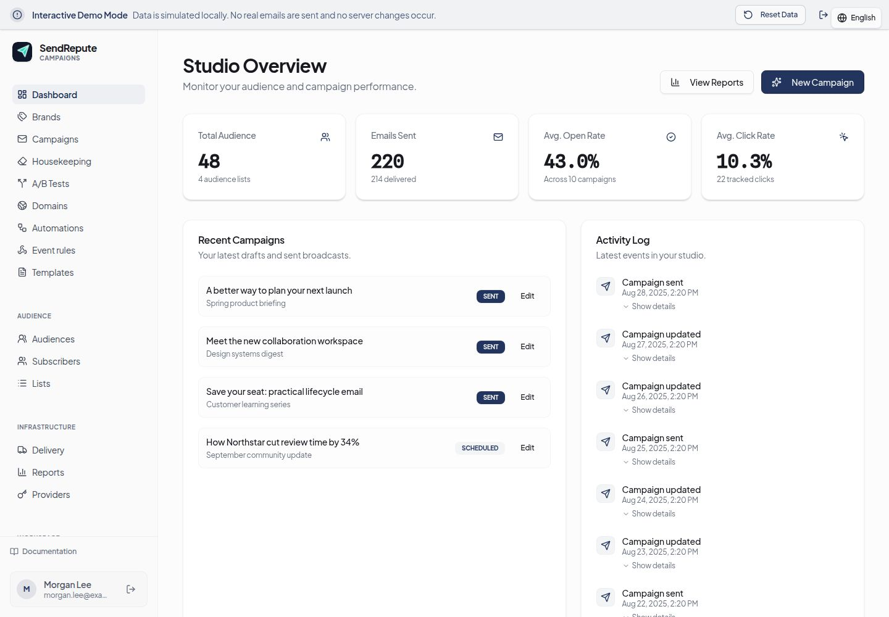

# SendRepute Campaigns 0.1.19

Self-hosted campaign and subscriber management. **This repository distributes a runnable compiled release, not the full source monorepo.** It includes the Campaigns browser build, server, delivery and customer-API bridge runtimes, a private bundled copy of the compiled public SendRepute customer SDK, database migrations, and operational documentation. It does **not** include the main SendRepute website, central scanner/API implementation, database contents, credentials, or a hosted-service license. Component manifests identify their respective license declarations; third-party dependencies and assets retain their own terms. Do not infer a blanket license for the hosted service or third-party assets.



**[Official Campaigns demo](https://www.sendrepute.com/campaigns/?demo=true)**. [Main website Campaigns documentation](https://www.sendrepute.com/campaigns/docs).

## Download and install

Download the [v0.1.19 ZIP](https://github.com/sendrepute/sendrepute-campaigns/raw/refs/tags/v0.1.19/downloads/sendrepute-campaigns-0.1.19.zip) or [tar.gz](https://github.com/sendrepute/sendrepute-campaigns/raw/refs/tags/v0.1.19/downloads/sendrepute-campaigns-0.1.19.tar.gz) and verify it against the [SHA-256 checksums](https://github.com/sendrepute/sendrepute-campaigns/blob/v0.1.19/downloads/sendrepute-campaigns-0.1.19-SHA256SUMS). These files are versioned **repository downloads**, not GitHub Release binary assets. Alternatively, GitHub's **Code → Download ZIP** is a repository snapshot, not the checksummed runtime release archive. Do not use a ZIP containing a different version without checking its contents.

### Changes in 0.1.19

- Saved Library selection lives in Campaign Design; Campaign Review now places analysis above the design preview and offers Edit current directly in the existing separate Standard/VIP hosted popup without a catalog or inline editor. Saving an edited private campaign copy preserves the original template and its canonical source.
- Standard previews safely contain malformed CSS using a parser in the browser-only preview path, without rewriting stored or exported email. Actual demo templates retain canonical Standard and native VIP sources; the VIP edit return retains its access identity. Three real UI illustrations are bundled in the English and Arabic in-app documentation.

### Changes in 0.1.18

- Campaign Design now has searchable, paginated Saved Library cards with source badges and edit actions. Standard and VIP designs reopen the same existing hosted builder popup used by Templates with their canonical source intact, not a converted inline editor or an embedded main-site page.
- Campaign Review offers Edit in builder directly through that popup without navigating away. Saving produces a private campaign copy and preserves the original template. This frontend-only patch does not change the main website or compiled server, delivery, bridge, SDK and installation configuration.

### Changes in 0.1.17

- Standard previews use parsed CSS dark-branch neutralization and a light color scheme in the preview only. The authored email, stored source, export and delivered content retain their original dark-mode support; native VIP source is not rewritten.
- Saved Library badges now sit on a separate translucent black header strip above each preview, instead of obscuring its design. This frontend patch does not change server, delivery, bridge, SDK or installation configuration.

### Changes in 0.1.16

- Saved Library badges now label all canonical MJML designs Standard, including prebuilt, AI-created and blank designs, rather than showing the retired Local MJML label. Native VIP documents retain their VIP label regardless of current entitlement.
- Distinct gold crown VIP and teal Standard badges improve source recognition in the library. This frontend-only patch does not change the compiled server, bridge, delivery, SDK or installation configuration.

### Changes in 0.1.15

- The Templates list now passes the actual generated result kind to the Standard/VIP callback, retaining native VIP document, access and HTML information rather than incorrectly rejecting a native VIP as Standard. A failed transfer retains the completed result for retry without another AI generation.
- After selecting a template, choosing a blank design saves explicit minimal MJML instead of omitting the source and inadvertently restoring the previous template. Saved Library labels reflect the actual VIP, Standard, local MJML or HTML source.
- This frontend patch does not make a billable-generation claim. Compiled server, bridge, delivery, SDK and installation configuration are unchanged from 0.1.14.

### Changes in 0.1.14

- Standard and VIP AI generation use one persistent, centered dialog across quote, generation, compilation and result. The loading artwork has a definite in-flow height so its animation remains visible instead of collapsing behind a black overlay.
- Quotes can be cancelled without accepting late responses. The dialog does not close behind an active generation overlay. The free demo and contract-based tests are not evidence of a billable hosted generation.

### Changes in 0.1.13

- Demo AI generation accepts the real Standard MJML v1 and native VIP response shapes, including a successful compilation response with `valid: true`, and displays the current effective price. The same Standard loading phase and VIP native loading canvas remain visible during generation and compilation rather than switching to the earlier placeholder.
- Standard and VIP generated designs can be saved and reopened with their owned content. This patch changes the browser frontend only; central API contracts and compiled server, bridge, delivery and SDK remain unchanged. Mock-provider and demo tests do not represent a billable hosted generation result.

### Changes in 0.1.12

- Standard and VIP design now share a clearer gallery with static CSS/DOM mini-thumbnails; viewing gallery cards does not automatically request image or detail previews. Saved Library appears above the gallery, and the active VIP tab remains selected.
- Standard and native VIP AI generation use the actual hosted quote and generation operations. Standard scripts are included with the free automatic flow even at zero balance; paid generation still requires an explicit current quote and price consent, and a completed request is locked against accidental repeat charges. If compilation fails after a completed generation, the owned result remains available for a free compilation retry.
- The generator shows a busy canvas while waiting, and the selected editor remains open after generation. The former local Grapes visual editor is replaced by the hosted Standard workflow; existing canonical MJML in saved templates remains preserved. Campaign Review retains the analysis and corrections entry point.

### Changes in 0.1.11

- Campaign Review retains the parent request ID returned by classification so the existing AI single/all correction quotes and actions can work, with their existing explicit paid consent and freshness guards.
- Saving a visually edited imported Standard or VIP template creates a private campaign copy rather than overwriting the source template. The saved campaign reopens in its matching editor with its own source, compiled HTML and identity.
- Visual editing handles compiled HTML with the HTML parser and safely adapts self-closing MJML tags and entities for that parser. The authored canonical MJML is not rewritten by preview normalization. This frontend patch makes no claim to resolve a user-specific paid request or to complete in-progress task 617.

### Changes in 0.1.10

- Analysis and corrections now offer an authoritative classifier-model selector in both the inline template editor and campaign preflight. The selector loads available models and the default from the customer API when needed; unavailable models cannot be selected.
- Classification uses the selected model. Quotes, analysis freshness, and explicit price consent are bound to that model; switching models invalidates stale results and consent before another paid operation.
- This frontend patch retains the compiled server, delivery, bridge, SDK, and installation configuration from 0.1.9. It does not claim to complete the in-progress task 617 or diagnose a user-specific paid correction failure.

### Changes in 0.1.9

- Template editor header controls wrap instead of overlapping at 320–390px widths in English and Arabic.
- Content recommendations explain empty evidence for known issue codes. Failed correction requests surface available HTTP status, error code and safe request reference; a 502/503 does not claim a particular upstream service is broken or authorize a paid retry.
- Retains the safe light-only previews, isolated builders, and protected paid-flow state from earlier stable releases. This patch does not claim to resolve the outstanding hosted MJML diagnostic or task 615.

### Changes in 0.1.8

- Standard and VIP gallery, saved template, campaign and local editor previews now use the same light-only preview normalization. It removes complete automatic dark-mode media rules and applies the exact bundled offline image adapter; white text on a cream preview no longer appears when the OS prefers dark mode.
- Authored MJML, saved documents and exported email HTML retain their own dark-mode support. This release does not claim to resolve the outstanding hosted MJML diagnostic.

### Changes in 0.1.7

- Standard and VIP are exclusive across template and campaign entry points. The chooser stages a selection until Apply, without a duplicate sidebar/modal panel.
- Analysis/corrections share a finite local progress flow. Paid rewrite quotes are bound to the current draft and price consent; reverting cannot overwrite newer edits, and compile failures remain visible.
- Keeps the three offline photographic previews, protected nullable-account VIP purchase identity, and all 0.1.6 corrections. This release does not resolve the outstanding hosted MJML diagnostic.

### Changes in 0.1.6

- Polished navy Price rewrite action in the corrections panel. Analysis/preflight and optional paid rewrite quote now have clearly separate presentation.
- Corrections provide specific parent-revision and price-change guidance on conflicts, invalidate stale price consent, and require a fresh quote before a new paid rewrite.
- Retains the safe nullable-account VIP purchase identity and isolated Standard/VIP catalog mode behavior from 0.1.4–0.1.5. A hosted MJML diagnostic is not resolved by this frontend release.

### Changes in 0.1.5

- The Standard/VIP selector loads only the selected catalog. Switching modes clears stale results and prevents late responses from the previous mode from appearing. Each mode keeps independent request state.
- Retains 0.1.4's opaque purchase identity protection for nullable-account connections, canonical editable Standard MJML selection, and bundled offline photographic previews. No hosted API or SDK update is required.

### Changes in 0.1.4

- Fix VIP purchase identity for real connections with a null account ID: the server exposes a stable opaque, installation-keyed credential fingerprint, and the client uses it to retain the pending/uncertain purchase lock across reloads. The fingerprint does not reveal the API key.
- **Do not upgrade to 0.1.2 or 0.1.3:** these earlier builds cannot reliably retain the VIP purchase lock for real nullable-account connections. Both are marked prerelease; use 0.1.4 instead.

### Changes in 0.1.3 (superseded; do not install)

- VIP purchase pending state is persisted before the request is sent, so reloading while a purchase is still in flight preserves the uncertain-outcome lock rather than allowing a duplicate charge.
- Includes the 0.1.2 corrections, VIP consent, and catalog preview improvements.

### Changes in 0.1.2 (superseded; do not install)

- Corrections use the central service's exact editable-word set and independent pending state.
- VIP purchase requires a request ID and explicit price consent. An uncertain purchase remains blocked across navigation and reload instead of being retried automatically.
- Catalog previews load automatically near the viewport center, reuse cached results, and respect rate-limit cooldowns.

### Upgrade from an earlier release

Back up PostgreSQL, application data/encryption key and your private `.env` first. Verify the archive checksum and extract into a **new directory**. Stop the old Campaigns service before starting the new one; do not run both against the same database. Copy your existing `.env` without regenerating it, and retain the same Compose project name (default `sendrepute-campaigns`) and existing `campaigns-postgres` / `campaigns-data` volumes. Preserve any custom Compose overrides and bind-mount paths. Never use `docker compose down -v`.

From the new directory run `docker compose up -d --build` with the same project/override options as the old installation. For non-Docker installations, keep the existing database URL, configuration, data directory and encryption key, install with `npm ci --omit=dev --ignore-scripts`, then restart your existing service against the new runtime. Hard-refresh the browser after upgrade. See [operations](docs/operations.md) for backup and rollback requirements. This patch requires no new npm SDK version and no Cloudflare deployment.

Requirements: Linux x64/ARM64 with Docker Engine + Compose v2 (Windows users: Docker Desktop/WSL2); or Node.js 22+ and PostgreSQL for a non-Docker installation. Native Windows archive installation is unverified. Use persistent database and application volumes, a public HTTPS reverse proxy and DNS for production delivery, and outbound access to your chosen SMTP relay/provider. [Full installation instructions](docs/install.md).

From the extracted **release archive** (or repository distribution root):

```sh
./install.sh
docker compose up -d --build
```

Open `http://localhost:8080/campaigns/install`; retrieve the one-time installer token on your own host with:

```sh
docker compose exec campaigns cat /var/lib/sendrepute-campaigns/installer-token
```

Keep the token private. Configure a public HTTPS URL before sending. The wizard creates the local owner and validates a SendRepute API key for activation. **Activation does not require a deposit**; local management is free. Hosted SendRepute AI, classification, and other paid services are separate: valid key, network access, available credit/entitlement and **explicit price consent** may be required. Self-hosting does not include free hosted AI operations.

Email delivery happens from your local Campaigns server to your configured SMTP relay or provider API, **not** through a central SendRepute SMTP proxy. Configure provider credentials and sender-domain SPF/DKIM/DMARC; review suppressions, unsubscribe links and one-click unsubscribe DKIM signing with an actual received message before production sending. Keep uncertain send outcomes for manual reconciliation rather than blindly retrying. [Security and deliverability](docs/security-and-deliverability.md).

Back up both PostgreSQL and the Campaigns application data/encryption key, plus your private `.env`, to protected off-host storage; periodically verify a restore. The application export alone does not preserve delivery history. [Upgrade, backup and restore procedures](docs/operations.md). Do not commit `.env`, data, token, or backups to GitHub.

## Release boundary

This distribution deliberately excludes TypeScript source maps, main-site and scanner implementation, development tests and build toolchain. Browser assets, the three Campaigns runtime packages and the public customer SDK are precompiled. The bridge installs the included SDK as a local package rather than relying on a newer registry SDK; npm installs other production dependencies from `package-lock.json`. See [standalone server contract](docs/server-contract.md). The included build and runtime do not guarantee inbox placement, provider availability, or Docker/Windows compatibility beyond tested configurations.