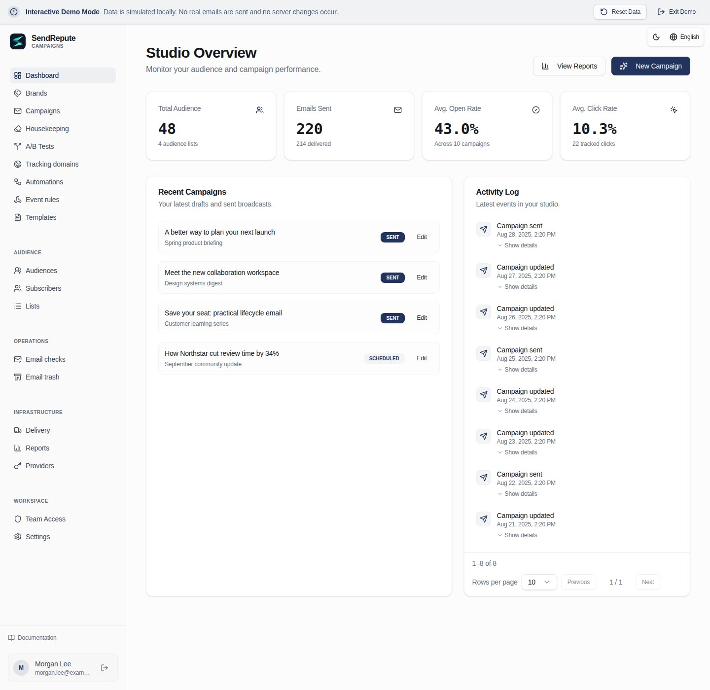

[English](README.md) · [العربية](README.ar.md) · [Français](README.fr.md) · [Русский](README.ru.md) · [Українська](README.uk.md) · [हिन्दी](README.hi.md) · [Deutsch](README.de.md) · [Español](README.es.md) · [Italiano](README.it.md) · [Português](README.pt.md) · [Bahasa Indonesia](README.id.md) · [Türkçe](README.tr.md) · [简体中文](README.zh.md) · [Tiếng Việt](README.vi.md)

# SendRepute Campaigns

Self-hosted audiences, campaigns, templates, automations and delivery from your
own server. This repository distributes the **compiled runtime**, not the full
source monorepo.



Try the [interactive demo](https://www.sendrepute.com/campaigns/?demo=true)
(no real messages, hosted builders or paid results).

<a id="quickstart-fresh-ubuntu-24042604"></a>

## Quickstart: fresh Ubuntu 24.04/26.04

On a **new server without an existing Campaigns installation**, run:

```sh
sudo apt-get update
sudo apt-get install -y git
git clone https://github.com/sendrepute/sendrepute-campaigns.git
cd sendrepute-campaigns
./setup.sh
```

Setup asks which access mode to use and reuses working Docker/Compose; on a
fresh supported Ubuntu server without Docker, it requests consent to install
Ubuntu's packages. It does not remove Snap Docker or bypass AppArmor. Do not
clone over an existing installation; see [Update](#update).

**CAMPAIGNS READY FOR OWNER SETUP** means the app is healthy inside its
container, not that owner setup is complete or public HTTPS has been verified.
For HTTPS, first verify the printed installation page from another network:
it must have a valid, trusted certificate with no browser warnings. If the
certificate is pending or invalid, do **not** enter any secrets.

For a new owner, the one-time token is **required**, not optional. Once your
chosen access is ready, run this on the VPS **from the project directory**:

```sh
sudo docker compose exec campaigns cat /var/lib/sendrepute-campaigns/installer-token
```

Omit `sudo` if your Docker account does not require it. Copy the command output
and paste it into the **Setup token** field on the printed installation page.
Fill in the owner details and corresponding Public URL ending in `/campaigns/`,
then complete SendRepute activation and owner setup in the wizard. Setup does
**not** print the token automatically. Never put it in a URL or share it; keep
the token, `.env` and logs private. An already installed workspace does not
need another setup token.

<a id="choose-access"></a>

## Choose access

- **HTTPS domain (recommended):** setup starts the included Caddy proxy.
  Enter a subdomain you control, for example `campaigns.example.com` (replace
  with your own), with **no scheme, port or path**. Point that hostname's DNS
  `A` record to this server, allow TCP 80/443 and check
  the trusted certificate externally. Use `AAAA` only with working IPv6.
- **Local / SSH tunnel:** binds the app to VPS loopback. Open it through a
  trusted SSH tunnel from your computer; your laptop's `localhost` is not
  the VPS.
- **Public IP + HTTP:** explicitly consent to unencrypted access on port 8080.
  Passwords, tokens and sessions can be intercepted; **not for secure
  production deployment**.

See the [setup command cookbook](docs/install.md#guided-setup-command-cookbook)
for exact commands, options, local SSH tunneling, diagnostics and warnings.

<a id="moving-from-http-to-https"></a>

## Moving from HTTP to HTTPS

Back up first. Point **your actual hostname** to the VPS, free/open TCP 80/443
and confirm its DNS works. On the VPS, in the **existing** project directory:

```sh
./setup.sh --mode https --host campaigns.sendrepute.com
```

Replace `campaigns.sendrepute.com` with your hostname (`campaign` and
`campaigns` are different DNS names). Confirm the exposure change when asked;
setup starts Caddy but does not rewrite the installed workspace's saved Public
URL. After verifying HTTPS externally, change that URL in **Workspace
Settings** to `https://YOUR_HOSTNAME/campaigns/`. If using Cloudflare, use
**Full (strict)**, never Flexible. See the
[migration steps](docs/install.md#migrate-an-installed-public-ip-http-workspace-to-https)
before changing a live installation.

<a id="download-v0141"></a>

## Download v0.1.43

Administrators can check for stable GitHub releases in Workspace Settings. Official versioned Release archive and SHA-256 checksum attachments are preferred. If those expected attachments are absent, the checker can instead resolve the same stable release tag in the official repository to its immutable commit and validate that commit's bounded `downloads/` checksum manifest. Repository download links are pinned to that commit, not a movable tag or branch. Invalid or duplicate expected attachments never permit this fallback. Settings displays an update notice, download/checksum links and the documented manual server update command for an existing Git clone; it never installs, extracts or executes a download. Back up the installation first, then follow the operator upgrade and restart procedure. Archive installations must follow the separate archive upgrade instructions and verify the downloaded bytes against the checksums. GitHub failures, absent or malformed publication metadata, and unknown installed versions are reported as unavailable, never as up to date. New release archives include their installed version metadata; older installations without this metadata cannot claim to be current. Release publishing and checksums are separate operator steps, not performed by the application.

Prefer a versioned archive? Download the [ZIP](https://github.com/sendrepute/sendrepute-campaigns/raw/refs/tags/v0.1.43/downloads/sendrepute-campaigns-0.1.43.zip)
or [tar.gz](https://github.com/sendrepute/sendrepute-campaigns/raw/refs/tags/v0.1.43/downloads/sendrepute-campaigns-0.1.43.tar.gz),
verify the [SHA-256 checksums](https://github.com/sendrepute/sendrepute-campaigns/blob/v0.1.43/downloads/sendrepute-campaigns-0.1.43-SHA256SUMS),
extract, and run `./setup.sh` there. These are repository downloads, **not**
GitHub Release binary attachments; **Code → Download ZIP** is a different
snapshot. See the [v0.1.43 release notes](https://github.com/sendrepute/sendrepute-campaigns/releases/tag/v0.1.43).

<a id="additional-tracking-hostnames"></a>

## Additional tracking hostnames

With the included HTTPS/Caddy installation already running, open **Domains**,
create a hostname challenge, add its A/AAAA record pointing to this server and
the exact displayed TXT ownership record, then click **Check DNS and verify**.
Campaigns automatically adds the verified hostname to the same managed proxy
and reuses the primary certificate when its SAN covers that hostname, otherwise
requesting an automatic certificate. Repeat for multiple hostnames; no per-domain
shell commands or proxy edits are required, and the primary installation
hostname and certificate settings are unchanged. Choose the desired verified
hostname independently in each campaign's **Tracking domain** dropdown.

DNS approval, loaded proxy configuration, and working public HTTPS are shown
separately. Loading a configuration does not prove ACME issuance or public
reachability. Covered Origin CA names require Cloudflare proxying and are not
directly browser-trusted. DNS and ports 80/443 must reach the existing proxy; Cloudflare
must permit ACME and remain **Full (strict)**. External proxies/Tunnels require
operator configuration. If the managed proxy is not running or the primary
hostname is missing, additions remain queued until that installation-level
problem is resolved. No insecure SSL fallback is performed.

Previously approved routes are retained when a selectable domain is deleted
or its challenge rotated, so delivered links are not silently revoked.
Keep their DNS and certificate renewal available. Preserve the PostgreSQL
approval ledger and HTTPS/Caddy volumes during upgrades/backups. Manual-primary
certificate installations may briefly interrupt connections during a
controlled Caddy-only update/restart. See the packaged `SMTP-TRACKING.md`
for status definitions, historic-link retention, and failure/retry boundaries.

<a id="update"></a>

## Update

Back up first; see [Back up](#back-up).
On the VPS, **inside your existing Git clone** (not a fresh clone), inspect
local changes, then run:

```sh
git status --short
git pull --ff-only && ./setup.sh --mode resume
```

`resume` preserves the existing access mode, including HTTPS. If pull refuses,
reconcile edits rather than force-resetting. Preserve `.env`, the same Compose
project, PostgreSQL and application volumes, and encryption key. Never run
`docker compose down -v` against real data. For archive upgrades, use the
[upgrade instructions](docs/operations.md#upgrade), not a new clone over the
installation.

<a id="back-up"></a>

## Back up

Preserve the full PostgreSQL database, application data/encryption key,
private `.env` and HTTPS/Caddy state. Follow the
[complete Docker backup commands](docs/operations.md#docker-infrastructure-backup),
then keep encrypted, access-controlled off-host copies. An in-app JSON export
is not an infrastructure backup and omits the retained HTTPS approval ledger,
including approved hostnames whose selectable domain rows were deleted.

For **opt-in scheduled** encrypted off-host backups, use the included
`backup.sh`, `backup.conf.example` and systemd examples. Nothing is scheduled
or enabled by setup. Install `age` and configure an existing off-host mounted
directory or restricted SFTP destination. Leave both age settings blank:
the first interactive backup creates its recovery file automatically and asks
you to save a separate safe copy before proceeding. Later backups reuse it;
there are no key-generation commands or public-key values to copy into config.
The host keeps a protected copy to verify each backup; never store your
independent recovery copy beside the encrypted backup archives.
See [automated backups](docs/operations.md#opt-in-encrypted-scheduled-backups)
for prerequisites, safe activation, verification and recovery. From the installed
directory, `./backup.sh status` shows last attempt, last success and archive;
it remains readable if the age identity or backup tools are unavailable, provided
the operator-owned private config and local spool/status file are intact.
`./backup.sh verify /private/path/archive.tar.age` checks decrypt, manifest and
PostgreSQL format without restoring data.

<a id="restore"></a>

## Restore

Restore only from a verified, matching PostgreSQL **and** data-volume backup;
the in-app JSON export omits delivery jobs, audit events and other runtime
state. Restoring can overwrite newer data or resume queued mail. Follow the
[isolated restore steps](docs/operations.md#restore-to-an-empty-isolated-installation)
before any production cutover.

<a id="more-information"></a>

## More information

- [Installation and setup commands](docs/install.md) — all flags, HTTPS/HTTP,
  manual Docker or Node.js paths, token and troubleshooting.
- [Operations, backup and restore](docs/operations.md) — upgrades and recovery.
- [Security and deliverability](docs/security-and-deliverability.md) — SMTP,
  SPF/DKIM/DMARC, consent and production checks.
- [Standalone server contract](docs/server-contract.md) — integration details.

Activation validates a separately issued SendRepute API key; **no deposit is
required for activation**, and local management is free. Optional hosted AI
and classification require their own entitlement or credit and explicit price
consent; demo AI does not perform paid results. Delivery goes from **your
server to your configured SMTP relay/provider**, not a central SendRepute
SMTP proxy.

<a id="release-boundary"></a>

## Release boundary

The release includes the compiled browser, server, delivery and customer-API
bridge, public customer SDK, migrations and docs. It excludes the main
SendRepute site and scanner, database contents, secrets, source maps, tests
and development toolchain. Component and third-party license terms still
apply; self-hosting grants no hosted-service license or inbox-placement
guarantee.
