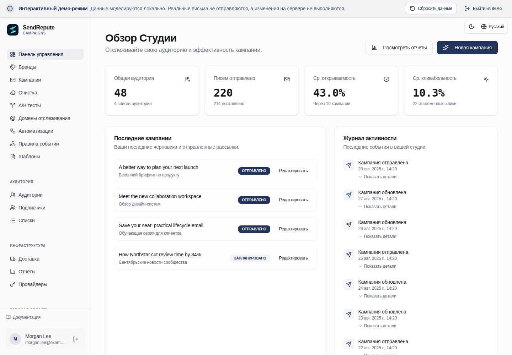

[English](README.md) · [العربية](README.ar.md) · [Français](README.fr.md) · [Русский](README.ru.md) · [Українська](README.uk.md) · [हिन्दी](README.hi.md) · [Deutsch](README.de.md) · [Español](README.es.md) · [Italiano](README.it.md) · [Português](README.pt.md) · [Bahasa Indonesia](README.id.md) · [Türkçe](README.tr.md) · [简体中文](README.zh.md) · [Tiếng Việt](README.vi.md)

# SendRepute Campaigns

Собственная инфраструктура (self-hosted) для аудиторий, кампаний, шаблонов, автоматизаций и рассылки прямо с
вашего сервера. В этом репозитории распространяется **скомпилированная среда выполнения**, а не полный
исходный код монорепозитория.



Попробуйте [интерактивное демо](https://www.sendrepute.com/campaigns/?demo=true)
(без реальных сообщений, облачных конструкторов и платных результатов).

<a id="quickstart-fresh-ubuntu-24042604"></a>

## Быстрый старт: чистая Ubuntu 24.04/26.04

На **новом сервере без установленного приложения Campaigns** выполните:

```sh
sudo apt-get update
sudo apt-get install -y git
git clone https://github.com/sendrepute/sendrepute-campaigns.git
cd sendrepute-campaigns
./setup.sh
```

Программа установки предложит выбрать режим доступа и задействует уже работающий Docker/Compose; на
чистом поддерживаемом сервере Ubuntu без Docker она запросит разрешение на установку
штатных пакетов Ubuntu. Программа не удаляет Snap-версию Docker и не обходит AppArmor. Не
клонируйте репозиторий поверх существующей установки; см. [Update](#update).

**CAMPAIGNS READY FOR OWNER SETUP** означает, что приложение корректно работает внутри
контейнера, а не то, что настройка владельца завершена или публичный HTTPS проверен.
При использовании HTTPS сначала проверьте выведенную в консоли страницу установки из другой сети:
у нее должен быть действительный доверенный сертификат без предупреждений в браузере. Если
сертификат еще выпускается или недействителен, **ни в коем случае** не вводите никакие секретные данные.

Для регистрации нового владельца одноразовый токен **обязателен**, а не опционален. Как только
выбранный режим доступа будет готов, выполните на VPS следующую команду **из директории проекта**:

```sh
sudo docker compose exec campaigns cat /var/lib/sendrepute-campaigns/installer-token
```

Пропустите `sudo`, если ваша учетная запись Docker этого не требует. Скопируйте вывод команды
и вставьте его в поле **Setup token** на открытой странице установки.
Заполните данные владельца и соответствующий Public URL, оканчивающийся на `/campaigns/`,
затем завершите активацию SendRepute и настройку владельца в мастере. Установка **не** выводит токен автоматически. Никогда не подставляйте его в URL и не передавайте другим лицам; храните
токен, `.env` и логи в секрете. Для уже установленного рабочего пространства (workspace) еще один токен настройки не требуется.

<a id="choose-access"></a>

## Выбор режима доступа

- **HTTPS-домен (рекомендуется):** установка запускает встроенный Caddy-прокси.
  Укажите поддомен, которым вы управляете, например `campaigns.example.com` (замените
  на свой), строго **без схемы, порта или пути**. Направьте DNS-запись
  `A` этого хостнейма на сервер, откройте порты TCP 80/443 и проверьте
  доверенный сертификат из внешней сети. Используйте `AAAA` только при корректно работающем IPv6.
- **Local / SSH-туннель:** привязывает приложение к loopback-интерфейсу VPS. Открывайте его через
  доверенный SSH-туннель со своего компьютера; `localhost` вашего ноутбука — это не
  VPS.
- **Публичный IP + HTTP:** явное согласие на незашифрованный доступ по порту 8080.
  Пароли, токены и сессии могут быть перехвачены; **не использовать для защищенного
  production-развертывания**.

Смотрите [руководство по командам установки](docs/install.md#guided-setup-command-cookbook),
где собраны точные команды, опции, инструкции по локальному SSH-туннелированию, диагностика и предупреждения.

<a id="moving-from-http-to-https"></a>

## Переход с HTTP на HTTPS

Сначала сделайте резервную копию. Направьте **свой фактический хостнейм** на VPS, освободите/откройте порты TCP 80/443
и убедитесь, что DNS работает. На VPS, в **текущей** директории проекта выполните:

```sh
./setup.sh --mode https --host campaigns.sendrepute.com
```

Замените `campaigns.sendrepute.com` на ваш хостнейм (`campaign` и
`campaigns` — разные DNS-имена). Подтвердите изменение режима публикации (exposure) при запросе;
установка запустит Caddy, но не перезапишет сохраненный Public URL рабочего пространства.
Проверив доступность HTTPS извне, измените этот URL в разделе **Workspace Settings** на `https://YOUR_HOSTNAME/campaigns/`. При использовании Cloudflare всегда выбирайте
**Full (strict)**, и никогда Flexible. Изучите
[шаги по миграции](docs/install.md#migrate-an-installed-public-ip-http-workspace-to-https),
прежде чем менять конфигурацию рабочей (live) установки.

<a id="download-v0141"></a>

## Загрузка v0.1.41

Администраторы могут проверять наличие стабильных релизов на GitHub в разделе Workspace Settings. Предпочтительнее использовать официальные версионированные архивы релиза (Release archive) и вложенные контрольные суммы SHA-256. Если ожидаемые вложения отсутствуют, механизм проверки может вместо этого разрешить тот же стабильный тег релиза в официальном репозитории до его неизменяемого коммита и валидировать привязанный к этому коммиту манифест контрольных сумм `downloads/`. Ссылки на скачивание из репозитория жестко привязаны к этому коммиту, а не к перемещаемому тегу или ветке. Недействительные или дублирующиеся ожидаемые вложения никогда не допускают использования этого запасного механизма (fallback). В настройках отображается уведомление об обновлении, ссылки для скачивания/проверки контрольных сумм и задокументированная команда для ручного обновления сервера из существующего Git-клона; система никогда не устанавливает, не извлекает и не выполняет скачанный файл самостоятельно. Сначала сделайте резервную копию, затем выполните процедуру обновления и перезапуска от лица оператора. При установке из архива необходимо следовать отдельным инструкциям по обновлению из архива и сверять байты скачанных файлов с контрольными суммами. Сбои GitHub, отсутствующие или некорректные метаданные публикации, а также неизвестные установленные версии сообщаются как недоступные (unavailable), а не как актуальные (up to date). Архивы новых релизов содержат метаданные об установленной версии; старые установки без таких метаданных не могут заявлять о своей актуальности. Публикация релиза и генерация контрольных сумм — это отдельные действия оператора, не выполняемые приложением.

Предпочитаете версионированный архив? Скачайте [ZIP](https://github.com/sendrepute/sendrepute-campaigns/raw/refs/tags/v0.1.41/downloads/sendrepute-campaigns-0.1.41.zip)
или [tar.gz](https://github.com/sendrepute/sendrepute-campaigns/raw/refs/tags/v0.1.41/downloads/sendrepute-campaigns-0.1.41.tar.gz),
проверьте [контрольные суммы SHA-256](https://github.com/sendrepute/sendrepute-campaigns/blob/v0.1.41/downloads/sendrepute-campaigns-0.1.41-SHA256SUMS),
распакуйте и выполните там `./setup.sh`. Это скачивания напрямую из репозитория, а **не**
бинарные вложения из GitHub Release; опция **Code → Download ZIP** выдает другой
снапшот. См. [примечания к релизу v0.1.41](https://github.com/sendrepute/sendrepute-campaigns/releases/tag/v0.1.41).

<a id="additional-tracking-hostnames"></a>

## Дополнительные хостнеймы для отслеживания

При уже запущенной установке со встроенным HTTPS/Caddy откройте раздел **Domains**,
создайте проверку (challenge) хостнейма, добавьте для него A/AAAA-запись, указывающую на этот сервер, и
точную отображаемую TXT-запись подтверждения владения, а затем нажмите **Check DNS and verify**.
Campaigns автоматически добавляет верифицированный хостнейм в тот же управляемый прокси
и переиспользует основной сертификат, если его SAN покрывает данный хостнейм, либо
автоматически запрашивает новый сертификат. Повторите этот процесс для нескольких хостнеймов; вам не нужно вводить
shell-команды или править конфигурацию прокси для каждого домена, при этом основной хостнейм установки
и настройки сертификата не меняются. Выбирайте нужный верифицированный
хостнейм отдельно в выпадающем списке **Tracking domain** для каждой кампании.

Подтверждение DNS, загруженная конфигурация прокси и работающий публичный HTTPS отображаются
отдельно. Загрузка конфигурации не доказывает выпуск ACME-сертификата или доступность извне.
Имена с сертификатом Origin CA требуют проксирования через Cloudflare и не являются
напрямую доверенными в браузерах. DNS и порты 80/443 должны достигать текущего прокси; Cloudflare
должен пропускать ACME-запросы и оставаться в режиме **Full (strict)**. Внешние прокси/туннели требуют
настройки оператором. Если управляемый прокси не запущен или отсутствует основной
хостнейм, добавления остаются в очереди, пока не будет решена эта проблема на уровне
установки. Резервный переход (fallback) на небезопасный SSL не выполняется.

Ранее одобренные маршруты сохраняются при удалении выбираемого домена
или ротации его проверки (challenge), поэтому ранее доставленные ссылки не аннулируются незаметно.
Обеспечивайте доступность их DNS и возможность продления сертификатов. Сохраняйте PostgreSQL
реестр одобрений (approval ledger) и тома HTTPS/Caddy при обновлениях/бэкапах. Установки с основным сертификатом, заданным
вручную (manual-primary), могут кратковременно прерывать соединения во время
контролируемого обновления/перезапуска только Caddy. См. поставляемый в комплекте `SMTP-TRACKING.md`
для изучения определений статусов, сохранения исторических ссылок и лимитов на ошибки/повторы.

<a id="update"></a>

## Обновление

Сначала сделайте бэкап; см. [Back up](#back-up).
На VPS, **внутри существующего клона Git** (а не в новом клоне), проверьте
локальные изменения, затем выполните:

```sh
git status --short
git pull --ff-only && ./setup.sh --mode resume
```

`resume` сохраняет текущий режим доступа, включая HTTPS. Если pull выдает отказ,
разрешите конфликты правок, а не делайте принудительный сброс (force-reset). Сохраняйте `.env`, тот же проект Compose,
тома PostgreSQL и приложения, а также ключ шифрования. Никогда не запускайте
`docker compose down -v` на реальных данных. Для обновления из архива используйте
[инструкции по обновлению](docs/operations.md#upgrade), а не новый клон поверх
существующей установки.

<a id="back-up"></a>

## Резервное копирование

Сохраняйте полную базу данных PostgreSQL, данные приложения / ключ шифрования,
приватный `.env` и состояние HTTPS/Caddy. Следуйте
[полным командам бэкапа Docker](docs/operations.md#docker-infrastructure-backup),
и храните зашифрованные копии с ограниченным доступом на другом хосте (off-host). Экспорт JSON из приложения
не является бэкапом инфраструктуры и не включает сохраненный реестр одобрений HTTPS,
в том числе одобренные хостнеймы, строки которых были удалены из списка выбираемых доменов.

Для создания зашифрованных off-host бэкапов **по расписанию (opt-in)** используйте прилагаемые
примеры `backup.sh`, `backup.conf.example` и systemd. Установка ничего не планирует
и не включает по умолчанию. Установите `age` и настройте существующую примонтированную off-host
директорию или SFTP-сервер с ограниченным доступом. Оставьте обе настройки age пустыми:
первый интерактивный бэкап автоматически создаст файл восстановления (recovery file) и попросит
вас сохранить отдельную надежную копию перед продолжением. Последующие бэкапы будут использовать его повторно;
вам не нужно выполнять команды генерации ключей или копировать публичные ключи в конфигурацию.
Хост хранит защищенную копию для верификации каждого бэкапа; никогда не храните свою
независимую копию для восстановления рядом с зашифрованными архивами.
См. [автоматическое резервное копирование](docs/operations.md#opt-in-encrypted-scheduled-backups)
для ознакомления с предварительными требованиями, безопасной активацией, верификацией и восстановлением. При запуске из
директории установки `./backup.sh status` показывает последнюю попытку, последнее успешное выполнение и архив;
данные остаются читаемыми даже при отсутствии age identity или инструментов резервного копирования, если
приватная конфигурация, принадлежащая оператору, и локальный файл spool/status целы.
`./backup.sh verify /private/path/archive.tar.age` проверяет расшифровку, манифест и
формат PostgreSQL без восстановления данных.

<a id="restore"></a>

## Восстановление

Выполняйте восстановление только из проверенного, согласованного бэкапа базы PostgreSQL **и** data-тома;
внутренний экспорт JSON (in-app) не содержит задачи доставки, события аудита и прочие данные runtime-состояния.
Восстановление может перезаписать более новые данные или возобновить отправку писем из очереди. Следуйте
[шагам по изолированному восстановлению](docs/operations.md#restore-to-an-empty-isolated-installation)
перед любым переключением в production.

<a id="more-information"></a>

## Дополнительная информация

- [Команды установки и настройки](docs/install.md) — все флаги, HTTPS/HTTP,
  ручные пути Docker или Node.js, токен и устранение неполадок.
- [Эксплуатация, бэкап и восстановление](docs/operations.md) — обновления и восстановление данных.
- [Безопасность и доставляемость](docs/security-and-deliverability.md) — SMTP,
  SPF/DKIM/DMARC, согласие на рассылку и проверки перед выходом в production.
- [Контракт автономного сервера](docs/server-contract.md) — детали интеграции.

Активация валидирует отдельно выпущенный API-ключ SendRepute; **для активации не требуется
депозит (пополнение баланса)**, а локальное управление полностью бесплатно. Опциональные облачные ИИ (hosted AI)
и классификация требуют собственного доступа (entitlement) или баланса, а также явного согласия со стоимостью;
демо-ИИ не генерирует платные результаты. Рассылка писем осуществляется с **вашего
сервера на ваш настроенный SMTP-релей/провайдер**, а не через центральный SMTP-прокси
SendRepute.

<a id="release-boundary"></a>

## Границы релиза

В релиз входят скомпилированные браузерный и серверный модули, подсистема доставки, API-мост (customer-API bridge),
публичный клиентский SDK, миграции и документация. В него не включены основной
сайт и сканер SendRepute, содержимое базы данных, секреты, карты кода (source maps), тесты
и инструментарий для разработки. Лицензионные условия компонентов и сторонних продуктов продолжают
действовать; self-hosting установка не дает лицензии на облачные сервисы (hosted-service) или гарантии
попадания писем в папку «Входящие».
