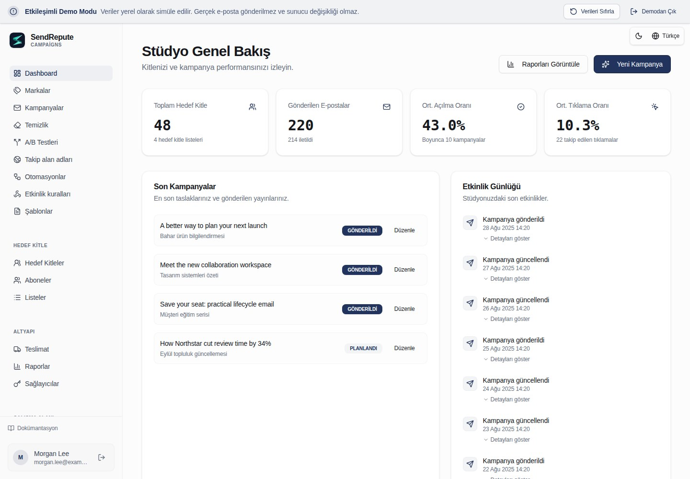

[English](README.md) · [العربية](README.ar.md) · [Français](README.fr.md) · [Русский](README.ru.md) · [Українська](README.uk.md) · [हिन्दी](README.hi.md) · [Deutsch](README.de.md) · [Español](README.es.md) · [Italiano](README.it.md) · [Português](README.pt.md) · [Bahasa Indonesia](README.id.md) · [Türkçe](README.tr.md) · [简体中文](README.zh.md) · [Tiếng Việt](README.vi.md)

# SendRepute Campaigns

Kendi sunucunuzda barındırabileceğiniz hedef kitleler, kampanyalar, şablonlar, otomasyonlar ve teslimat. Bu depo tam kaynak kodlu monorepo'yu değil, **derlenmiş çalışma zamanını** dağıtır.



[Etkileşimli demoyu](https://www.sendrepute.com/campaigns/?demo=true) deneyin
(gerçek mesajlar, barındırılan oluşturucular veya ücretli sonuçlar içermez).

<a id="quickstart-fresh-ubuntu-24042604"></a>

## Hızlı Başlangıç: Temiz Ubuntu 24.04/26.04

**Mevcut bir Campaigns kurulumu olmayan yeni bir sunucuda** şunu çalıştırın:

```sh
sudo apt-get update
sudo apt-get install -y git
git clone https://github.com/sendrepute/sendrepute-campaigns.git
cd sendrepute-campaigns
./setup.sh
```

Kurulum, kullanılacak erişim modunu sorar ve çalışan Docker/Compose'u yeniden kullanır; Docker yüklü olmayan, desteklenen temiz bir Ubuntu sunucusunda ise Ubuntu paketlerini kurmak için onay ister. Snap Docker'ı kaldırmaz veya AppArmor'ı atlamaz (bypass etmez). Mevcut bir kurulumun üzerine klonlamayın; bkz. [Güncelleme](#update).

**CAMPAIGNS READY FOR OWNER SETUP**, uygulamanın konteyneri içinde sağlıklı bir şekilde çalıştığını ifade eder; sahip (owner) kurulumunun tamamlandığı veya herkese açık HTTPS erişiminin doğrulandığı anlamına gelmez.
HTTPS için öncelikle ekrana yazdırılan kurulum sayfasını farklı bir ağdan doğrulayın:
tarayıcı uyarısı içermeyen, geçerli ve güvenilir bir sertifikaya sahip olmalıdır. Sertifika beklemedeyse veya geçersizse **kesinlikle** herhangi bir gizli bilgi (secret) girmeyin.

Yeni bir sahip kurulumunda, tek seferlik token **zorunludur**, isteğe bağlı değildir. Seçtiğiniz erişim yöntemi hazır olduğunda, VPS üzerinde **proje dizininden** şu komutu çalıştırın:

```sh
sudo docker compose exec campaigns cat /var/lib/sendrepute-campaigns/installer-token
```

Docker hesabınız gerektirmiyorsa `sudo` parametresini atlayın. Komut çıktısını kopyalayın
ve ekrana yazdırılan kurulum sayfasındaki **Setup token** alanına yapıştırın.
Sahip (owner) bilgilerini ve `/campaigns/` ile biten ilgili Public URL'yi doldurun,
ardından sihirbaz üzerinden SendRepute aktivasyonunu ve sahip kurulumunu tamamlayın. Kurulum, token'ı
otomatik olarak **yazdırmaz**. Token'ı asla bir URL'ye koymayın veya paylaşmayın; token, `.env` dosyası ve log'ları gizli tutun. Zaten kurulmuş olan bir çalışma alanının yeni bir kurulum token'ına ihtiyacı yoktur.

<a id="choose-access"></a>

## Erişim yöntemini seçin

- **HTTPS domain (önerilen):** Kurulum, dâhili Caddy proxy'sini başlatır.
  Kontrolünüz altındaki bir alt alan adı girin, örneğin `campaigns.example.com` (kendi alan adınızla değiştirin), ancak **şema, port veya yol (path) kullanmayın**. Bu sunucu adının (hostname) DNS
  `A` kaydını bu sunucuya yönlendirin, TCP 80/443'e izin verin ve dışarıdan güvenilir sertifikayı kontrol edin. `AAAA` kaydını yalnızca çalışan bir IPv6 bağlantınız varsa kullanın.
- **Local / SSH tunnel:** Uygulamayı VPS loopback adresine bağlar. Uygulamayı bilgisayarınızdan güvenilir bir SSH tüneli aracılığıyla açın; dizüstü bilgisayarınızın `localhost` adresi
  VPS değildir.
- **Public IP + HTTP:** 8080 portu üzerinden şifrelenmemiş erişime açıkça onay verir.
  Parolalar, token'lar ve oturumlar araya girilerek ele geçirilebilir; **güvenli canlı (production) dağıtımlar için uygun değildir**.

Kesin komutlar, seçenekler, yerel SSH tünelleme, tanılama (diagnostics) ve uyarılar için [kurulum komutları kılavuzuna (cookbook)](docs/install.md#guided-setup-command-cookbook)
bakın.

<a id="moving-from-http-to-https"></a>

## HTTP'den HTTPS'ye geçiş

Öncelikle yedek alın. **Gerçek sunucu adınızı (hostname)** VPS'e yönlendirin, TCP 80/443 portlarını açık hâle getirin
ve DNS'in çalıştığını doğrulayın. VPS üzerinde, **mevcut** proje dizininde şunu çalıştırın:

```sh
./setup.sh --mode https --host campaigns.sendrepute.com
```

`campaigns.sendrepute.com` ifadesini sunucu adınızla değiştirin (`campaign` ve
`campaigns` farklı DNS adlarıdır). Sorulduğunda dışa açılma (exposure) değişikliğini onaylayın;
kurulum Caddy'yi başlatır ancak kurulu çalışma alanının kaydedilmiş Public URL'sini yeniden yazmaz. HTTPS'i dışarıdan doğruladıktan sonra, **Workspace
Settings** bölümünden bu URL'yi `https://YOUR_HOSTNAME/campaigns/` olarak değiştirin. Cloudflare kullanıyorsanız,
Flexible değil, daima **Full (strict)** ayarını kullanın. Canlı (live) bir kurulumu değiştirmeden önce
[geçiş adımlarına](docs/install.md#migrate-an-installed-public-ip-http-workspace-to-https)
göz atın.

<a id="download-v0141"></a>

## v0.1.44'i İndir

Yöneticiler, **Workspace Settings** üzerinden kararlı GitHub sürümlerini kontrol edebilir. Resmî sürümlendirilmiş Release (Yayın) arşivi ve SHA-256 sağlama toplamı (checksum) ekleri tercih edilir. Beklenen bu ekler yoksa, denetleyici bunun yerine resmî depodaki aynı kararlı sürüm etiketini, o etiketin değiştirilemez commit'ine çözümleyebilir ve bu commit'e bağlı `downloads/` sağlama toplamı bildirimini (manifest) doğrulayabilir. Depo indirme bağlantıları, yeri değiştirilebilir bir etikete veya dala (branch) değil, doğrudan o commit'e sabitlenir. Beklenen eklerin geçersiz veya yinelenen (duplicate) olması durumunda bu geri dönüş (fallback) yöntemine asla izin verilmez. Ayarlar bölümünde bir güncelleme bildirimi, indirme/sağlama toplamı bağlantıları ve mevcut bir Git klonu için belgelenmiş manuel sunucu güncelleme komutu görüntülenir; indirilen bir dosyayı asla yüklemez, çıkartmaz (extract) veya çalıştırmaz. Önce kurulumu yedekleyin, ardından operatör yükseltme ve yeniden başlatma prosedürünü izleyin. Arşiv kurulumları, ayrı olarak sağlanan arşiv yükseltme talimatlarını takip etmeli ve indirilen baytları sağlama toplamlarıyla doğrulamalıdır. GitHub hataları, eksik veya hatalı biçimlendirilmiş yayın (publication) meta verileri ve bilinmeyen kurulu sürümler hiçbir zaman güncel olarak değil, kullanılamıyor olarak raporlanır. Yeni sürüm arşivleri kendi kurulu sürüm meta verilerini içerir; bu meta veriye sahip olmayan eski kurulumlar güncel olduklarını iddia edemez. Sürüm yayınlama ve sağlama toplamları, uygulama tarafından gerçekleştirilmeyen, ayrı operatör adımlarıdır.

Sürümlendirilmiş bir arşivi mi tercih ediyorsunuz? [ZIP](https://github.com/sendrepute/sendrepute-campaigns/raw/refs/tags/v0.1.44/downloads/sendrepute-campaigns-0.1.44.zip)
veya [tar.gz](https://github.com/sendrepute/sendrepute-campaigns/raw/refs/tags/v0.1.44/downloads/sendrepute-campaigns-0.1.44.tar.gz) dosyasını indirin,
[SHA-256 sağlama toplamlarını (checksums)](https://github.com/sendrepute/sendrepute-campaigns/blob/v0.1.44/downloads/sendrepute-campaigns-0.1.44-SHA256SUMS) doğrulayın,
dosyaları çıkartın ve orada `./setup.sh` komutunu çalıştırın. Bunlar depo indirmeleridir, **kesinlikle**
GitHub Release ikili (binary) ekleri değildir; **Code → Download ZIP** ile alınan dosya farklı bir
anlık görüntüdür (snapshot). [v0.1.44 sürüm notlarına](https://github.com/sendrepute/sendrepute-campaigns/releases/tag/v0.1.44) göz atın.

<a id="additional-tracking-hostnames"></a>

## Ek izleme (tracking) sunucu adları

Dâhili HTTPS/Caddy kurulumu zaten çalışır durumdayken **Domains** bölümünü açın,
bir sunucu adı sınaması (hostname challenge) oluşturun, bu sunucuya işaret eden A/AAAA kaydını ve
görüntülenen TXT sahiplik kaydını birebir ekleyin, ardından **Check DNS and verify** düğmesine tıklayın.
Campaigns, doğrulanan sunucu adını yönetilen aynı proxy'ye otomatik olarak ekler.
Sertifikanın SAN değeri bu sunucu adını kapsıyorsa birincil sertifikayı yeniden kullanır, aksi takdirde
otomatik olarak yeni bir sertifika talep eder. Bu işlemi birden fazla sunucu adı için tekrarlayabilirsiniz; her alan adı için (per-domain)
shell komutu çalıştırmanız veya proxy'de düzenleme yapmanız gerekmez ve birincil kurulumun
sunucu adı ile sertifika ayarları değişmeden kalır. Her bir kampanyanın **Tracking domain** açılır menüsünden istediğiniz doğrulanmış
sunucu adını bağımsız olarak seçebilirsiniz.

DNS onayı, yüklenen proxy yapılandırması ve çalışan genel HTTPS erişimi ayrı ayrı gösterilir.
Bir yapılandırmanın yüklenmesi, ACME aracılığıyla sertifika verildiğini (issuance) veya dışarıdan erişilebilirliği kanıtlamaz. Kapsamdaki Origin CA adları Cloudflare proxy kullanımı gerektirir ve doğrudan
tarayıcı tarafından güvenilir kabul edilmez. DNS ve 80/443 portları mevcut proxy'ye ulaşabilmelidir; Cloudflare
ACME'ye izin vermeli ve **Full (strict)** ayarında kalmalıdır. Harici proxy'ler/Tüneller
operatör yapılandırması gerektirir. Yönetilen proxy çalışmıyorsa veya birincil
sunucu adı eksikse, eklemeler kurulum düzeyindeki bu sorun çözülene kadar kuyrukta bekletilir. Asla güvensiz SSL geri dönüşü (fallback) yapılmaz.

Önceden onaylanmış yollar (routes), seçilebilir bir alan adı silindiğinde
veya sınaması (challenge) yenilendiğinde (rotated) korunur; böylece teslim edilmiş bağlantılar sessizce iptal edilmez.
Bu alan adlarının DNS'ini ve sertifika yenileme işlemlerini erişilebilir durumda tutun. Yükseltmeler/yedeklemeler sırasında PostgreSQL
onay defterini (approval ledger) ve HTTPS/Caddy birimlerini (volumes) koruyun. Birincil sertifikanın manuel olarak kurulduğu durumlarda,
sadece Caddy'yi kapsayan kontrollü bir güncelleme/yeniden başlatma işlemi sırasında bağlantılar
kısa süreliğine kesintiye uğrayabilir. Durum tanımları, geçmiş bağlantıların muhafazası (retention) ve başarısızlık/yeniden deneme sınırları için paket içindeki `SMTP-TRACKING.md`
belgesine göz atın.

<a id="update"></a>

## Güncelleme

Öncelikle yedek alın; bkz. [Yedekleme](#back-up).
VPS üzerinde, **mevcut Git klonunuzun içinde** (yeni bir klon değil), yerel
değişiklikleri inceleyin, ardından şunu çalıştırın:

```sh
git status --short
git pull --ff-only && ./setup.sh --mode resume
```

`resume`, HTTPS dâhil mevcut erişim modunu korur. Eğer pull komutu reddedilirse,
zorla sıfırlamak yerine düzenlemeleri birleştirin (reconcile). `.env` dosyasını, aynı Compose
projesini, PostgreSQL ve uygulama birimlerini (volumes) ve şifreleme anahtarını koruyun. `docker compose down -v` komutunu asla
gerçek verilere karşı çalıştırmayın. Arşiv yükseltmeleri için,
kurulumun üzerine yeni bir klon almak yerine [yükseltme talimatlarını](docs/operations.md#upgrade) kullanın.

<a id="back-up"></a>

## Yedekleme

Tüm PostgreSQL veritabanını, uygulama verilerini/şifreleme anahtarını,
gizli `.env` dosyasını ve HTTPS/Caddy durumunu (state) koruyun. [Eksiksiz Docker yedekleme komutlarını](docs/operations.md#docker-infrastructure-backup) izleyin,
ardından bu yedeklerin şifrelenmiş, erişim kontrollü ve sunucu dışında (off-host) tutulan kopyalarını saklayın. Uygulama içi JSON dışa aktarımı (export)
bir altyapı yedeği değildir; seçilebilir alan adı satırları silinmiş olan onaylı sunucu adları da dâhil olmak üzere, saklanan HTTPS onay defterini dâhil etmez (omit).

**İsteğe bağlı zamanlanmış (opt-in scheduled)**, şifrelenmiş, sunucu dışı (off-host) yedeklemeler için dâhilî olarak gelen
`backup.sh`, `backup.conf.example` ve systemd örneklerini kullanın. Kurulum tarafından hiçbir şey zamanlanmaz
veya etkinleştirilmez. `age` kurun ve mevcut bağlanmış (mounted) bir sunucu dışı dizin
veya kısıtlı bir SFTP hedefi yapılandırın. Her iki age ayarını da boş bırakın:
ilk etkileşimli yedekleme, kurtarma dosyasını otomatik olarak oluşturur ve devam etmeden
önce ayrı, güvenli bir kopyasını kaydetmenizi ister. Sonraki yedeklemeler bu dosyayı yeniden kullanır;
yapılandırmaya (config) kopyalanacak herhangi bir anahtar oluşturma komutu veya açık anahtar (public-key) değeri yoktur.
Sunucu (host), her bir yedeği doğrulamak için korumalı bir kopya tutar; bağımsız kurtarma
kopyanızı asla şifrelenmiş yedek arşivleriyle aynı yerde saklamayın.
Önkoşullar, güvenli aktivasyon, doğrulama ve kurtarma için
[otomatik yedeklemelere](docs/operations.md#opt-in-encrypted-scheduled-backups)
göz atın. Kurulum dizininden çalıştırılan `./backup.sh status` komutu, son denemeyi, son başarılı işlemi ve arşivi gösterir;
operatöre ait özel yapılandırma (private config) ve yerel spool/durum dosyası sağlam kaldığı sürece,
age kimliği (identity) veya yedekleme araçları mevcut olmasa dahi bu okunabilir kalır.
`./backup.sh verify /private/path/archive.tar.age`, verileri geri yüklemeden (restore)
şifre çözme (decrypt) işlemini, bildirimi (manifest) ve PostgreSQL formatını kontrol eder.

<a id="restore"></a>

## Geri Yükleme

Yalnızca doğrulanmış ve birbiriyle eşleşen PostgreSQL **ve** veri birimi (data-volume) yedeğinden geri yükleme yapın;
uygulama içi JSON dışa aktarımı (export); teslimat görevlerini (delivery jobs), denetim kayıtlarını (audit events) ve diğer çalışma zamanı (runtime) durumlarını
içermez. Geri yükleme işlemi, daha yeni verilerin üzerine yazabilir veya kuyruktaki e-postaların gönderimine devam edebilir. Herhangi bir canlı (production) ortama geçişten
önce [yalıtılmış geri yükleme adımlarını](docs/operations.md#restore-to-an-empty-isolated-installation)
izleyin.

<a id="more-information"></a>

## Daha fazla bilgi

- [Kurulum ve yapılandırma komutları](docs/install.md) — tüm bayraklar (flags), HTTPS/HTTP,
  manuel Docker veya Node.js yolları (paths), token ve sorun giderme.
- [Operasyonlar, yedekleme ve geri yükleme](docs/operations.md) — yükseltmeler ve kurtarma.
- [Güvenlik ve teslim edilebilirlik](docs/security-and-deliverability.md) — SMTP,
  SPF/DKIM/DMARC, onay (consent) ve canlı ortam (production) kontrolleri.
- [Bağımsız sunucu sözleşmesi](docs/server-contract.md) — entegrasyon ayrıntıları.

Aktivasyon, ayrı olarak sağlanan bir SendRepute API anahtarını doğrular; **aktivasyon için herhangi bir depozito gerekmez** ve yerel yönetim ücretsizdir. İsteğe bağlı barındırılan (hosted) yapay zekâ ve sınıflandırma (classification) hizmetleri, kendi yetkilendirmelerine (entitlement) veya kredilerine ve açık fiyat onayına ihtiyaç duyar; demo yapay zekâ ücretli sonuçlar üretmez. E-posta teslimatı merkezi bir SendRepute SMTP proxy'sinden değil, **kendi sunucunuzdan yapılandırdığınız SMTP geçişine/sağlayıcısına (relay/provider)** doğru gerçekleşir.

<a id="release-boundary"></a>

## Sürüm kapsamı

Bu sürüm; derlenmiş tarayıcı, sunucu, teslimat ve müşteri-API köprüsü,
herkese açık müşteri SDK'sı, geçişler (migrations) ve belgeleri içerir. Ana
SendRepute sitesi ve tarayıcısı (scanner), veritabanı içerikleri, gizli bilgiler (secrets), kaynak haritaları (source maps), testler
ve geliştirme araç zinciri (toolchain) buna dâhil değildir. Bileşen ve üçüncü taraf lisans koşulları geçerliliğini korur; uygulamayı kendi sunucunuzda barındırmanız (self-hosting), size barındırılan hizmet (hosted-service) lisansı veya gelen kutusuna düşme (inbox-placement) garantisi sağlamaz.
