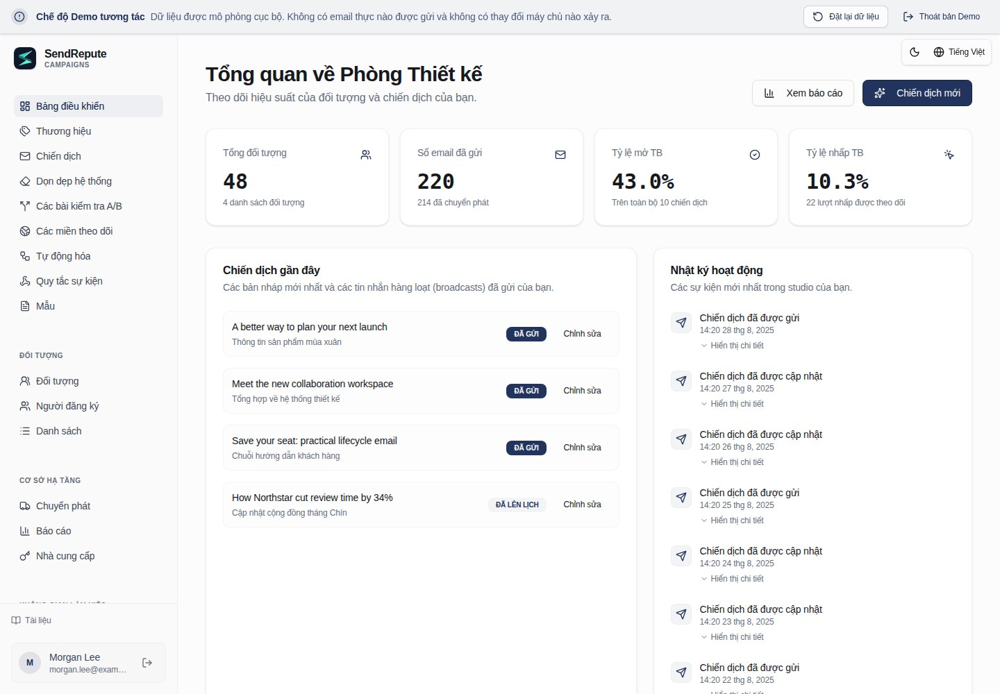

[English](README.md) · [العربية](README.ar.md) · [Français](README.fr.md) · [Русский](README.ru.md) · [Українська](README.uk.md) · [हिन्दी](README.hi.md) · [Deutsch](README.de.md) · [Español](README.es.md) · [Italiano](README.it.md) · [Português](README.pt.md) · [Bahasa Indonesia](README.id.md) · [Türkçe](README.tr.md) · [简体中文](README.zh.md) · [Tiếng Việt](README.vi.md)

# SendRepute Campaigns

Tự lưu trữ các tập khách hàng, chiến dịch, mẫu, tự động hóa và gửi thông điệp từ chính
máy chủ của bạn. Kho lưu trữ này phân phối **bản runtime đã được biên dịch**, không phải toàn bộ
mã nguồn monorepo.



Dùng thử [bản demo tương tác](https://www.sendrepute.com/campaigns/?demo=true)
(không có tin nhắn thực tế, trình thiết kế được lưu trữ hay kết quả tính phí).

<a id="quickstart-fresh-ubuntu-24042604"></a>

## Bắt đầu nhanh: Ubuntu 24.04/26.04 mới cài đặt

Trên một **máy chủ mới chưa từng cài đặt Campaigns**, hãy chạy lệnh sau:

```sh
sudo apt-get update
sudo apt-get install -y git
git clone https://github.com/sendrepute/sendrepute-campaigns.git
cd sendrepute-campaigns
./setup.sh
```

Trình cài đặt sẽ hỏi chế độ truy cập bạn muốn sử dụng và tận dụng lại Docker/Compose đang hoạt động; trên một
máy chủ Ubuntu sạch (fresh) được hỗ trợ chưa có Docker, nó sẽ yêu cầu sự đồng ý để cài đặt
các gói của Ubuntu. Trình cài đặt không gỡ bỏ Snap Docker hoặc bỏ qua AppArmor. Tuyệt đối không
clone đè lên một bản cài đặt đang có sẵn; hãy xem [Cập nhật](#update).

**CAMPAIGNS READY FOR OWNER SETUP** có nghĩa là ứng dụng đang hoạt động bình thường bên trong
container, chứ không phải quá trình thiết lập của chủ sở hữu đã hoàn tất hay HTTPS công khai đã được xác minh.
Đối với HTTPS, trước tiên hãy xác minh trang cài đặt được hiển thị từ một mạng khác:
trang này phải có một chứng chỉ hợp lệ, đáng tin cậy và không có cảnh báo từ trình duyệt. Nếu
chứng chỉ đang chờ xử lý hoặc không hợp lệ, tuyệt đối **không** nhập bất kỳ thông tin bí mật nào.

Đối với chủ sở hữu mới, token dùng một lần là **bắt buộc**, không phải tùy chọn. Khi
phương thức truy cập bạn đã chọn sẵn sàng, hãy chạy lệnh này trên VPS **từ thư mục dự án**:

```sh
sudo docker compose exec campaigns cat /var/lib/sendrepute-campaigns/installer-token
```

Bỏ qua `sudo` nếu tài khoản Docker của bạn không yêu cầu. Sao chép kết quả của lệnh
và dán vào trường **Setup token** trên trang cài đặt được hiển thị.
Điền thông tin chi tiết của chủ sở hữu và Public URL tương ứng kết thúc bằng `/campaigns/`,
sau đó hoàn tất kích hoạt SendRepute và thiết lập chủ sở hữu trong trình hướng dẫn. Trình cài đặt
**không** tự động in ra token. Không bao giờ đưa token vào một URL hay chia sẻ nó; hãy giữ bí mật
token, `.env` và các bản log. Một workspace đã được cài đặt không
cần thêm một setup token nào nữa.

<a id="choose-access"></a>

## Chọn phương thức truy cập

- **Tên miền HTTPS (khuyên dùng):** quá trình cài đặt sẽ khởi chạy Caddy proxy đi kèm.
  Nhập một tên miền phụ (subdomain) mà bạn kiểm soát, ví dụ `campaigns.example.com` (thay
  bằng tên miền của bạn), **không bao gồm scheme, cổng hoặc đường dẫn**. Trỏ bản ghi DNS
  `A` của tên miền (hostname) đó về máy chủ này, cho phép TCP 80/443 và kiểm tra
  chứng chỉ tin cậy từ bên ngoài. Chỉ sử dụng `AAAA` khi IPv6 đang hoạt động tốt.
- **Local / SSH tunnel:** liên kết (binds) ứng dụng với loopback của VPS. Mở truy cập thông qua một
  SSH tunnel đáng tin cậy từ máy tính của bạn; `localhost` trên laptop của bạn không phải
  là VPS.
- **Public IP + HTTP:** yêu cầu đồng ý rõ ràng để truy cập không mã hóa trên cổng 8080.
  Mật khẩu, token và phiên có thể bị đánh chặn; **không dành cho việc triển khai
  môi trường thực tế (production) an toàn**.

Xem [cẩm nang các lệnh thiết lập](docs/install.md#guided-setup-command-cookbook)
để biết các lệnh chính xác, các tùy chọn, thiết lập local SSH tunneling, chẩn đoán và cảnh báo.

<a id="moving-from-http-to-https"></a>

## Chuyển đổi từ HTTP sang HTTPS

Hãy sao lưu trước. Trỏ **tên miền (hostname) thực tế của bạn** về VPS, giải phóng/mở TCP 80/443
và xác nhận DNS hoạt động tốt. Trên VPS, bên trong thư mục dự án **hiện tại**:

```sh
./setup.sh --mode https --host campaigns.sendrepute.com
```

Thay `campaigns.sendrepute.com` bằng tên miền (hostname) của bạn (`campaign` và
`campaigns` là các tên DNS khác nhau). Xác nhận việc thay đổi cấu hình phơi bày khi được hỏi;
trình cài đặt sẽ khởi động Caddy nhưng không ghi đè Public URL đã lưu của workspace đã cài đặt. Sau khi xác minh HTTPS từ bên ngoài, hãy đổi URL đó trong **Workspace
Settings** thành `https://YOUR_HOSTNAME/campaigns/`. Nếu sử dụng Cloudflare, hãy dùng
**Full (strict)**, tuyệt đối không dùng Flexible. Xem
[các bước chuyển đổi](docs/install.md#migrate-an-installed-public-ip-http-workspace-to-https)
trước khi thay đổi một bản cài đặt đang chạy thực tế.

<a id="download-v0141"></a>

## Tải về v0.1.41

Quản trị viên có thể kiểm tra các bản phát hành (release) ổn định trên GitHub trong Workspace Settings. Ưu tiên các tệp đính kèm tệp nén (archive) phát hành có phiên bản chính thức và mã băm SHA-256. Nếu thiếu các tệp đính kèm dự kiến đó, trình kiểm tra có thể thay vào đó phân giải cùng tag của bản phát hành ổn định trong kho lưu trữ chính thức về commit bất biến của nó và xác thực tệp kê khai mã băm `downloads/` được liên kết với commit đó. Các liên kết tải về từ kho lưu trữ được gắn chặt vào commit đó, không phải vào một tag hay nhánh (branch) có thể di chuyển. Các tệp đính kèm dự kiến không hợp lệ hoặc trùng lặp sẽ tuyệt đối không cho phép sử dụng cơ chế dự phòng này. Settings hiển thị thông báo cập nhật, các liên kết tải về/mã băm và lệnh cập nhật máy chủ thủ công đã được ghi tài liệu cho bản Git clone hiện tại; nó không bao giờ tự động cài đặt, giải nén hay thực thi tệp tải về. Hãy sao lưu bản cài đặt trước, sau đó thực hiện quy trình nâng cấp và khởi động lại dành cho người vận hành. Các bản cài đặt từ tệp nén phải tuân theo các hướng dẫn nâng cấp tệp nén riêng biệt và xác minh các byte tải về so với các mã băm. Các lỗi của GitHub, siêu dữ liệu công bố bị thiếu hoặc sai định dạng, và các phiên bản cài đặt không xác định sẽ được báo cáo là không khả dụng, tuyệt đối không báo cáo là đã cập nhật. Các tệp nén của bản phát hành mới có chứa siêu dữ liệu phiên bản cài đặt của chúng; những bản cài đặt cũ không có siêu dữ liệu này không thể khẳng định là bản hiện tại. Việc xuất bản các bản phát hành và tạo mã băm là các bước thực hiện riêng biệt của người vận hành, không do ứng dụng thực hiện.

Bạn thích tệp nén theo phiên bản hơn? Hãy tải về [ZIP](https://github.com/sendrepute/sendrepute-campaigns/raw/refs/tags/v0.1.41/downloads/sendrepute-campaigns-0.1.41.zip)
hoặc [tar.gz](https://github.com/sendrepute/sendrepute-campaigns/raw/refs/tags/v0.1.41/downloads/sendrepute-campaigns-0.1.41.tar.gz),
xác minh [các mã băm SHA-256](https://github.com/sendrepute/sendrepute-campaigns/blob/v0.1.41/downloads/sendrepute-campaigns-0.1.41-SHA256SUMS),
giải nén, và chạy `./setup.sh` tại đó. Đây là các tệp tải về từ kho lưu trữ, **không phải**
các tệp đính kèm nhị phân của GitHub Release; **Code → Download ZIP** là một snapshot
khác hoàn toàn. Xem [ghi chú phát hành v0.1.41](https://github.com/sendrepute/sendrepute-campaigns/releases/tag/v0.1.41).

<a id="additional-tracking-hostnames"></a>

## Các hostname theo dõi bổ sung

Khi bản cài đặt HTTPS/Caddy đi kèm đang chạy, hãy mở **Domains**,
tạo một thử thách hostname (hostname challenge), thêm bản ghi A/AAAA trỏ về máy chủ này và
bản ghi TXT xác thực quyền sở hữu hiển thị chính xác, sau đó nhấp **Check DNS and verify**.
Campaigns sẽ tự động thêm hostname đã xác minh vào cùng một proxy được quản lý
và tái sử dụng chứng chỉ chính khi SAN của chứng chỉ đó bao gồm hostname này, nếu không
nó sẽ yêu cầu một chứng chỉ tự động. Lặp lại quá trình này cho nhiều hostname; không cần
các lệnh shell cho từng tên miền hay phải chỉnh sửa proxy, và hostname của bản cài đặt
chính cùng cài đặt chứng chỉ vẫn không đổi. Hãy chọn
hostname đã xác minh mong muốn một cách độc lập trong danh sách thả xuống **Tracking domain** của từng chiến dịch.

Sự phê duyệt DNS, cấu hình proxy đã tải, và HTTPS công khai đang hoạt động được hiển thị
riêng biệt. Việc tải cấu hình không chứng minh được ACME đã cấp chứng chỉ hoặc có thể
truy cập công khai. Các tên được cấp bởi Origin CA yêu cầu sử dụng proxy của Cloudflare và không
được trình duyệt tin cậy trực tiếp. DNS và các cổng 80/443 phải tiếp cận được proxy hiện có; Cloudflare
phải cho phép ACME và duy trì ở mức **Full (strict)**. Các proxy/Tunnel bên ngoài đòi hỏi
sự cấu hình của người vận hành. Nếu proxy được quản lý không chạy hoặc
hostname chính bị thiếu, các mục bổ sung sẽ vẫn nằm trong hàng đợi cho đến khi sự cố ở cấp độ cài đặt này
được giải quyết. Không thực hiện dự phòng SSL không an toàn (insecure SSL fallback).

Các tuyến (routes) đã phê duyệt trước đó vẫn được giữ lại khi một tên miền có thể chọn bị xóa
hoặc challenge của nó bị xoay vòng, vì vậy các liên kết đã gửi không bị thu hồi âm thầm.
Hãy duy trì DNS và khả năng gia hạn chứng chỉ của chúng. Hãy bảo tồn sổ cái phê duyệt
PostgreSQL và các volume HTTPS/Caddy trong quá trình nâng cấp/sao lưu. Các bản cài đặt có
chứng chỉ chính thủ công có thể làm gián đoạn kết nối trong thời gian ngắn trong quá trình
cập nhật/khởi động lại chỉ dành cho Caddy một cách có kiểm soát. Xem tệp `SMTP-TRACKING.md` được đóng gói
để biết các định nghĩa trạng thái, việc giữ lại liên kết lịch sử, và các giới hạn thất bại/thử lại.

<a id="update"></a>

## Cập nhật

Hãy sao lưu trước; xem mục [Sao lưu](#back-up).
Trên VPS, **bên trong thư mục Git clone hiện tại của bạn** (không phải một bản clone mới), hãy kiểm tra
các thay đổi cục bộ, sau đó chạy lệnh:

```sh
git status --short
git pull --ff-only && ./setup.sh --mode resume
```

`resume` bảo tồn chế độ truy cập hiện tại, bao gồm cả HTTPS. Nếu lệnh pull từ chối,
hãy đối chiếu các chỉnh sửa thay vì thiết lập lại bắt buộc (force-resetting). Hãy bảo tồn `.env`, cùng
project Compose, các volume PostgreSQL và ứng dụng, và khóa mã hóa. Tuyệt đối không chạy
`docker compose down -v` đối với dữ liệu thực tế. Đối với nâng cấp bằng tệp nén (archive), hãy sử dụng
[hướng dẫn nâng cấp](docs/operations.md#upgrade), không phải là một clone mới đè lên
bản cài đặt.

<a id="back-up"></a>

## Sao lưu

Hãy bảo tồn toàn bộ cơ sở dữ liệu PostgreSQL, dữ liệu ứng dụng/khóa mã hóa,
`.env` riêng tư và trạng thái HTTPS/Caddy. Hãy tuân theo
[các lệnh sao lưu Docker hoàn chỉnh](docs/operations.md#docker-infrastructure-backup),
sau đó giữ các bản sao ngoài máy chủ (off-host) được mã hóa, có kiểm soát truy cập. Bản xuất JSON trong ứng dụng
không phải là bản sao lưu cơ sở hạ tầng và sẽ bỏ qua sổ cái phê duyệt HTTPS đã giữ lại,
bao gồm các hostname đã được phê duyệt nhưng các hàng domain có thể chọn của chúng đã bị xóa.

Đối với các bản sao lưu ngoài máy chủ được mã hóa **được lên lịch tự nguyện (opt-in scheduled)**, hãy sử dụng
`backup.sh`, `backup.conf.example` đi kèm và các ví dụ systemd. Quá trình cài đặt không lên lịch
hoặc kích hoạt bất cứ thứ gì. Cài đặt `age` và cấu hình một thư mục gắn ngoài (mounted directory)
đã có sẵn hoặc một đích SFTP bị giới hạn. Để trống cả hai cài đặt age:
bản sao lưu tương tác đầu tiên sẽ tự động tạo tệp khôi phục của nó và yêu cầu
bạn lưu một bản sao an toàn riêng biệt trước khi tiếp tục. Các bản sao lưu sau đó sẽ tái sử dụng nó;
không có các lệnh tạo khóa hoặc các giá trị khóa công khai (public-key) cần sao chép vào cấu hình.
Máy chủ giữ một bản sao được bảo vệ để xác minh mỗi bản sao lưu; tuyệt đối không lưu trữ
bản sao khôi phục độc lập của bạn bên cạnh các tệp nén sao lưu được mã hóa.
Xem [sao lưu tự động](docs/operations.md#opt-in-encrypted-scheduled-backups)
để biết các điều kiện tiên quyết, kích hoạt an toàn, xác minh và khôi phục. Từ thư mục
cài đặt, `./backup.sh status` hiển thị lần thử cuối, lần thành công cuối và tệp nén;
nó vẫn có thể đọc được nếu định danh (identity) age hoặc các công cụ sao lưu không khả dụng, miễn là
cấu hình riêng tư do người vận hành sở hữu và tệp spool/status cục bộ còn nguyên vẹn.
`./backup.sh verify /private/path/archive.tar.age` kiểm tra giải mã, tệp kê khai (manifest) và
định dạng PostgreSQL mà không khôi phục dữ liệu.

<a id="restore"></a>

## Khôi phục

Chỉ khôi phục từ bản sao lưu PostgreSQL **và** volume dữ liệu trùng khớp, đã được xác minh;
bản xuất JSON trong ứng dụng bỏ qua các tác vụ phân phối (delivery jobs), sự kiện kiểm toán (audit events) và trạng thái
runtime khác. Việc khôi phục có thể ghi đè dữ liệu mới hơn hoặc tiếp tục gửi thư đang xếp hàng. Hãy tuân theo
[các bước khôi phục cách ly](docs/operations.md#restore-to-an-empty-isolated-installation)
trước khi chuyển đổi sang môi trường thực tế (production cutover).

<a id="more-information"></a>

## Thông tin thêm

- [Các lệnh cài đặt và thiết lập](docs/install.md) — tất cả các flag, HTTPS/HTTP,
  các đường dẫn Docker hoặc Node.js thủ công, token và khắc phục sự cố.
- [Vận hành, sao lưu và khôi phục](docs/operations.md) — nâng cấp và phục hồi.
- [Bảo mật và khả năng phân phối](docs/security-and-deliverability.md) — SMTP,
  SPF/DKIM/DMARC, sự đồng ý (consent) và kiểm tra môi trường thực tế (production checks).
- [Hợp đồng máy chủ độc lập (Standalone server contract)](docs/server-contract.md) — chi tiết tích hợp.

Việc kích hoạt sẽ xác thực một khóa API SendRepute được cấp riêng biệt; **không yêu cầu đặt cọc
để kích hoạt**, và quản lý cục bộ là miễn phí. AI và phân loại được lưu trữ trên máy chủ tùy chọn yêu cầu
quyền lợi hoặc credit riêng của chúng cùng với sự đồng ý rõ ràng về giá; bản demo AI không thực hiện các kết quả tính phí. Quá trình gửi đi đi từ **máy chủ
của bạn đến relay/nhà cung cấp SMTP do bạn cấu hình**, không phải một proxy SMTP
trung tâm của SendRepute.

<a id="release-boundary"></a>

## Ranh giới bản phát hành

Bản phát hành bao gồm trình duyệt đã biên dịch, máy chủ, cầu nối phân phối (delivery) và customer-API,
SDK khách hàng công khai, các di chuyển (migrations) và tài liệu. Nó loại trừ trang web
SendRepute chính và trình quét (scanner), nội dung cơ sở dữ liệu, các secret, source map, các bài kiểm thử
và chuỗi công cụ phát triển. Các điều khoản cấp phép của thành phần và bên thứ ba vẫn được
áp dụng; việc tự lưu trữ (self-hosting) không cấp quyền đối với giấy phép dịch vụ được lưu trữ trên máy chủ hoặc sự đảm bảo
vào hộp thư đến (inbox-placement guarantee).
