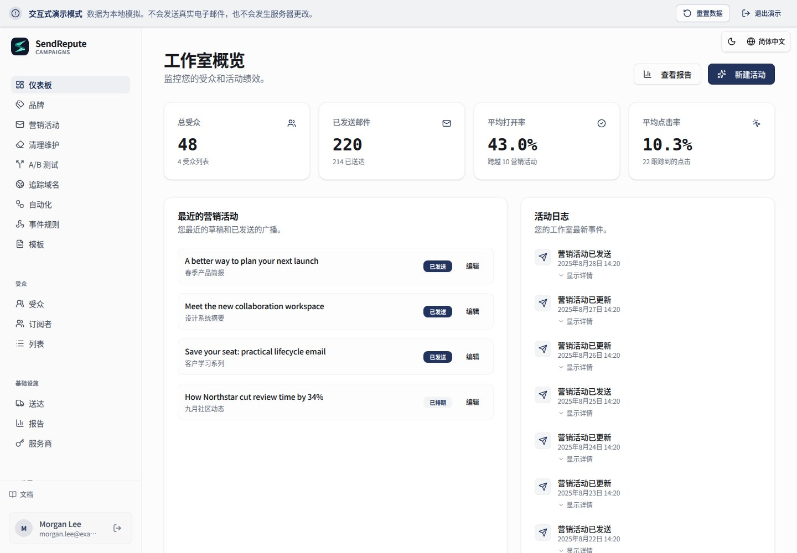

[English](README.md) · [العربية](README.ar.md) · [Français](README.fr.md) · [Русский](README.ru.md) · [Українська](README.uk.md) · [हिन्दी](README.hi.md) · [Deutsch](README.de.md) · [Español](README.es.md) · [Italiano](README.it.md) · [Português](README.pt.md) · [Bahasa Indonesia](README.id.md) · [Türkçe](README.tr.md) · [简体中文](README.zh.md) · [Tiếng Việt](README.vi.md)

# SendRepute Campaigns

在您自己的服务器上自托管受众、营销活动、模板、自动化以及邮件投递。此仓库分发的是**编译后的运行时**，而不是完整的源代码单体仓库（monorepo）。



欢迎体验[交互式演示](https://www.sendrepute.com/campaigns/?demo=true)
（不包含真实消息、托管式构建器或付费结果）。

<a id="quickstart-fresh-ubuntu-24042604"></a>

## 快速入门：全新的 Ubuntu 24.04/26.04

在**未安装过 Campaigns 的全新服务器**上，运行：

```sh
sudo apt-get update
sudo apt-get install -y git
git clone https://github.com/sendrepute/sendrepute-campaigns.git
cd sendrepute-campaigns
./setup.sh
```

安装程序会询问要使用哪种访问模式，并复用正常运行的 Docker/Compose；在未安装 Docker 但受支持的全新 Ubuntu 服务器上，它会请求同意安装 Ubuntu 的系统软件包。它不会移除 Snap 版的 Docker，也不会绕过 AppArmor。切勿直接克隆并覆盖现有的安装；请参阅[更新](#update)。

**CAMPAIGNS READY FOR OWNER SETUP** 表示应用在其容器内运行健康，并不代表所有者设置已完成或公共 HTTPS 已验证。对于 HTTPS，请首先从其他网络访问并验证控制台输出的安装页面：它必须具有有效且受信任的证书，且没有浏览器警告。如果证书处于挂起状态或无效，**切勿**输入任何机密信息。

对于新所有者，一次性令牌是**必需的**，而非可选。一旦您选择的访问模式准备就绪，请在 VPS 的**项目目录中**运行以下命令：

```sh
sudo docker compose exec campaigns cat /var/lib/sendrepute-campaigns/installer-token
```

如果您的 Docker 账户不需要 `sudo`，请将其省略。复制命令输出，并将其粘贴到控制台输出的安装页面上的 **Setup token** 字段中。填写所有者详细信息以及以 `/campaigns/` 结尾的相应 Public URL，然后在向导中完成 SendRepute 激活和所有者设置。安装程序**不会**自动打印该令牌。切勿将其置于 URL 中或与他人分享；请务必对该令牌、`.env` 以及日志保密。已经安装好的工作区不需要再次获取设置令牌。

<a id="choose-access"></a>

## 选择访问方式

- **HTTPS 域名（推荐）：** 安装程序会启动内置的 Caddy 代理。
  输入一个受您控制的子域名，例如 `campaigns.example.com`（替换为您自己的域名），**不要包含协议、端口或路径**。将该主机名的 DNS
  `A` 记录指向此服务器，放行 TCP 80/443 端口，并从外部检查受信任的证书。仅在 IPv6 正常工作的情况下使用 `AAAA`。
- **本地 / SSH 隧道：** 将应用绑定到 VPS 的环回接口。通过来自您计算机的受信任 SSH 隧道打开它；您笔记本电脑上的 `localhost` 并不是该 VPS。
- **公网 IP + HTTP：** 明确同意在 8080 端口进行未加密的访问。
  密码、令牌和会话可能会被拦截；**不可用于安全的生产环境部署**。

请参阅[设置命令手册](docs/install.md#guided-setup-command-cookbook)
以获取确切的命令、选项、本地 SSH 隧道、诊断方法以及警告信息。

<a id="moving-from-http-to-https"></a>

## 从 HTTP 迁移到 HTTPS

请先备份。将**您的实际主机名**指向 VPS，放行/开放 TCP 80/443 端口
并确认其 DNS 解析正常。在 VPS 的**现有**项目目录中运行：

```sh
./setup.sh --mode https --host campaigns.sendrepute.com
```

将 `campaigns.sendrepute.com` 替换为您的主机名（`campaign` 和
`campaigns` 是不同的 DNS 名称）。在系统提示时确认暴露状态的更改；
安装程序会启动 Caddy，但不会重写已安装工作区中保存的 Public URL。在外部验证 HTTPS 后，在 **Workspace
Settings** 中将该 URL 更改为 `https://YOUR_HOSTNAME/campaigns/`。如果使用 Cloudflare，请使用
**Full (strict)**，切勿使用 Flexible。在修改正式运行的安装之前，请参阅
[迁移步骤](docs/install.md#migrate-an-installed-public-ip-http-workspace-to-https)。

<a id="download-v0141"></a>

## 下载 v0.1.42

管理员可以在 Workspace Settings 中检查稳定的 GitHub 发布版本。推荐使用官方带版本号的 Release 压缩包及 SHA-256 校验和附件。如果缺失这些预期的附件，检查器可以转而在官方仓库中，将相同的稳定发布标签解析为其不可变的 commit，并验证该 commit 绑定的 `downloads/` 校验和清单。仓库下载链接将固定到该 commit，而不是可变动的标签或分支。如果预期附件无效或重复，则绝不会触发此回退机制。针对现有的 Git 克隆，设置界面会显示更新通知、下载/校验和链接以及已在文档中说明的手动服务器更新命令；它绝不会自动安装、解压或执行下载。请务必先备份现有安装，然后按照运维升级和重启流程进行操作。压缩包安装方式必须遵循单独的压缩包升级说明，并根据校验和验证下载的字节内容。GitHub 故障、发布元数据缺失或格式错误以及安装版本未知等情况，均会报告为不可用，绝不会显示为已是最新版本。新版 Release 压缩包内包含其安装版本元数据；没有此元数据的旧版安装将无法声称为最新。Release 发布和校验和生成是独立的运维步骤，由应用程序以外的流程执行。

更倾向于使用带版本号的压缩包？请下载 [ZIP](https://github.com/sendrepute/sendrepute-campaigns/raw/refs/tags/v0.1.42/downloads/sendrepute-campaigns-0.1.42.zip)
或 [tar.gz](https://github.com/sendrepute/sendrepute-campaigns/raw/refs/tags/v0.1.42/downloads/sendrepute-campaigns-0.1.42.tar.gz)，
验证 [SHA-256 校验和](https://github.com/sendrepute/sendrepute-campaigns/blob/v0.1.42/downloads/sendrepute-campaigns-0.1.42-SHA256SUMS)，
解压并在该目录下运行 `./setup.sh`。这些是仓库下载，**不是**
GitHub Release 二进制附件；**Code → Download ZIP** 获取到的是不同的
快照。请参阅 [v0.1.42 发行说明](https://github.com/sendrepute/sendrepute-campaigns/releases/tag/v0.1.42)。

<a id="additional-tracking-hostnames"></a>

## 额外的追踪主机名

在内置的 HTTPS/Caddy 已运行的情况下，打开 **Domains**，
创建一个主机名质询（challenge），添加指向该服务器的 A/AAAA 记录及
所显示的准确 TXT 所有权记录，然后点击 **Check DNS and verify**。
Campaigns 会自动将验证通过的主机名添加到同一个托管代理中，
并在其 SAN 覆盖该主机名时复用主证书，否则
将自动申请新证书。针对多个主机名可重复此操作；无需执行基于各个域名的
shell 命令或编辑代理配置，且主安装的
主机名和证书设置保持不变。您可以在各个营销活动的 **Tracking domain** 下拉菜单中，独立选择所需的已验证主机名。

DNS 批准状态、加载的代理配置以及正常的公共 HTTPS 状态会分开显示。加载配置并不证明 ACME 已签发证书或
公网可达。受覆盖的 Origin CA 名称要求使用 Cloudflare 代理，且不会
被浏览器直接信任。DNS 和 80/443 端口必须可触达现有代理；Cloudflare
必须允许 ACME 并保持为 **Full (strict)**。外部代理/隧道需要
运维人员自行配置。如果托管代理未运行或主
主机名缺失，添加操作将保持排队状态，直到该安装级别的问题
得到解决。系统不会执行任何不安全的 SSL 回退。

当可选域名被删除或其质询被轮换时，先前批准的路由将被保留，因此已发送的链接不会被悄悄撤销。
请保持其 DNS 和证书续期的可用性。在升级/备份期间，请保留 PostgreSQL
批准台账和 HTTPS/Caddy 数据卷。对于手动主证书的安装，
在受控的纯 Caddy 更新/重启期间可能会短暂中断连接。请参阅内置的 `SMTP-TRACKING.md`
以获取状态定义、历史链接保留以及失败/重试边界。

<a id="update"></a>

## 更新

请先备份；请参阅[备份](#back-up)。
在 VPS 上的**现有 Git 克隆内**（非全新的克隆），检查
本地更改，然后运行：

```sh
git status --short
git pull --ff-only && ./setup.sh --mode resume
```

`resume` 会保留现有的访问模式（包括 HTTPS）。如果 pull 被拒绝，
请协调修改，而不是强制重置。请保留 `.env`、同一个 Compose
项目、PostgreSQL 和应用数据卷，以及加密密钥。切勿
针对真实数据运行 `docker compose down -v`。对于压缩包升级，请使用
[升级说明](docs/operations.md#upgrade)，而不是用新的克隆覆盖现有安装。

<a id="back-up"></a>

## 备份

请保留完整的 PostgreSQL 数据库、应用数据/加密密钥、
私有 `.env` 和 HTTPS/Caddy 状态。遵循
[完整的 Docker 备份命令](docs/operations.md#docker-infrastructure-backup)，
然后保留已加密且具备访问控制的主机外（off-host）副本。应用内的 JSON 导出
并非基础设施级备份，它会遗漏已保留的 HTTPS 批准台账，
包括那些可选域名行已被删除但曾获批的主机名。

对于**选择性开启的定时**加密主机外备份，请使用内置的
`backup.sh`、`backup.conf.example` 和 systemd 示例。安装程序不会调度
或启用任何内容。请安装 `age`，并配置现有已挂载的
主机外目录或受限的 SFTP 目标地址。将两个 age 设置都留空：
第一次交互式备份会自动创建其恢复文件，并要求
您在继续前先安全保存一份独立的副本。随后的备份将复用该文件；
无需执行密钥生成命令，也无需将公钥值复制到配置中。
宿主机会保留一份受保护的副本以验证每次备份；切勿将您
独立的恢复副本与加密后的备份压缩包存放在一起。
请参阅[自动化备份](docs/operations.md#opt-in-encrypted-scheduled-backups)
以了解前提条件、安全激活、验证及恢复操作。在安装目录下，
`./backup.sh status` 会显示最后一次尝试、最后一次成功及压缩包的信息；
只要运维人员自有的私有配置和本地 spool/状态文件完好无损，即使 age 身份凭据或备份工具不可用，它依然可读。
`./backup.sh verify /private/path/archive.tar.age` 可用于检查解密、清单和
PostgreSQL 格式，而无需恢复数据。

<a id="restore"></a>

## 恢复

仅可从经过验证且相互匹配的 PostgreSQL **和**数据卷备份进行恢复；
应用内 JSON 导出遗漏了投递任务、审计事件及其他运行时
状态。恢复操作可能会覆盖较新的数据，或恢复队列中邮件的发送。在
任何生产环境切换之前，请遵循[隔离恢复步骤](docs/operations.md#restore-to-an-empty-isolated-installation)。

<a id="more-information"></a>

## 更多信息

- [安装和设置命令](docs/install.md) — 所有标志参数、HTTPS/HTTP、
  手动 Docker 或 Node.js 路径、令牌及故障排查。
- [运维、备份和恢复](docs/operations.md) — 升级与恢复。
- [安全与送达率](docs/security-and-deliverability.md) — SMTP、
  SPF/DKIM/DMARC、接收许可及生产环境检查。
- [独立服务器契约](docs/server-contract.md) — 集成细节。

激活过程会验证单独签发的 SendRepute API 密钥；**激活无需预存任何费用**，且本地管理完全免费。可选的托管 AI 和分类功能需要拥有独立的授权或额度，并需要明确确认价格；演示版 AI 不会产生付费结果。邮件投递是从**您的服务器直接发送至您配置的 SMTP 中继/提供商**，而不是通过中心化的 SendRepute SMTP 代理。

<a id="release-boundary"></a>

## 发布边界

此发布包含已编译的浏览器端、服务器端、投递与客户 API 桥接器、公共客户 SDK、迁移脚本以及文档。它不包括 SendRepute 主站点与扫描器、数据库内容、机密信息、Source Maps、测试用例以及开发工具链。各组件和第三方的许可条款依然适用；自托管不授予任何托管服务的许可证，也不提供进箱保证。
